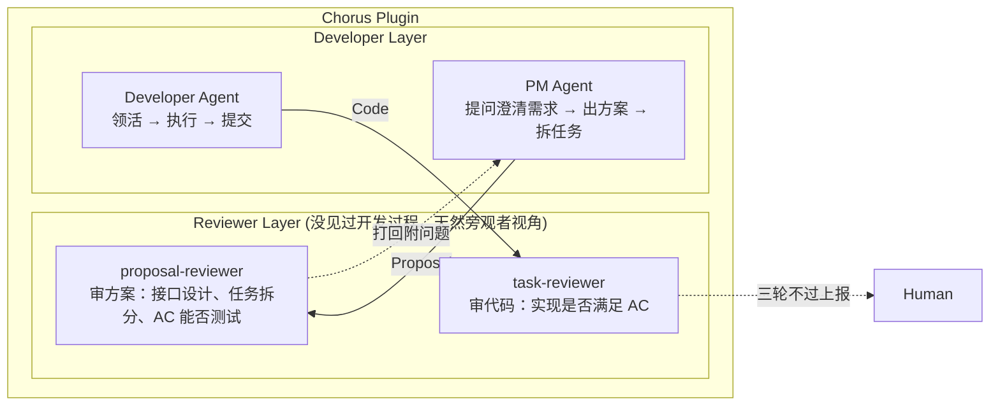

# Agent Review Pattern

> 让 Agent 审 Agent — 用独立的 Reviewer Agent 执行验收审查

## 问题：人成了瓶颈

不加审查时：
- Agent 说"做完了"可信度约五成
- 代码写了但没测、主流程通了但边界没覆盖
- 每次都要人逐条确认

加了审查但让人执行时：
- 工作量从"复制粘贴"换成了"逐条 review"
- 瓶颈还是卡在一个人身上

## 解决方案：独立的 Reviewer Agent

Chorus 的关键决策：利用 Claude Code 的插件机制，定义**两个独立的 reviewer agent**，与执行任务的 agent 完全隔离。

### 两个 Reviewer 的职责

| Reviewer | 审查内容 | 审查规则 |
|---|---|---|
| `proposal-reviewer` | 方案 | 接口设计是否对得上、任务拆分是否合理、AC 能否测试 |
| `task-reviewer` | 代码 | 实现是否满足 AC |

### 审查规则

- 审查记录**永久存档**
- 审不过就打回，附上具体问题
- Agent 自己改完再交
- **最多三轮**还过不了才上报人类

## 效果

- 接口对不对得上、标准满没满足、依赖有没有画反 — 都有 reviewer 扛
- 东西递到人手上时，已经被挑过一轮刺了
- 人只需要做最终判断

## 调试思路的转变

之前：出问题得从最终代码往回猜 Agent 哪步想歪了

之后：直接翻 Elaboration 记录和 Proposal 审查历史，就能定位到是哪个假设出了偏差

## 参见

- [[Three Engineering Primitives]] — Review Pattern 是协调原语的具体实现
- [[Chorus]] — 完整的项目演进（v0.1 → v0.6.1）
