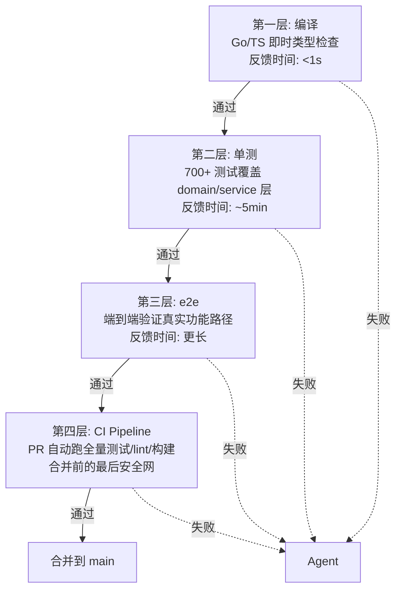
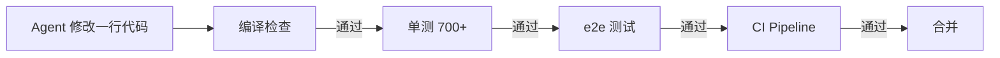

# Four-Layer Feedback Loop

> Agent 需要快速知道自己做错了什么。一层不够，四层刚好。

## 四层结构

| 层级 | 反馈时间 | 覆盖的错误类型 |
|---|---|---|
| 第一层：编译 | <1s | 语法错误、类型不匹配、API 签名错误 |
| 第二层：单测 | ~5min | 单元逻辑回归、多租户隔离等边界条件 |
| 第三层：e2e | 更长 | 多模块真实联动、集成边界 |
| 第四层：CI | PR 时 | 全部 + lint + type-check + 多平台构建 |

## 关键原则：反馈环路越短越精准

- **强类型作为编译期质量闸**：Agent 生成了签名不匹配的函数？编译失败。TypeScript 直接报错。这些错误在弱类型语言里会悄悄进入运行时。
- 单测覆盖 domain 和 service 层 — Agent 修改后 5 分钟内知道有没有引入回归
- e2e 验证真实的功能路径 — Agent 在单测里验证不到的集成边界

## 技术栈（AgentsMesh 案例）

- **Go** — backend，强类型
- **TypeScript** — frontend
- **Proto** — API 格式，跨语言类型检查
- **Air** — Go 热重载，修改 1 秒内重启

## 参见

- [[Harness Engineering]] — 四层反馈闭环是 Harness 验证子系统的具体实现
- [[Three Engineering Primitives]] — 反馈闭环支撑分解和协调原语
