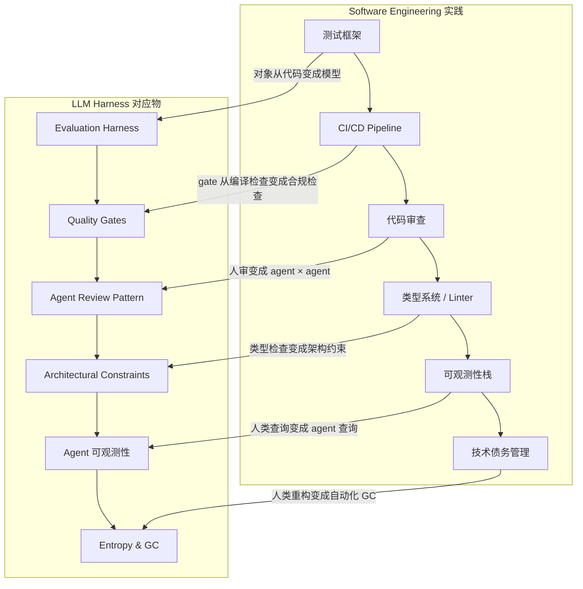

# Software Engineering 和 LLM Harness 的关联

## 核心论点

LLM evaluation harness 本质上是 **software engineering 的嫡长子**——它不是 AI 领域凭空发明的新东西，而是软件工程中成熟实践的重新排列组合，只是被测试的对象从程序变成了模型。理解这个关联，才能理解为什么 harness engineering 的本质是 software engineering。

## 一句话关系图

```
传统软件工程                    LLM Harness
─────────────────────────────────────────────────
函数 / 类                      Model (推理核心)
测试框架 (pytest/unittest)      Evaluation Harness (度量模型输出)
CI/CD pipeline                 Quality Gates (质量闸门)
代码审查 (PR review)           Agent Review Pattern (agent 审 agent)
类型系统 / linter              Constraints (架构约束)
可观测性栈 (logs/metrics)      Agent 可观测性 (LogQL/PromQL 暴露给 agent)
技术债务管理                   Entropy & GC (定期清理 drift)
模块化 / 依赖注入              Three Engineering Primitives (隔离/分解/协调)
```

## 各维度的深层关联

### 1. 测试 → Evaluation Harness

**传统软件工程**：写完代码后，用测试框架验证行为是否正确。测试失败说明代码有 bug。

**LLM Harness**：给模型一个任务，用 harness 验证模型输出是否满足标准。失败的不是代码，而是 prompt 设计、harness 约束或模型能力本身。

OpenAI 的实践 [[summaries/openai-harness-engineering-codex]] 把 evaluation harness 用于：
- 验证 Codex 生成的代码是否通过类型检查和 lint
- 验证架构约束是否被遵守（custom linter）
- 验证 UI 行为（Chrome DevTools MCP + DOM snapshot 对比）
- 验证性能指标（PromQL 查询响应时间）

**关键区别**：传统测试是确定性的（相同的输入 → 相同的输出），LLM harness 要处理概率性输出，所以往往需要 golden dataset + 评分函数，而非简单的 assert 相等。

### 2. CI/CD → Quality Gates

**传统软件工程**：代码合并前过 CI，检查 build、test、lint、type check。

**LLM Harness**：质量闸门从"代码能不能跑"变成"模型输出是否合规"。OpenAI 的 quality gates 例子：
- 自定义 linter 检查架构边界（Types → Config → Repo → Service → Runtime → UI，每层只能向固定方向依赖）
- 结构化测试（structural tests）验证 dependency graph 合法性
-  taste invariants：静态强制 structured logging、命名规范、文件大小限制

**OpenAI 的核心洞察**（原文）：
> "This is the kind of architecture you usually postpone until you have hundreds of engineers. With coding agents, it's an early prerequisite: the constraints are what allows speed without decay or architectural drift."

### 3. 代码审查 → Agent Review Pattern

**传统软件工程**：人工 PR review，发现逻辑错误、风格问题、安全漏洞。

**LLM Harness**：Agent Review Pattern——agent 审 agent。OpenAI 的 Ralph Wiggum Loop：
- Codex 写完 PR → 自己先 review（local review）
- 请求其他 agent 做 additional review（cloud review）
- 响应 feedback，迭代直到所有 agent reviewer 满意
- 最终才由 human 或 human-delegated agent merge

这对应 [[Agent Review Pattern]] 的完整实现。

### 4. 类型系统 / Linter → Constraints

**传统软件工程**：TypeScript/Flow 做类型检查，ESLint/ruff 做代码风格检查，提前拦截错误。

**LLM Harness**：Constraints 收紧模型行为的搜索空间。OpenAI 的 custom linter 示例：
- 架构边界 linter：验证代码只沿合法方向依赖
- 错误信息直接注入 remediation 指令——agent 读到这个 linter 报错时，上下文里已经包含了修复方法

这对应 [[Harness Engineering]] 的约束层：
> 约束 = 收紧搜索空间，减少错误空间（架构 linter、类型系统、权限边界）

### 5. 可观测性栈 → Agent 可观测性

**传统软件工程**：日志 / metrics / traces 分别通过 ELK、Prometheus/Grafana、Jaeger 暴露，工程师查询诊断。

**LLM Harness**：把同样的可观测性暴露给 agent。OpenAI 的实践：
- 给 Codex 完整的 local observability stack（Vector → Victoria Logs/Metrics/Traces）
- Codex 可以用 LogQL 查日志、PromQL 查 metrics、TraceQL 查调用链
- 用这些信号推理："确保服务启动在 800ms 内"——这种 prompt 以前需要人类 SRE 拆解，现在 agent 自己查、自己修

这揭示了一个深刻转变：**观测数据的消费者从 human 变成了 agent**，agent 从被观测对象变成能主动查询观测数据的自主体。

### 6. 技术债务管理 → Entropy & GC

**传统软件工程**：定期重构、tech debt backlog、 Architectural Decision Record。

**LLM Harness**：Agent 生成的代码会复制现有模式——包括不良模式。OpenAI 最初每周花 20% 人工清理"AI slop"，发现不可扩展后改为：
- 定义"golden principles"（opinionated mechanical rules）
- 后台 Codex 任务定期扫描 drift、update quality grades、open targeted refactoring PRs
- Automerged after human review in < 1 minute

> "Technical debt is like a high-interest loan: it's almost always better to pay it down continuously in small increments than to let it compound."

### 7. 模块化 / 依赖注入 → Three Engineering Primitives

**传统软件工程**：模块化降低耦合、依赖注入提高可测性、接口抽象隔离变化。

**LLM Harness** 对应 [[Three Engineering Primitives]]：
- **隔离**：每个 agent session 工作在独立的 git worktree + ephemeral observability stack 里
- **分解**：大任务分解成小 building blocks，每块独立验证后再组合
- **协调**：Supervisor agent 调度專业 agent，harness 作为中枢

## 为什么这个关联重要

理解"harness 是 SE 的延伸"而非"全新的 AI 领域"有实际价值：

1. **经验可迁移**：你不需要重新学"如何做测试"，只需要理解测试对象变了（从代码到模型输出）
2. **工具可复用**：pytest 可以直接作为 harness 的一部分（OpenAI 就是这么做的），不需要另起炉灶
3. **错误模式可预期**：架构腐化、tech debt、测试覆盖不足——这些问题在 harness 里同样会发生，用 SE 的方法解决即可
4. **避免重复造轮子**：很多团队在"如何给 agent 做评测"上重复发明本已存在于 SE 的成熟方案

## 一图总结



## 新增洞察：工具选型是 Harness 时代的基础设施管理能力

*(来源：PAS AI Harness 实践 2026-04-22)*

### Nick 的工具选型教训

在 PAS AI 项目中，团队试用并评估了大量 CodingAgent 工具生态：

| 类别 | 代表工具 | 现状 |
|------|---------|------|
| WEB 终端 | ClaudeCodeUI、Portal、Mobvibe、vibetunnel | 成熟度参差，远程访问有价值 |
| 本地工具 | VibeGo、ACP UI、AgentX、CodePilot | 个人开发者可用，扩展性有限 |
| 任务看板 | VibeKanban、CodeKanban、Cline Kanban | 单需求不需要，多需求时人成为瓶颈 |
| IM Bot | golembot、Vibe-Remote、iLink | 手机端操控有价值，但稳定性和安全性待验证 |
| 多 Agent 框架 | openagents、Hephaestus、OpenHarness | 团队协作愿景美好，当前成熟度不足 |

**核心结论（Nick 原话）**：

> "工具链极度过剩，选型比开发更重要。87 个工具试下来，最可靠的还是直接用 CLI。"

### 与 SE 的关联：框架选型 vs 轮子再造

这个教训在软件工程中有直接对应：

- **传统 SE 教训**：技术栈选型往往比具体实现更重要，一旦选错迁移成本极高
- **Harness 时代**：AI 工具生态同样面临过度碎片化，选型判断力成为核心竞争力
- **类比**：不是每个团队都需要自研测试框架——用 pytest/Jest 就好；同样，不是每个团队都需要自研 Agent 编排——先用好 CLI 再说

### 未来愿景：看板管理多 Agent

Nick 预期的未来形态：

```
看板（任务分配）
    ├── Agent-1（前端模块）
    ├── Agent-2（后端 API）
    ├── Agent-3（测试覆盖）
    └── Agent-4（文档/部署）
Human in the Loop → 最终 merge
```

这与 SE 中的"持续集成/多角色协作"理念一致，只是执行者从人变成了 Agent。

**当前障碍**：工具成熟度不足，人的监管成本依然高于直接上手写的成本。VibeKanban 和 OpenClaw+Tmux 都试过不 work，核心问题是**人在多 Agent 并行时成为瓶颈**——与 SE 中"多线程/并行任务的管理"问题如出一辙。

**现实路径**：在工具成熟之前，CLI + 好的规范约束（AGENTS.md）是最可靠的组合。这与 SE 中"简单架构优于过度工程化"的原则一致。

## 参考页面

- [[Harness Engineering]] — 核心定义与三次范式迁移
- [[Four-Layer Feedback Loop]] — Harness 的反馈环细节
- [[Agent Review Pattern]] — agent 审 agent 的实现
- [[Three Engineering Primitives]] — 三原语：隔离 / 分解 / 协调，与 SE 模块化直接对应
- [[summaries/openai-harness-engineering-codex]] — OpenAI 五个月百万行代码的实践
- [[summaries/claude-code-agentic-harness]] — Claude Code 的 harness 实现
- [[summaries/harness-core-concept]] — 三层架构：约束 / 反馈环 / 质量闸门
