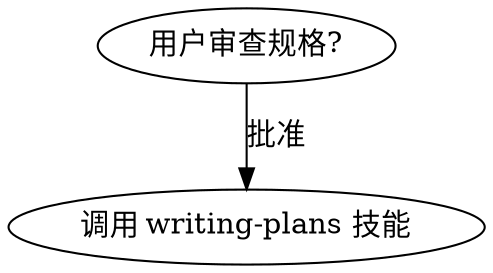

# Superpowers + OpenSpec Workflow

superpowers-zh + OpenSpec + superpowers-openspec 组合，形成一个从**任务识别 → 需求澄清 → 方案确认 → 规范落地 → 计划执行 → 代码实现**的完整工作流。这是目前最完整的 AI Coding 端到端方法论栈。

## 核心定位

| 组件 | 职责 | 产出 |
|------|------|------|
| **superpowers-zh** | 工作流方法论（何时用哪个 skill） | Skill 调用决策 |
| **superpowers-openspec** | 中文意图 → OpenSpec 路由 | OpenSpec 阶段选择 |
| **OpenSpec** | 规范产物管理（CLI + 模板） | proposal/design/spec/tasks |
| **speccoding-template** | 完整项目模板（两级 Spec 体系） | 项目骨架 + 七阶段工作流 |

## 调用链

```
用户任务
  │
  ▼
┌─────────────────────────────────────────────┐
│  superpowers / using-superpowers             │
│  「收到任务，先检查是否有匹配的 skill」        │
│  哪怕只有 1% 可能性也必须调用 Skill 工具      │
└────────────────┬────────────────────────────┘
                 │
         ┌───────┴────────┐
         ▼                ▼
┌──────────────────┐  ┌──────────────────────────┐
│ brainstorming     │  │ chinese-code-review      │
│ （需求澄清）       │  │ （中文团队代码审查）       │
└────────┬─────────┘  └──────────────────────────┘
         │
         ▼
┌─────────────────────────────────────────────┐
│  superpowers-openspec                        │
│  「先分析 / 先写方案 / 功能改造 / 规则变更」  │
│  → 进入 OpenSpec 规范阶段                    │
│  否则 → 直接进入 implementing-plans          │
└────────────────┬────────────────────────────┘
                 │
    ┌────────────┴────────────┐
    │                         │
    ▼                         ▼
「需要完整方案文档？」      「输入零散？」
    │                         │
    ▼                         ▼
┌──────────────────┐  ┌──────────────────┐
│ docs/solutions/  │  │ /opsx:explore    │
│ <主题>.md        │  │ （收敛问题空间）   │
│ 等待用户确认      │  └────────┬─────────┘
└────────┬─────────┘           │
         │                     ▼
         │         ┌──────────────────────┐
         └────────►│ /opsx:propose        │
                   │ （提案新变更）         │
                   └────────┬─────────────┘
                            │
                            ▼
                   ┌────────────────────┐
                   │ OpenSpec CLI +      │
                   │ 4个 baked-in skills │
                   │ opsx-propose        │
                   │ opsx-explore        │
                   │ opsx-apply-change  │
                   │ opsx-archive-change │
                   └────────┬────────────┘
                            │
          ┌──────────────────┼──────────────────┐
          ▼                  ▼                  ▼
   proposal.md         design.md         tasks.md
   spec.md (场景式)    风险权衡          实现步骤
                            │
                            ▼
                   ┌────────────────────┐
                   │ /opsx:apply        │
                   │ 开始实现            │
                   └────────────────────┘
```

## 三个关键判断点

### 判断点 1：superpowers 层 — 是否需要规范阶段

**触发 superpowers-openspec 的信号：**
- 明确要求：先分析 / 先写 spec / 先做详细设计 / 先写方案
- 混合意图：帮我设计并实现 XX / 先把方案定下来再开发
- 任务本质：新功能 / 功能改造 / 规则变更 / 接口变更 / 数据模型变化

**不触发（直接进入 implementing）：**
- 纯 bug 修复（不涉及规则/流程/接口变化）
- 单点技术优化，影响范围明确

### 判断点 2：superpowers-openspec 层 — 方案文档先行门禁

**当用户要求完整方案文档时：**
1. 先生成 `docs/solutions/<主题>.md`
2. 询问是否需要"方案文档自我闭环验证"
3. **等用户确认后才创建 OpenSpec change**
4. `proposal.md` 必须引用来源方案文档

### 判断点 3：OpenSpec 层 — 选择哪个 OPSX 命令

| 情况 | 命令 |
|------|------|
| 输入完整，需求边界清晰 | `/opsx:propose` |
| 输入零散（会议纪要/聊天记录） | `/opsx:explore` 先收敛 |
| 方案确认，快速推进 | `/opsx:ff`（fast-forward） |

## 技能引用模式

### 模式 1：流程图节点（强制顺序）


> 终止状态是调用 writing-plans。不要调用其他实现技能。

### 模式 2：路由表（条件分支）

```
| 场景 | 调用技能 |
|------|---------|
| 中文代码审查 | chinese-code-review + requesting-code-review |
| 构建 MCP 服务器 | mcp-builder |
| 中文 Git 工作流 | chinese-git-workflow |
```

### 模式 3：文档内嵌推荐（下游 agent 指引）

plan.md 头部写入：
```markdown
> **面向 AI 代理的工作者：** 必需子技能：superpowers:subagent-driven-development（推荐）或 superpowers:executing-plans
```

### 模式 4：CLI 命令路由

skill 内部引导 AI 执行：
```bash
openspec-cn new change "<name>"
openspec-cn status --change "<name>" --json
openspec-cn instructions <artifact-id> --change "<name>" --json
```

## 两级 Spec 体系

speccoding-template 定义了规范管理的核心结构：

| 层级 | 位置 | 作用 | 何时维护 |
|------|------|------|----------|
| **项目级** | `spec/` | 整体需求、设计、任务清单 | 仅人工明确要求时修改 |
| **需求级** | `openspec/changes/<name>/` | 单个变更的提案/设计/规格/任务 | OpenSpec CLI 管理 |

## 完整七阶段工作流（speccoding-template）

```
git branch
    → openspec scaffold（创建变更目录）
    → brainstorming（需求澄清）
    → writing-plans（制定计划）
    → executing-plans（按计划执行）
    → /opsx:apply（实施变更）
    → /opsx:archive（归档变更）
    → git merge
```

## 上游更新机制：当前问题

| 组件 | 更新机制 | 风险 |
|------|---------|------|
| OpenSpec skills（baked-in） | ❌ 无 — 静态快照 | 模板内的 skills 不会随上游更新 |
| superpowers skills | 用户自行安装版本 | 依赖用户手动更新 |
| superpowers-openspec | 独立 repo，手动同步 | 同上 |

**改进方向：** 用 git subtree/submodule 替代静态 copy，或在 CLAUDE.md 中锚定版本。

## 与其他 SDD 工具的关系

| 工具 | 核心创新 | 与本工作流的关系 |
|------|---------|----------------|
| OpenSpec | Delta-format spec + 26 tool adapters | 规范层（本工作流依赖） |
| Spec-Kit | YAML 可编程流水线 | 互补 — 可作为 OpenSpec 的执行引擎 |
| GSD | Context hygiene | 互补 — 解决上下文膨胀问题 |
| Vibe-Skills | 340+ skills + 129 治理规则 | 上位替代 — superpowers 是 Vibe-Skills 的子集 |
| Spec2Ship | 多角色协商 | 互补 — 可在 OpenSpec 之前做方案评审 |

## 设计原则总结

1. **规范先于实现** — 方案未确认不进入编码
2. **混合意图优先规范** — "帮我设计并实现"应先进入 superpowers-openspec，而不是直接编码
3. **技能叠加不互斥** — chinese-code-review + requesting-code-review 同时启用
4. **产出物集中存放** — 所有变更产物必须在 `openspec/changes/<name>/` 下，禁止散落
5. **图示降低歧义** — 架构/流程/状态优先 Mermaid，页面结构优先 ASCII
