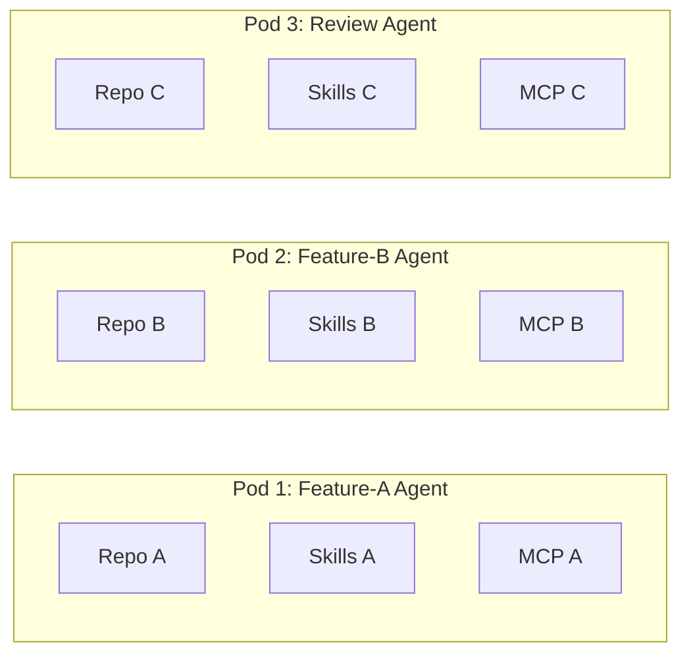
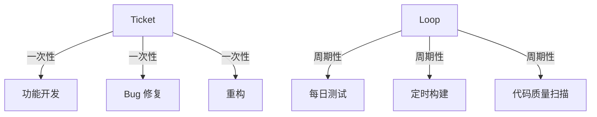
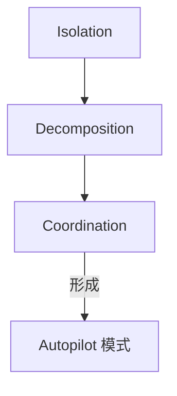

# Three Engineering Primitives

> AgentsMesh 52 天自举实践中逼出来的三个工程原语

## 背景

52 天，600 次提交，965,687 行代码吞吐，一个人用 AgentsMesh 建造了 AgentsMesh。在反复撞墙之后，收敛出三个跨场景通用的工程原语。

---

## 1. 隔离（Isolation）

**每个 Agent 需要自己独立的工作空间。**

Agent 并行工作时，如果工作空间共享，冲突从"可能发生"变成"结构上不能发生"。隔离同时也意味着**内聚** — 在独立的 Pod 环境中，把 Agent 运行需要的全部上下文准备好：

- Repo（代码库）
- Skills（工具集）
- MCP（Model Context Protocol）配置

**实现方式**：Git worktree + 沙箱。AgentsMesh 用 Pod 实现：
- 每个 Pod 运行在独立的 Git worktree
- 冲突在结构上不可能发生
- 构建 Pod 的过程就是为 Agent 执行准备环境的过程

---

## 2. 分解（Decomposition）

**Agent 不擅长处理"帮我搞这个代码库"。擅长的是：你拥有这个范围，这是验收标准，这是完成定义。**

所有权不只是任务分配，它改变了 Agent 推理的方式。分解是任何 Agent 运行之前**必须完成**的工程工作。

AgentsMesh 提供了两种任务抽象：

| | Ticket | Loop |
|---|---|---|
| 性质 | 一次性工作项 | 周期性自动化任务 |
| 适用场景 | 功能开发、Bug修复、重构 | 每日测试、定时构建、代码质量扫描 |
| 调度 | 手动领取 + 看板状态流转 | Cron 表达式 |
| 记录 | MR 关联 | 独立 LoopRun 记录 |

**两种抽象边界清晰**：做一件事，用 Ticket；反复做同一件事，用 Loop。

---

## 3. 协调（Coordination）

**Agent 之间的协同不需要模拟人类的分工方式。**

传统团队需要岗位角色，是因为每个人只精通几个专业方向。但 Agent 不受这个约束 — 同一个 Agent 可以写代码、生成文档、做竞品分析、执行测试、编排其他 Agent。

AgentsMesh 的协调机制：

### Channel（集体层次）
多个 Pod 在同一个协作空间里共享消息、决策和文档。
- Supervisor Agent 和 Worker Agent 形成协作结构的基础
- 不是群聊，是带上下文历史的结构化通信层

### Binding（能力层次）
两个 Pod 之间点对点的权限授权：

| Binding 权限 | 作用 |
|---|---|
| `terminal:read` | 一个 Agent 可以观察另一个 Agent 的终端输出 |
| `terminal:write` | 一个 Agent 可以直接控制另一个 Agent 的执行 |

Supervisor 不是靠发消息来感知 Worker 的状态，而是靠**直接看到它的终端**。

---

## 三原语的关系

隔离是前提（没有隔离，多 Agent 并行在结构上不可能）；分解是基础（没有清晰的边界和验收标准，Agent 不知道该干什么）；协调是最后一环（有了前两者，Agent 才能自主地协作）。

---

## 与 Software Engineering 的关联

三原语并非凭空发明，而是有明确的 SE 根源：

| SE 经典实践 | 三原语中的对应 |
|---|---|
| 模块化 / 依赖注入 | Isolation → 每个 Pod 把 Repo/Skills/MCP 内聚在一起 |
| 任务分解（WBS） | Decomposition → 把大任务变成独立可验证的 building blocks |
| 团队协调（微服务间通信） | Coordination → Supervisor/Worker Channel + Binding |

权威来源佐证：
- **Anthropic** 的 [[claude-code-best-practices]] 明确要求 Explore → Plan → Implement 的三阶段分解，以及 subagent + hooks 的协调机制
- **OpenAI** 的 [[openai-harness-engineering-codex]] 把 git worktree per change（隔离）和 Supervisor review loop（协调）作为 harness 的核心
- **Anthropic Agent SDK** 的 Subagents + Tools + Context + Hooks 架构，本质上就是三原语的工程实现

> **注意**："Three Engineering Primitives" 这个词组本身是 AgentsMesh 作者的自创词（coined term），在 Anthropic/OpenAI 官方文档中并无此统称。但三原语背后的实践——Isolation、Decomposition、Coordination——均散见于这两家官方文档中，可交叉印证。

---

## 参见

- [[Harness Engineering]] — 三原语是 Harness 设计在多 Agent 场景下的具体化
- [[SE and LLM Harness]] — 三原语与 SE 经典实践的完整映射表
- [[Chorus]] — Chorus 也实现了类似的任务分解和审查协调机制
