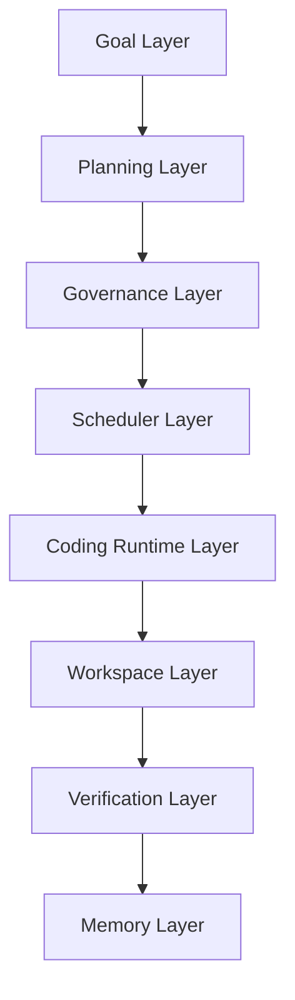

# AI DevOS

> Durable Software Engineering Operating System for AI Agents

## Definition

AI DevOS 是首个面向**软件工程长期自治**的操作系统，核心理念：Agent 不是聊天机器人，而是长期存活的软件工程 worker；软件开发不是普通 automation，而是需要 architecture continuity、semantic memory、verification loops、governance 的专业活动。

## 解决的问题（7大痛点）

| 痛点 | 描述 |
|------|------|
| 长任务不可持续 | 现有 Agent 只能持续数分钟，session 漂移、无 recovery/replay/checkpoint |
| 缺乏工程连续性 | 通用 Agent 不理解 repo graph/architecture，导致"代码局部正确，系统整体退化" |
| 缺乏长任务治理 | Kanban 系统只管 task，不管 runtime 生命周期和 context degeneration |
| 缺乏 Runtime 级调度 | 没有 lease system、retry queue、dead-letter queue、preemption |
| 缺乏 Verification-driven | Agent "生成代码 ≠ 验证代码"，缺少 CI verification |
| 缺乏组织治理 | 多 Agent 系统无 ownership、approval chain、budget system |
| 缺乏 Persistent Memory | session 结束后架构决策丢失，下一次"重新从零理解项目" |

## 核心架构（8层）

## 核心创新

1. **Long-task Governance** — 专门治理长时间软件工程任务，而非单次推理
2. **Coding-native Durable Runtime** — 软件工程自治 Runtime，而非通用 Agent Runtime
3. **Verification-first Architecture** — execute→verify→recover→continue 闭环
4. **Organizational Governance** — ownership + approval + audit + budgeting + policy 引入 Agent
5. **Persistent Engineering Memory** — 形成长期软件工程连续性

## 技术栈建议

| 层 | 推荐方案 |
|----|----------|
| Frontend | Next.js |
| Backend | Go/Rust |
| Scheduler | Temporal / Hermes-inspired |
| Queue | Postgres + Redis |
| Runtime | Claude Code / Codex |
| Workspace | Git worktree + container |
| Verification | GitHub Actions + Playwright |
| Memory | PostgreSQL + pgvector |

## MVP 目标

验证：AI 能连续自治开发 4~8 小时

MVP 必须有：task board、durable scheduler、Claude Code/Codex 集成、git worktree 隔离、CI verification loop、checkpoint/recovery、architecture memory

## 相关项目

- [[Multica]] — 多 Agent 队友平台，runtime abstraction 参考
- [[paperclip]] — 心跳驱动的 Agent 编排平台，governance 参考
- [[OpenClaw]] — workspace 管理 + codebase inspection 能力可复用
- [[Hermes Agent]] — durable scheduler 基础
- [[agent-skills]] — SDLC 技能封装参考

## 可行性评估

> 结论：**可行（长远战略项目）**。核心技术组件均有成熟实现。主要风险在于长时 task context 管理（4-8 小时压缩稳定性）和 verification 误判率，需在 MVP Phase 0 验证。Notion 评估：https://www.notion.so/349ecf12-1763-81f6-aad8-e7ca985717cd?v=361ecf12-1763-81f5-99fd-f04fc7c90f5e
