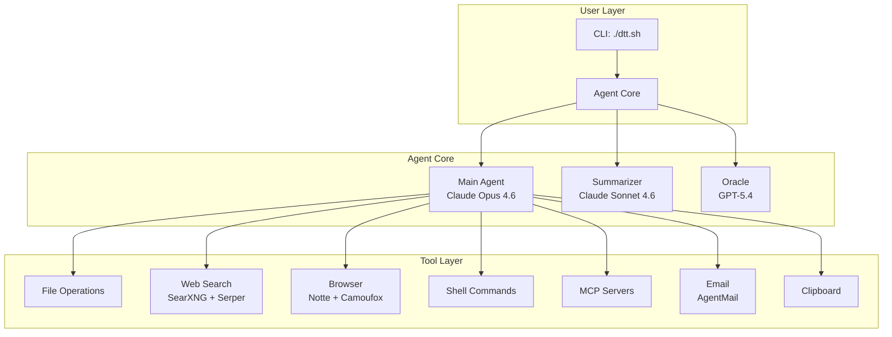

# Dothething (DTT)

**Type:** Autonomous AI Agent
**Website:** https://dotheth.ing
**GitHub:** https://github.com/fluffypony/dothething (1,636 stars)
**License:** BSD-3-Clause
**Created:** 2026-04-09
**Language:** Shell / Python

## Overview

Dothething (DTT) is a **local AI agent** — you describe a task in plain English, walk away, and come back to results. It handles research, data extraction, browser automation, file editing, and code execution until the job is done, or tells you exactly why it couldn't.

The agent routes **Claude Opus** through **OpenRouter** (so only one API key is needed). It combines web search, browser automation, file operations, shell commands, MCP server connectivity, email, clipboard, and custom skills into a unified autonomous workflow.

## Architecture



## Key Features

- **Browser automation** — Notte + Camoufox (fingerprint-resistant Firefox fork) for multi-step web interactions, captcha solving
- **Web search** — Hybrid SearXNG (self-hosted) + Serper, supports Google/Bing/DuckDuckGo and image search
- **File editing & shell** — Full read/write/execute capabilities with persistent shell sessions
- **MCP server connectivity** — Connect existing MCP servers via `~/.dtt/mcp.json`
- **Custom skills** — Load skills from `~/.dtt/skills/<name>/SKILL.md` (Claude Code convention)
- **Email** — Send/receive via AgentMail integration
- **Clipboard** — Copy/paste including images (wl-clipboard on Wayland, xclip on X11)
- **Live input** — Press any key mid-task to inject instructions; Ctrl-Q to queue
- **Orchestrator mode** — Run and manage multiple agents in parallel from one terminal
- **Thread persistence** — Full conversation logs saved to `~/.dtt/threads/` for resumption
- **Cost tracking** — Token usage and dollar cost via OpenRouter, with Anthropic prompt caching
- **Cost limits** — `--max-cost` flag to checkpoint and stop at budget threshold

## Getting Started

```bash
git clone https://github.com/fluffypony/dothething.git
cd dothething
./dtt.sh --prompt "Find the 10 largest public companies by revenue that went bankrupt in the last 20 years and write a markdown report with causes and timelines."
```

First run prompts for OpenRouter API key (required) and 2Captcha key (optional). Everything else installs automatically to `/tmp/dothething`.

## Key Commands

| Flag | What it does |
|---|---|
| `--prompt "..."` | Inline task instead of editor |
| `--fast` | Use Opus 4.6-fast (cheaper) |
| `--cwd DIR` | Working directory for file ops |
| `--max-loops N` | Cap agent turns (default: 200) |
| `--oraclepro` | Use GPT-5.4-pro for oracle |
| `--resume ID` | Resume previous session |
| `--headed` | Show browser window |
| `--orchestrator` | Multi-agent terminal UI |
| `--pipe` | Stdout-only mode for pipelines |
| `--tui` | Full-screen terminal UI |
| `--notify-desktop` | Desktop notification on finish |
| `--notify-email EMAIL` | Email notification on finish |
| `--max-cost USD` | Stop at cost threshold |

## Tools

**File operations:** `read_file`, `write_file`, `edit_file`, `batch_read`, `diff_files`

**System:** `run_command`, `shell_session`, `run_code`, `glob`, `list_dir`, `search_file`, `clipboard_copy`, `clipboard_paste`, `request_user_input`

**Web:** `search_web` (hybrid Serper + SearXNG), `fetch_page` (Notte scraping), `browser_agent` (interactive control), `http_request`

**Analysis:** `think`, `oracle`, `delegate`, `analyze_data`, `analyze_image`, `batch_process`

**State:** `notes_add`, `notes_read`, `plan_create`, `plan_update`

**Config:** `manage_config`, `manage_skill`, `manage_mcp`

**Email:** `email_auth`, `email_list_inboxes`, `email_create_inbox`, `email_list`, `email_read`, `email_send`, `email_delete`, `email_wait_for_message`

## Skills System

Skills live at `~/.dtt/skills/<name>/SKILL.md` (Claude Code convention):

```yaml
---
name: my-skill
description: What this skill does
inline: true          # inject into agent context
allowed-tools: [Read, Write, Edit]  # implies inline
---
Your skill instructions here...
```

## MCP Servers

Configure in `~/.dtt/mcp.json`:

```json
{
  "mcpServers": {
    "my-server": {
      "command": "npx",
      "args": ["-y", "my-mcp-server"],
      "env": { "API_KEY": "***" }
    }
  }
}
```

## Data Locations

| Path | What's there |
|---|---|
| `~/.dtt/env` | API keys (mode 0600) |
| `~/.dtt/threads/` | Saved conversation threads |
| `~/.dtt/threads/<id>/cache/` | Per-thread scratch folder |
| `~/.dtt/skills/<name>/SKILL.md` | User-defined skills |
| `~/.dtt/mcp.json` | MCP server configuration |
| `/tmp/dothething/` | Runtime: venv, SearXNG, Camoufox |

## Technical Details

| Aspect | Detail |
|---|---|
| Language | Shell + Python |
| Main model | Claude Opus 4.6 via OpenRouter |
| Summarizer | Claude Sonnet 4.6 |
| Oracle | GPT-5.4 (or GPT-5.4-pro with `--oraclepro`) |
| Browser | Notte + Camoufox (Firefox fork) |
| Search | SearXNG + Serper |
| Platform | macOS, Linux |

## Related

- [Harness Engineering](/wiki/concepts/Harness-Engineering) — context for agent reliability patterns
