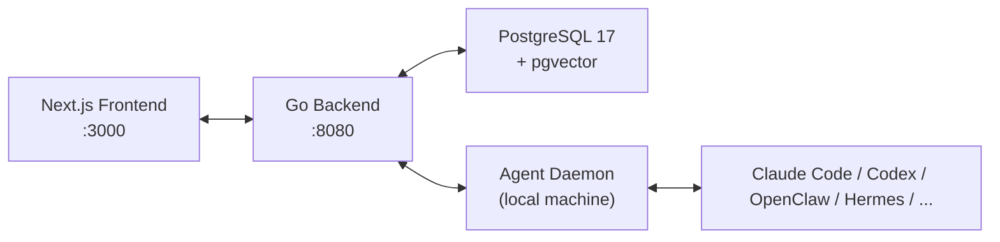

# Multica

**Type:** AI Agent Collaboration Platform
**Website:** https://multica.ai
**GitHub:** https://github.com/multica-ai/multica (26,275 stars)
**License:** Open Source
**Created:** 2026-01-13
**Language:** TypeScript (frontend), Go (backend)

## Overview

Multica is an **open-source managed agents platform** that turns coding agents into real teammates. It provides a task board, agent profiles, skill compounding, and unified runtime management for heterogeneous AI agent CLIs.

The core insight: agents should be first-class teammates — assigned issues, posting comments, reporting blockers — not just prompt targets.

## Architecture



**Frontend:** Next.js 16 (App Router)
**Backend:** Go with Chi router + gorilla/websocket
**Database:** PostgreSQL 17 with pgvector (vector embeddings)
**Agent Runtime:** Local daemon on each team member's machine

## Supported Agent CLIs

| CLI | Command | Provider |
|-----|---------|----------|
| Claude Code | `claude` | Anthropic |
| Codex | `codex` | OpenAI |
| GitHub Copilot CLI | `copilot` | GitHub |
| OpenClaw | `openclaw` | Open-source |
| OpenCode | `opencode` | Anomaly |
| Hermes | `hermes` | Nous Research |
| Gemini CLI | `gemini` | Google |
| Pi | `pi` | Pi |
| Cursor Agent | `cursor-agent` | Cursor |
| Kimi | `kimi` | Moonshot |
| Kiro CLI | `kiro-cli` | Kiro |

## Core Features

### 1. Agents as Teammates
Agents appear on the task board, have profiles, participate in conversations, and report blockers — just like human colleagues.

### 2. Autonomous Execution
Full task lifecycle: `enqueue → claim → start → complete/fail`. WebSocket streaming for real-time progress.

### 3. Reusable Skills
Every solution becomes a reusable skill for the whole team. Skills compound over time.

### 4. Unified Runtimes
One dashboard for all compute — local daemons and cloud runtimes, with auto-detection of available CLIs.

### 5. Multi-Workspace
Workspace-level isolation — each team has its own agents, issues, and settings.

## Self-Hosting

**Two commands:**
```bash
curl -fsSL https://raw.githubusercontent.com/multica-ai/multica/main/scripts/install.sh | bash -s -- --with-server
multica setup self-host
```

Requires: Docker + Docker Compose. Images served from GHCR:
- `ghcr.io/multica-ai/multica-backend:latest`
- `ghcr.io/multica-ai/multica-web:latest`

Login options:
- **Recommended:** Set `RESEND_API_KEY` for email verification codes
- **Without email:** code printed to backend container logs
- **Development:** `APP_ENV=development` + `MULTICA_DEV_VERIFICATION_CODE=888888`

## CLI Reference

| Command | Description |
|---------|-------------|
| `multica setup` | One-command: configure + authenticate + start daemon |
| `multica setup self-host` | Same, for self-hosted |
| `multica daemon start` | Start local agent runtime |
| `multica daemon status` | Check daemon status (PID, uptime, agents, workspaces) |
| `multica daemon logs -f` | Follow daemon logs |
| `multica auth status` | Show current auth state |
| `multica issue list` | List workspace issues |
| `multica issue create` | Create new issue |

## Comparison with Alternatives

### vs Paperclip
| | Multica | Paperclip |
|---|---|---|
| Focus | Team AI collaboration | Solo agent company simulator |
| User model | Multi-user, roles & permissions | Single board operator |
| Agent interaction | Issues + Chat | Issues + Heartbeat |
| Deployment | Cloud-first | Local-first |
| Governance | Lightweight | Heavy (org chart, approvals, budgets) |

### vs Slock.ai
- Slock.ai: Cloud SaaS, agent marketplace, no self-hosting option
- Multica: Open source, self-hostable, multi-agent CLI support

## Related

- [[raw/multica/README]] — Source documentation
- [[github-deer-flow]] — Multi-agent orchestration alternative
- [[github-swarm]] — Parallel worktree orchestration
- [[OpenClaw]] — Supported agent framework
