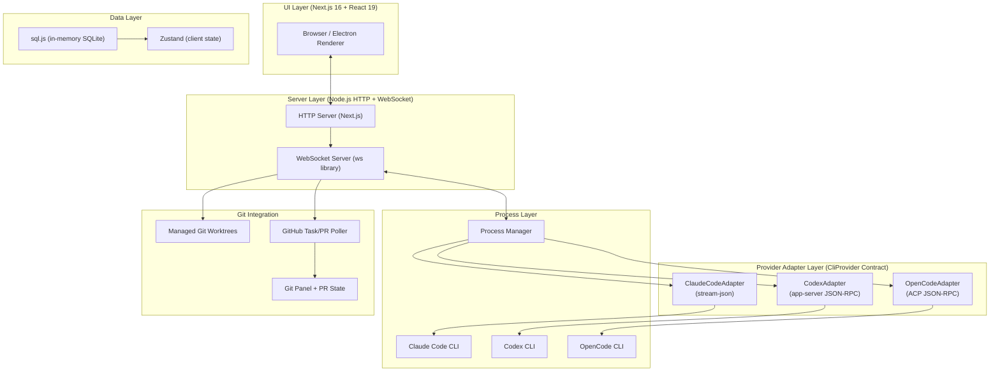

# Tessera

> GitHub: https://github.com/horang-labs/tessera
> Apache-2.0 · v0.1.3 · Horang Labs, Inc.

## 一句话描述

Tessera 是一个开源的 **AI 编码 Agent 可视化工作区**——在浏览器或桌面应用中同时运行 Claude Code、Codex、OpenCode 多个 Agent，配合 Git worktree、Kanban 面板和实时输出观测，实现并行软件工作的可视化指挥。

## 基本信息

| 字段 | 值 |
|------|-----|
| 当前版本 | 0.1.3 |
| License | Apache-2.0 |
| 作者 | Horang Labs, Inc. |
| 入口方式 | CLI (`tessera`) / Desktop (.exe/.dmg) / npm (`@horang-labs/tessera`) |
| Node 要求 | ≥ 20.0.0 |
| npm 要求 | ≥ 10.0.0 |

## 核心架构



**协议归一化层**是架构核心——三个 Adapter 将各自的 CLI 协议（Claude Code `stream-json`、Codex `app-server` JSON-RPC、OpenCode ACP JSON-RPC）统一转换为共享的实时消息模型，前端无感知底层差异。

## 核心子系统

### 1. Provider Adapter 架构 (`src/lib/cli/providers/`)

每个 CLI 对应一个 Adapter，实现 `CliProvider` 接口：

| Adapter | 协议 | 特有能力 |
|---------|------|---------|
| `ClaudeCodeAdapter` | `stream-json` | Permission modes, plan approval, AskUserQuestion, skill discovery |
| `CodexAdapter` | `app-server` JSON-RPC | Approval requests, plan deltas, sandbox controls, reasoning effort |
| `OpenCodeAdapter` | ACP JSON-RPC | OpenCode modes, permission presets, OpenCode model bridge |

Adapter 封装：进程生命周期、协议解析、运行时控制、权限审批、中断、skill 发现。前端只和接口契约打交道。

### 2. 会话与任务管理

- **Session**：Agent 对话记录，含 chat history、tool results、attachments
- **Task**：带 git worktree 的实现任务，可关联 session，有 workflow state
- **Collection**：Task 分组
- **Chat-to-Task**：从探索性对话无缝转入 worktree-backed 实现任务

### 3. Git Worktree 管理 (`src/lib/worktrees/`)

Tessera 不只是看 Agent 输出——它管理实际的 git worktree：

- `managed.ts` — 创建/删除/列出 managed worktrees
- `naming.ts` — worktree 路径命名规则
- `preflight.ts` — 操作前检查
- `git-runner.ts` — 执行 git 命令
- 支持 commit、push、PR 创建/PR merge

### 4. GitHub PR 状态追踪 (`src/lib/github/`)

- `task-pr-poller.ts` — 定期轮询 Task 关联的 PR 状态
- `session-pr-sync.ts` — 同步 Session 的 PR 状态
- `task-pr-broadcast.ts` / `session-pr-broadcast.ts` — 通过 WebSocket 广播给 UI
- 覆盖：PR opened / merged / closed / draft / review-required

### 5. WebSocket 实时通信 (`src/lib/ws/`)

- `wsServer` 基于 `ws` 库，path 为 `/ws`
- 广播：rate limit 状态、PR 状态变更、session 事件、task 状态
- Next.js 16 HMR WebSocket 也走同一 HTTP server

### 6. 桌面端 (Electron 33)

- `electron/main.ts` — 主进程：窗口管理、系统托盘、IPC
- `electron/tray.ts` — 托盘图标 + 菜单
- `electron/preload.ts` — 渲染进程桥接
- Windows 标题栏自定义（40px，含关闭/最小化/最大化）
- 支持 Windows WSL 环境下运行 CLI

## 安装和使用

### npm 浏览器模式

```bash
npm install -g @horang-labs/tessera
tessera                    # 默认 32123 端口
tessera --port 3100        # 指定端口
# 打开 http://127.0.0.1:32123
```

### 桌面端

从 [GitHub Releases](https://github.com/horang-labs/tessera/releases) 下载：
- Windows: `Tessera-${version}-windows-${arch}.exe`（portable）
- macOS: `Tessera-${version}-macos-${arch}.dmg`（签名 + notarized）
- Linux: `Tessera-${arch}.AppImage` / `.deb`

### 前置要求

至少安装一个 CLI 并完成认证：

```bash
claude --version   # Anthropic Claude Code
codex --version    # OpenAI Codex
opencode --version # OpenCode
```

### 开发模式

```bash
git clone https://github.com/horang-labs/tessera.git
cd tessera
npm install
npm run dev         # 开发服务器
npm run electron:dev # Electron 开发模式
```

## 与同类工具对比

| 特性 | Tessera | Continue | Claude Code (raw) |
|------|---------|----------|-------------------|
| 多 Agent 并行 | ✅ 最多 N 个并行面板 | ✅ 多 sub-model | ❌ 单会话 |
| Git worktree 管理 | ✅ 原生 managed worktrees | ❌ | ❌ |
| Kanban 视图 | ✅ | ❌ | ❌ |
| WebSocket 实时 | ✅ | ❌ | ❌ |
| PR 状态追踪 | ✅ 轮询 + 广播 | ❌ | ❌ |
| 协议归一化 | ✅ 三种 CLI 统一接口 | ❌ 专用 | ❌ |
| 桌面打包 | ✅ Electron | ❌ | ❌ |
| 开源 | ✅ Apache-2.0 | ✅ Apache-2.0 | ❌ 闭源 |

## 关键文件索引

| 文件 | 作用 |
|------|------|
| `server.ts` | HTTP + WebSocket 服务端入口 |
| `src/lib/cli/providers/provider-contract.ts` | `CliProvider` 接口定义 |
| `src/lib/cli/providers/bootstrap.ts` | Provider 注册初始化 |
| `src/lib/cli/process-manager.ts` | CLI 进程管理 |
| `src/lib/ws/server.ts` | WebSocket 服务端 |
| `src/lib/worktrees/managed.ts` | Git worktree 生命周期 |
| `src/lib/github/task-pr-poller.ts` | GitHub PR 状态轮询 |
| `electron/main.ts` | Electron 主进程 |
| `bin/tessera.mjs` | CLI 入口脚本 |
| `src/stores/` | Zustand 状态管理 |

## 技术栈一览

```
Frontend:  Next.js 16 (React 19, Tailwind CSS 4, Zustand 5)
Desktop:   Electron 33
Backend:   Node.js HTTP + ws WebSocket
Database:  sql.js (in-memory SQLite)
Auth:      JWT + bcryptjs + RSA key pairs
Logging:   pino + pino-pretty
Markdown:  react-markdown + remark-gfm + rehype-sanitize
Syntax:    Shiki (server-side syntax highlighting)
Animation: framer-motion 12
i18n:      i18next + react-i18next
Build:     electron-builder, Turbopack
```
