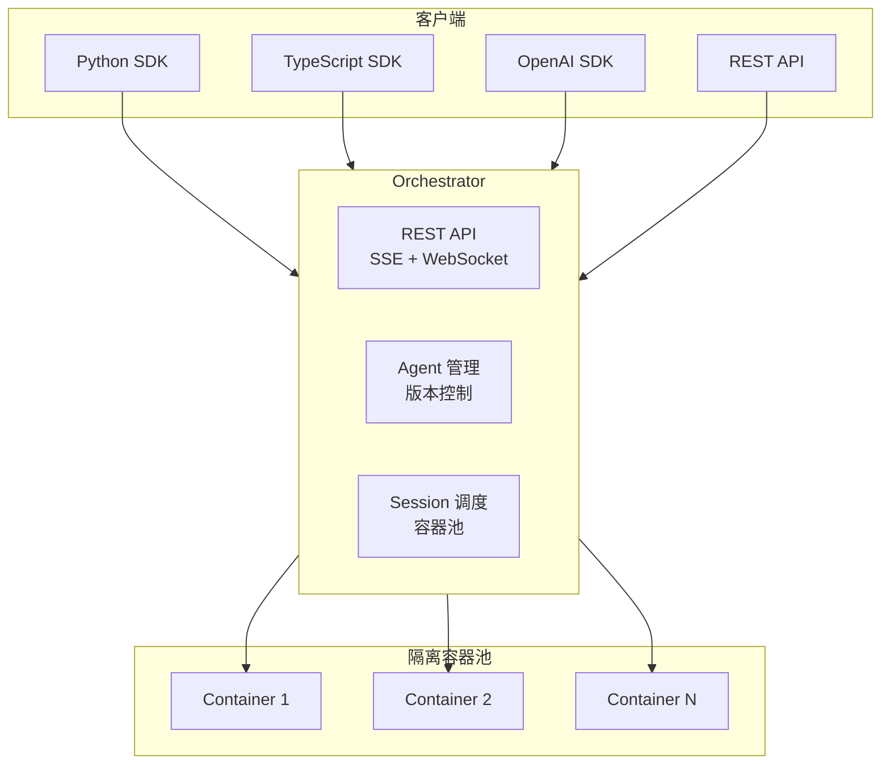

# OpenClaw Managed Agents

> The open alternative to Claude Managed Agents & ChatGPT Workspace Agents. Any model, any cloud, open source.

## 一句话定义

OpenClaw Managed Agents 是 **Claude Managed Agents 的开源替代品**，通过 REST API 提供完整的 Agent 管理能力，支持任意模型（Anthropic、OpenAI、Gemini、Moonshot、DeepSeek 等）、任意云部署、Docker 容器化隔离会话。

## 定位

```
OpenClaw Managed Agents = OpenClaw（Agent 运行时）+ Managed Agents（4 原语 API）
                         = 将 OpenClaw 从个人 AI 助手变成可编程的 Agent 服务
```

## 核心概念：4 原语

| 概念 | 说明 | API |
|------|------|-----|
| **Agent** | 可复用配置：模型、系统提示、工具、MCP 服务器、权限策略 | `POST/GET/PATCH/DELETE /v1/agents` |
| **Environment** | 容器配置：包（pip/apt/npm）、网络策略 | `POST/GET/DELETE /v1/environments` |
| **Session** | 持久化对话，运行在隔离的 Docker 容器中 | `POST/GET/DELETE /v1/sessions` |
| **Event** | 消息、工具调用、思考块、状态变更，SSE 流式输出 | `POST/GET /v1/sessions/:id/events` |

## vs Claude Managed Agents

| | Claude Managed Agents | OpenClaw Managed Agents |
|---|---|---|
| **模型** | Claude only | 任意模型（Anthropic、OpenAI、Gemini、Moonshot、DeepSeek、Mistral、xAI、Bedrock、OpenRouter、Groq 等） |
| **托管** | Anthropic 云 | 任意云或 VPS，只要能跑 Docker |
| **费用** | $0.08/session-hour + Token | 无平台费 |
| **源码** | 闭源 | MIT 开源 |
| **数据** | Anthropic 基础设施 | 你的磁盘、VPC、控制权 |
| **多 Agent/子 Agent** | 研究预览（受限） | GA — 子 Agent 是一等公民，可检查 |
| **子 Agent 可观测性** | 不透明（仅工具结果） | 一等公民 — 每个子会话可通过同一 API 检查 |
| **SDK** | 7 种语言 + CLI | Python + TypeScript + OpenAI 兼容 |
| **Streaming** | 实时 SSE token delta | 实时 SSE token delta |

## 架构



## 核心特性

### 容器隔离

- 每个活跃 Session 运行在独立 Docker 容器中
- cgroup 限制 + 挂载状态
- Session 状态持久化（事件队列 + HMAC 密钥持久化）
- 运行中容器可在 Orchestrator 重启后重新接管

### 并发能力

- 暖池 + 活跃池
- $4/月 Hetzner CAX11 上支持 5-7 并发会话

### 多 SDK 支持

```python
# Python SDK
from openclaw_managed_agents import OpenClawClient
client = OpenClawClient(base_url="http://localhost:8080")
agent = client.agents.create(model="moonshot/kimi-k2.5", instructions="You are helpful.")
session = client.sessions.create(agent_id=agent.agent_id)
```

```python
# OpenAI SDK 兼容
from openai import OpenAI
client = OpenAI(
    base_url="http://localhost:8080/v1",
    api_key="unused",
    default_headers={"x-openclaw-agent-id": "<your-agent-id>"},
)
r = client.chat.completions.create(model="placeholder", messages=[...])
```

## 快速开始

```bash
git clone https://github.com/stainlu/openclaw-managed-agents
cd openclaw-managed-agents

export MOONSHOT_API_KEY=***
docker compose up --build -d

# 创建 Agent
AGENT=$(curl -s -X POST http://localhost:8080/v1/agents \
  -H 'Content-Type: application/json' \
  -d '{"model":"moonshot/kimi-k2.5","instructions":"You are a research assistant."}' \
  | jq -r '.agent_id')

# 打开 Session
SESSION=$(curl -s -X POST http://localhost:8080/v1/sessions \
  -H 'Content-Type: application/json' \
  -d "{\"agentId\":\"$AGENT\"}" | jq -r '.session_id')

# 发送消息
curl -s -X POST "http://localhost:8080/v1/sessions/$SESSION/events" \
  -H 'Content-Type: application/json' \
  -d '{"content":"What is 2+2? Reply with just the number."}'
```

## 发布物

| 制品 | 位置 |
|------|------|
| Orchestrator 镜像 | `ghcr.io/stainlu/openclaw-managed-agents-orchestrator` |
| Agent 运行时镜像 | `ghcr.io/stainlu/openclaw-managed-agents-agent` |
| 限网 egress 代理镜像 | `ghcr.io/stainlu/openclaw-managed-agents-egress-proxy` |
| Telegram 适配器镜像 | `ghcr.io/stainlu/openclaw-managed-agents-telegram-adapter` |
| TypeScript SDK | `@stainlu/openclaw-managed-agents` |
| Python SDK | `openclaw-managed-agents` |
| OpenAPI 规范 | `openapi/openapi.yaml` |

## vs 直接在 VPS 上运行 OpenClaw

AWS Lightsail OpenClaw 蓝图适合个人使用（一个人操作，一个浏览器配对，通过 WhatsApp/Telegram/Discord 聊天）。

OpenClaw Managed Agents 适用于**构建产品**：

| | OpenClaw 直接在 VPS | OpenClaw Managed Agents |
|---|---|---|
| **适用人群** | 单人操作员 | 构建程序化 Agent 产品的开发者 |
| **访问方式** | 浏览器配对 + SSH CLI | HTTP REST + SSE + WebSocket |
| **Sessions** | 1 个共享操作员配对 | N 个持久化 API Sessions |
| **Session 隔离** | 单工作空间 | 每个 Session 独立 Docker 容器 |
| **重启安全** | 个人数据存活；飞行中工作丢失 | 持久化事件队列，容器重新接管 |
| **并发** | 同一时间一人 | 暖池 + 活跃池，5-7 并发 |

## 技术栈

| 层次 | 技术 |
|------|------|
| 语言 | TypeScript + Python |
| 容器 | Docker |
| 协议 | REST + SSE + WebSocket |
| SDK | Python + TypeScript + OpenAI 兼容 |

## 相关页面

- [[Harness Engineering]] — Agent 可靠工作工程化方法论
- [[ai-frameworks/openharness]] — 基于 Harness Engineering 的 24/7 自动执行框架
