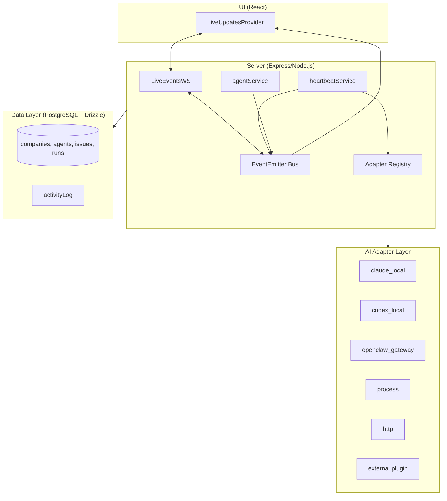
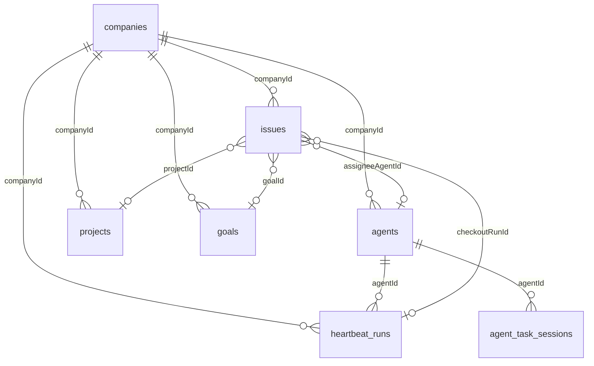

# Paperclip

> Autonomous Agent Orchestration Platform — 自主 Agent 编排平台，通过心跳机制管理 AI Agent 的执行、任务分配和预算治理。

## 一句话定义

Paperclip 是一个**心跳驱动的 Agent 编排平台**（非 Agent 运行时），以公司为租户隔离单位，以 Issue 为工作单元，以心跳为执行粒度，通过适配器层对接各种 Agent 运行时（Claude Code、Codex、OpenClaw 等），提供企业级的治理、预算、审计能力。

## 定位

```
Paperclip = Agent 编排平台（控制平面）
           ≠ Agent 运行时（执行平面）

Paperclip 定义：何时触发心跳、携带什么上下文
适配器决定：Agent 运行多久、做什么
```

## 核心架构



## 心跳机制（Heartbeat）

Agent **不连续运行**，而是以"心跳"为最小执行单位。

### 4种 Wakeup 触发

| 触发类型 | 说明 |
|---------|------|
| `timer` | 定时调度 |
| `assignment` | 任务分配/检出 |
| `on_demand` | 手动按钮/API |
| `automation` | 系统内部自动化 |

> 同一 Agent 正在运行时，新 wakeup 会被**合并**（去重），防止重复执行。

### 心跳生命周期

```
Wakeup → Enqueue(去重合并) → RunExecutor 认领
       → 创建 heartbeatRun 记录
       → Adapter.execute()
       → Agent 运行时输出日志/状态
       → 解析 usage/cost → 更新 DB + 推送 WebSocket
       → Agent 状态置 idle/error
```

### Agent 状态机

```
active → idle ↔ running → error
                    ↓
              paused | terminated
```

## AI 适配器架构

`ServerAdapterModule` 是核心接口，每个适配器实现以下方法：

| 方法/属性 | 作用 |
|----------|------|
| `type` | 标识适配器类型 |
| `execute(ctx)` | 调用 Agent，返回 usage/cost |
| `testEnvironment(ctx)` | 验证运行时环境 |
| `sessionCodec` | 跨心跳的会话序列化 |
| `getConfigSchema()` | UI 配置表单声明 |
| `supportsLocalAgentJwt` | 能力标志 |

### 支持的适配器类型

| 类型 | 示例 | 说明 |
|------|------|------|
| Local CLI | `claude_local`, `codex_local` | 直接运行本地 CLI |
| Gateway | `openclaw_gateway` | WebSocket/HTTP 连接远程 Agent |
| Generic | `process` | 执行任意 shell 命令 |
| Generic | `http` | 向外部 Agent 发 webhook |
| Plugin | 外部 npm 包 | 可分发自定义适配器 |

### 双侧实现

- **Server 侧**：`ServerAdapterModule` — 负责执行
- **UI 侧**：提供 `ConfigFields` + `buildAdapterConfig` — 渲染配置表单

## 实时通信

### 两条独立通道

**1. WebSocket（核心系统事件）**
- 路径：`/api/companies/:companyId/events/ws`
- 服务端：`LiveEventsWS` + Node.js `EventEmitter` in-process 总线
- 按 `companyId` 分发，按部署模式和凭证鉴权
- 保活：每 30s ping/pong

**2. SSE（Plugin UI 流）**
- Plugin Worker → `ctx.streams.emit()` → `PluginStreamBus` → SSE endpoint → `usePluginStream` hook

### 主要事件类型

```
heartbeat.run.queued    心跳已入队
heartbeat.run.status    状态变更
heartbeat.run.event     结构化事件
heartbeat.run.log       stdout/stderr 日志块
agent.status            Agent 状态变化
activity.logged         活动日志（cost.reported / issue.created）
```

## 插件系统

- Plugin 是**独立 Node.js 进程**，通过 **JSON-RPC over stdio** 与主机通信
- 支持**热插拔**：安装/卸载/升级/配置变更无需重启 Paperclip Server
- UI 扩展方式：**Slots**（静态槽位：`page`/`sidebar`/`dashboardWidget`/`detailTab`）+ **Launchers**（动态触发器）
- Agent 工具贡献：Plugin 在 manifest 声明工具（自动以 plugin ID 为 namespace），主机通过 `executeTool` RPC 路由

### 热插拔生命周期

```
Hot Install:  解析 manifest → 启动 Worker → 注册服务 → 挂载 UI
Hot Uninstall: 优雅关闭 Worker → 清理路由表 → 卸载 UI
Hot Upgrade:   关闭旧 Worker → 启动新 → 原子 swap 注册 → 刷新资产
Hot Config:   写配置 → 发 configChanged 通知 → 热更新或自重启
```

## 数据库模型

核心实体关系：



### 任务状态机

```
backlog → todo → in_progress → in_review → done
                      ↓              ↓
                  blocked       cancelled
```

关键：`checkoutRunId` 实现任务的**原子检出锁**，防止并发重复分配。

## Monorepo 结构

```
paperclipai/paperclip/
├── cli/                    # paperclipai npm CLI 入口
├── server/                 # @paperclipai/server（Express 后端）
├── ui/                     # @paperclipai/ui（React 前端）
└── packages/
    ├── shared/             # 共享类型、Zod schemas、constants
    ├── db/                 # Drizzle ORM、embedded-postgres、migrations
    ├── adapter-utils/      # ServerAdapter 接口定义
    ├── mcp-server/         # MCP bridge（薄封装，对接 REST API）
    └── adapters/           # 各 Agent 适配器（claude-local、codex-local 等）
```

## 技术选型

| 层次 | 技术 |
|------|------|
| 后端框架 | Express + Node.js |
| 数据库 | PostgreSQL + Drizzle ORM |
| 实时通信 | WebSocket（核心事件）+ SSE（Plugin 流）|
| 多租户隔离 | company 为根，所有实体按 companyId 隔离 |
| 适配器生态 | 内置 + 外部 npm plugin |
| MCP | `@paperclipai/mcp-server` 作为 REST API 的 MCP 桥接 |
| 部署 | Docker，支持 Untrusted PR Review |

## 与 Multica 的定位对比

| 维度 | Paperclip | Multica |
|------|----------|---------|
| 核心机制 | 心跳驱动（定时触发） | 连续运行 |
| 架构 | 编排平台（控制平面） | 队友平台（执行+编排） |
| 适配器 | 多 runtime 适配器层 | 内置 + SDK 扩展 |
| 租户模型 | 多公司隔离 | 单公司 |
| 预算治理 | 月度预算 + 成本追踪 | 无 |

## 相关页面

- [[Multica]] — 开源多 Agent 队友平台
- [[Agent Review Pattern]] — Agent 审 Agent 的机制
- [[Harness Engineering]] — 让 Agent 可靠工作的工程化方法论
