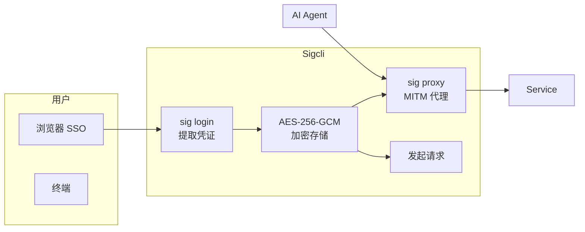

# Sigcli

> Authentication CLI & Proxy for AI agents. Give agents access, not your credentials.

## 一句话定义

Sigcli 是一个**AI 代理身份认证工具**，通过浏览器 SSO 或 OAuth2 自动注入凭证，让 AI Agent 能够在不知道密码的情况下代表用户操作内部系统（Jira、Wiki、日历等）。

## 定位

```
Sigcli = 代理身份认证层
         ≠ AI Agent 框架
         ≠ 凭据存储库

核心价值：AI Agent 需要访问你的内部系统，但不该看到你的密码
```

## 核心特性

### 浏览器 SSO 认证

| 步骤 | 操作 |
|------|------|
| 1 | 用户在真实浏览器中完成 SSO 登录（支持 MFA、任何登录流程） |
| 2 | Sigcli 提取凭证（Cookie、localStorage 等） |
| 3 | 凭证用 AES-256-GCM 加密存储到 `~/.sig/credentials/` |
| 4 | AI Agent 通过 `sig request` 发起请求，凭证自动注入 |

### OAuth2 客户端凭证模式

无需浏览器，自动完成 Token 交换、过期检测、静默刷新：

```bash
sig login https://api.example.com \
  --strategy oauth2 \
  --token-url https://oauth.example.com/token \
  --client-id test-client \
  --client-secret test-secret
```

### 安全特性

| 特性 | 说明 |
|------|------|
| **AES-256-GCM 加密** | 所有凭证静态加密 |
| **审计日志** | 每次访问均有记录 |
| **MITM 代理模式** | 设置 `HTTP_PROXY` 后凭证透明注入，零信任 |
| **声明式配置** | 定义提取规则（`extract[]`）和应用规则（`apply[]`） |

### 多 Provider 支持

```bash
sig request https://jira.example.com/rest/api/2/myself
sig request https://jira.example.com/rest/api/2/search --method POST --body '{"jql":"assignee=currentUser()"}'
```

## 架构



## 与 AI Agent Skills 集成

Sigcli 提供预构建的 Python 脚本，让 AI Agent 能够操作 14+ Web 服务：

- 邮件 (Gmail, Outlook)
- 聊天 (Slack, Discord)
- 论坛 (Reddit, V2EX)
- 视频平台 (YouTube)
- 社交网络 (X/Twitter, LinkedIn, Zhihu)

## 安装

```bash
npm install -g @sigcli/cli
sig init
sig login https://jira.example.com
```

## 技术栈

| 层次 | 技术 |
|------|------|
| 语言 | TypeScript |
| 加密 | AES-256-GCM |
| 协议 | OAuth2、HTTP(S) Proxy |

## 对比

| | Sigcli | 直接传密码 | 环境变量 |
|---|---|---|---|
| **安全性** | ✅ AES-256-GCM 加密 | ❌ 明文 | ❌ 明文 |
| **SSO 支持** | ✅ 浏览器完成 | ❌ | ❌ |
| **Token 刷新** | ✅ 自动 | ❌ | ❌ |
| **审计日志** | ✅ | ❌ | ❌ |
| **AI Native** | ✅ 稳定 CLI + JSON | ❌ | ❌ |

## 相关页面

- [[Harness Engineering]] — Agent 可靠工作工程化方法论
- [[agent-platforms/openclaw-managed-agents]] — OpenClaw 托管 Agent 平台
