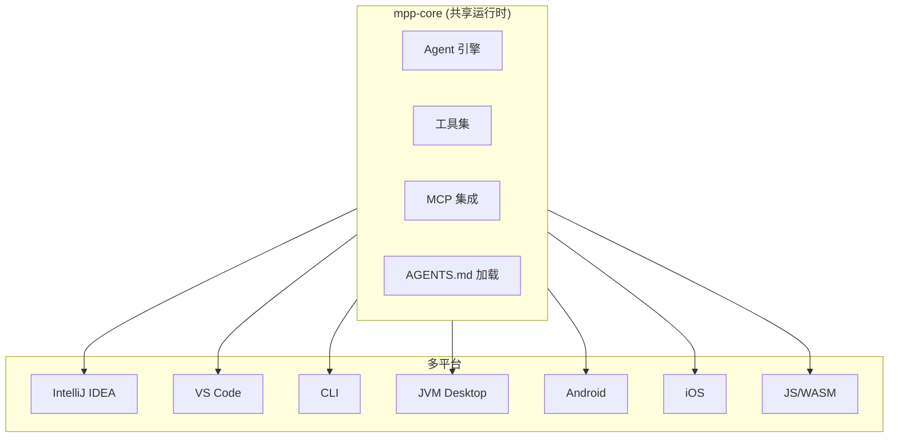

# AutoDev Xiuper

> AI-native Multi-Agent development platform built on Kotlin Multiplatform, covering all 7 phases of SDLC.

## 一句话定义

AutoDev Xiuper 是一个**AI 原生多 Agent 开发平台**，基于 Kotlin Multiplatform 构建，覆盖软件开发生命周期（SDLC）的全部 7 个阶段，支持 IntelliJ IDEA、VS Code、CLI、Desktop JVM、Android、iOS、JS/WASM Web 等全平台。

## 定位

```
AutoDev = AI-native 开发平台
         + 多 Agent 协作
         + 全生命周期覆盖

核心特点：统一平台 · 全开发阶段 · 跨全设备
```

## 核心架构



## 模块状态

| 模块 | 平台 | 状态 | 说明 |
|------|------|------|------|
| **mpp-core** | 共享 KMP 运行时 | ✅ | 共享 Agent 引擎、工具、MCP 集成 |
| **mpp-ui** | Desktop/Android/iOS/JS/WASM | ✅ | 主多平台 UI 入口 |
| **mpp-server** | JVM server | ✅ | Ktor 远程编码 Agent 服务器 |
| **mpp-idea** | IntelliJ IDEA | ✅ | IDEA 插件，含专用渲染器和工具窗口 |
| **mpp-vscode** | VS Code | ✅ | 独立包，基于 mpp-core JS 绑定 |
| **mpp-viewer** | 共享 viewer | ✅ | 图表/viewer 支持 |
| **mpp-ios** | iOS | 🔄 | iOS 包装器和构建脚本 |
| **mpp-web** | Landing/demo web | 🔄 | Vite landing 页和 demo 入口 |

## 内置 Agent

| Agent | 领域 | 说明 | 能力 | 状态 |
|-------|------|------|------|------|
| **DocumentAgent** | 需求/研究 | 文档查询和特性树生成 | DocQL / 分析子 Agent / 特性树 | ✅ |
| **CodingAgent** | 开发 | 带工作空间工具的编码 Agent | 文件系统 / Shell / MCP / 子 Agent / AGENTS.md | ✅ |
| **CodeReviewAgent** | 代码审查 | 审查、Lint 汇总、修复生成 | Linter / Diff 审查 / PR 审查服务 | ✅ |
| **ChatDBAgent** | 数据 | 自然语言数据库交互 | Schema 链接 / SQL 生成 / SQL 修订 | ✅ |
| **ArtifactAgent** | 快速原型 | 自包含可运行输出生成 | HTML / React / Node.js / Python / SVG / Mermaid | ✅ |
| **Web Agent** | Web 交互 | Web 交互能力 | 页面检查 / DOM 上下文 / 聊天辅助操作 | 🔄 |

## 子 Agent

| 子 Agent | 用途 | 关键特性 |
|---------|------|----------|
| **NanoDSL Agent** | 从自然语言描述生成 AI 原生 UI 代码 | Token 高效 DSL / 组件生成 / 状态管理 |
| **PlotDSL Agent** | 从自然语言生成统计图表 | ggplot2 风格语法 / 多图表类型 / 主题 |
| **Chart Agent** | 为 ComposeCharts 库生成图表配置 | Pie/Line/Column/Row / 数据分析 |
| **Analysis Agent** | 智能分析任意类型内容 | 内容类型检测 / 智能汇总 / 元数据提取 |
| **Codebase Investigator** | 调查代码库结构、模式、依赖 | 架构分析 / 模式检测 / 依赖映射 |
| **Domain Dict Agent** | 从代码库分析生成领域字典 | 热文件检测 / 类/方法提取 / 领域术语识别 |
| **Error Recovery Agent** | 分析错误并提供自愈修复建议 | 错误模式识别 / 修复建议 / 自动重试 |
| **SQL Revise Agent** | 根据 Schema 和执行反馈修订 SQL | Schema 感知纠正 / 查询优化 |
| **E2E Testing Agent** | 端到端测试 | 自然语言测试场景生成 / 多模态感知 / 自愈 |

## 核心特性

- **统一 KMP 运行时**：JVM、Android、iOS、JS、WASM 共享 Agent/运行时代码
- **项目规则感知**：自动发现 `AGENTS.md` 并从项目层级注入提示
- **子 Agent 架构**：分析、错误恢复、NanoDSL、图表、代码库调查、SQL 修订、Web Agent
- **IDE 工作流**：PR 审查、预推送审查、图表相关审查、聊天历史、Token 使用、模型/工具配置 UI
- **Agent 生态系统**：MCP、A2A agent commands、Claude Skill 加载、SpecKit 命令集成
- **多 LLM 支持**：OpenAI、Anthropic、Google、DeepSeek、Ollama 等
- **代码智能**：基于 Tree-sitter 的解析（Java、Kotlin、Python、JS/TS、Go、Rust、C#）
- **国际化**：中文/英文完整支持

## 技术栈

| 层次 | 技术 |
|------|------|
| 语言 | Kotlin Multiplatform |
| 框架 | Ktor (server), React 19 (UI) |
| IDE | IntelliJ IDEA Plugin, VS Code Extension |
| License | MPL-2.0 |

## 安装

- **IntelliJ IDEA**: [JetBrains Marketplace](https://plugins.jetbrains.com/plugin/29223-autodev-experiment)
- **VS Code**: [Visual Studio Marketplace](https://marketplace.visualstudio.com/items?itemName=Phodal.autodev)
- **CLI**: `npm install -g @xiuper/cli`
- **Web**: [web.xiuper.com](https://web.xiuper.com/)

## 相关页面

- [[Harness Engineering]] — Agent 可靠工作工程化方法论
- [[ai-frameworks/openharness]] — 24/7 自动执行框架
