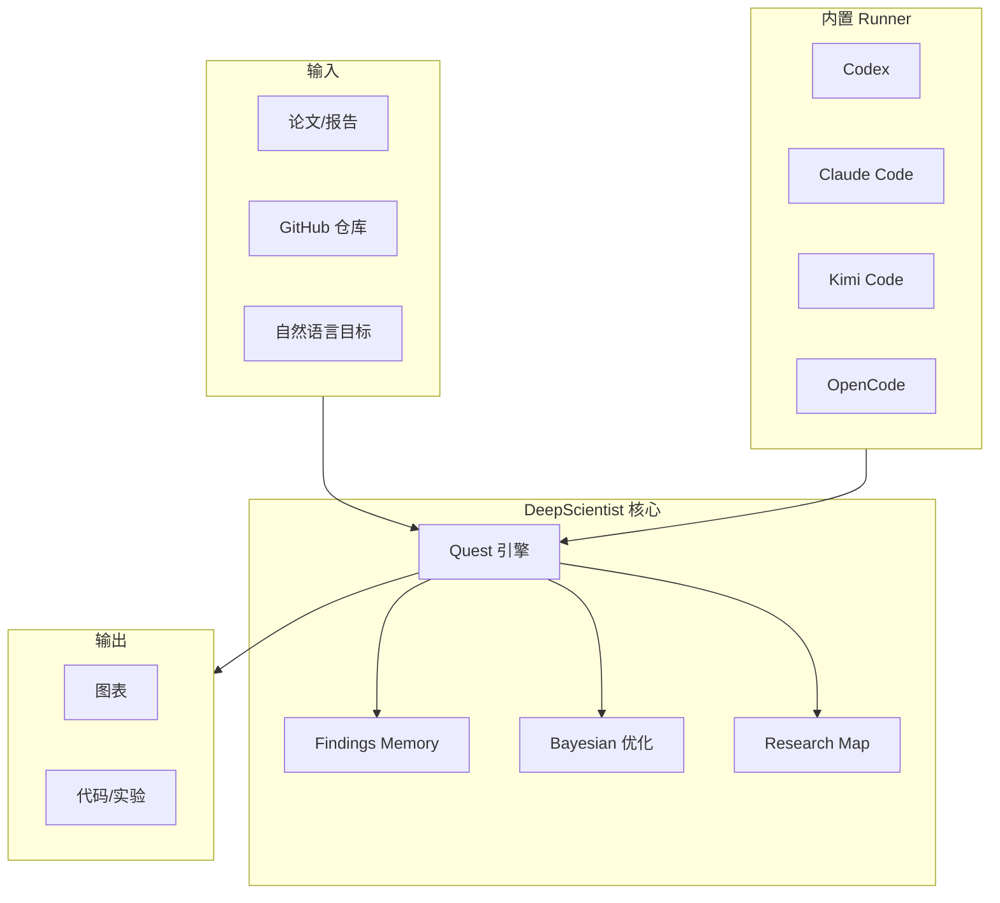

# DeepScientist

> Local-first autonomous research studio. Turn fragmented, repetitive, easy-to-lose research work into a local AI workspace that can keep moving, keep accumulating, and keep getting stronger over time.

## 一句话定义

DeepScientist 是一个**本地优先的自主研究工作室**，区别于一次性 AI Scientist 系统，它能在你的机器上保持完整的研究循环持续运转——从基线、实验轮到论文就绪输出，10 分钟完成 setup。

## 定位

```
DeepScientist = 本地优先研究工作室
              ≠ 一次性 AI Scientist
              ≠ autoresearch 风格系统

核心价值：让研究工作持续运转、持续积累、持续变强
```

## 核心特性

### 本地优先

- 代码、实验、草稿、项目状态默认保留在你的机器或服务器上
- 对未发表的想法、敏感的实验历史、长期研究循环尤其有价值

### 每任务一仓库

- 每个任务是一个真实的 Git 仓库
- 分支、工作树、文件自然表达研究结构

### 过程可检查

- 不仅给你输出
- 你可以检查它读了什么、改变了什么、保留了什么、下一步计划什么

### 内置人类协作

- DeepScientist 可以自主移动
- 你也可以随时介入、编辑、重定向、交接控制权

## 能力范围

### 1. 从论文或研究问题启动真实项目

- 输入核心论文、GitHub 仓库或自然语言研究目标
- 把它变成可执行的任务，而非几轮后丢失状态的聊天

### 2. 再现基线并保持可复用

- 恢复仓库、准备环境、处理依赖
- 保存什么坏了、什么修复了、哪些步骤可信

### 3. 持续运行实验而非一次通过

- 从现有结果提出下一个假设
- 分支、消融、比较、记录结论
- 将失败的路径作为资产保留

### 4. 将结果转化为可交付物

- 整理发现、结论、分析
- 产出图表、报告、论文草稿
- 支持本地 PDF 和 LaTeX 编译工作流

### 5. 多界面跟踪同一研究

- 浏览器中的 Web 工作空间
- 远程服务器的 TUI 工作流
- 外部连接器（协作和进度更新）

### 支持的连接器

- Weixin、QQ、Telegram、WhatsApp、Feishu、Lingzhu/Rokid

## 架构



## 内置 Runner

| Runner | 说明 |
|--------|------|
| **codex** | 使用已安装的 Codex CLI |
| **claude** | 使用已安装的 Claude Code CLI |
| **kimi** | 使用已安装的 Kimi Code CLI |
| **opencode** | 使用已安装的 OpenCode CLI |

## 快速开始

```bash
npm install -g @researai/deepscientist

# 推荐首次运行（Codex）
codex login
ds --here

# 或使用 Claude Code
ds --here --runner claude
```

## ICLR 2026 Top 10 论文

DeepScientist 在 ICLR 2026 中获得 Top 10，论文地址：https://openreview.net/forum?id=cZFgsLq8Gs

## 技术栈

| 层次 | 技术 |
|------|------|
| 语言 | TypeScript |
| 运行时 | Node.js |
| License | Apache-2.0 |

## 适用场景

✅ **适合**：
- 希望复现论文并超越现有基线的研究生和工程师
- 运行长期实验循环、消融、结构化结果分析的实验室或研究团队
- 希望代码、实验、笔记、写作活在同一工作空间的人
- 不想把未发表的想法和中间结果直接交给纯云工作流的人

❌ **不适合**：
- 简单的一次性研究任务
- 需要即时云端算力的场景

## 相关页面

- [[Harness Engineering]] — Agent 可靠工作工程化方法论
- [[ai-frameworks/openharness]] — 24/7 自动执行框架
