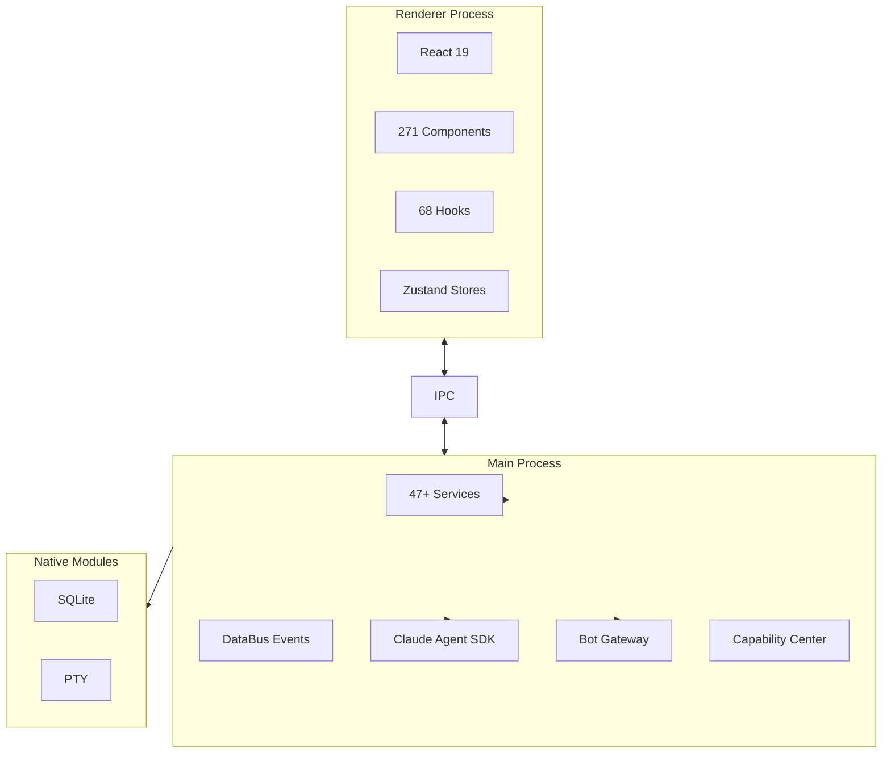

# OpenCow

> One task, one agent, delivered. The open-source platform for task-driven autonomous AI agents.

## 一句话定义

OpenCow 是一个**任务驱动的自主 AI Agent 平台**，每个任务分配一个专属 Agent（功能、报告、审计、活动并行交付），全平台 Electron 构建，本地优先，零遥测。

## 定位

```
OpenCow = 任务 → Agent 管道
         + 团队知识管理
         + 多 IM 平台集成

核心价值：1 Task = 1 Agent，15+ 任务并行
```

## 核心特性

### 任务到 Agent 管道

| 步骤 | 说明 |
|------|------|
| **Create** | 写任务描述交付物（活动、报告、功能、审计），不是 prompt。OpenCow 链接完整上下文：项目文件、先前工作、相关任务 |
| **Dispatch** | 每个任务一个 Agent，拥有完整上下文：项目知识、团队 playbook、组织标准 |
| **Deliver** | Agent 自主研究、草稿、构建、发布。实时进度，即时通知，每步审批门控 |

### 1:1 任务映射

```
1 Task = 1 Agent
     = 完整上下文
     = 完整可追溯性
     = 零歧义
```

### 本地优先

- 一切运行在你的机器上
- 零遥测、零云端
- 你的数据绝不离开

### 15+ 并行 Agent

- 同时交付 15+ 任务
- 可暂停和恢复任意 Agent，不丢失上下文

### 4 层深度上下文引擎

每个 Agent 继承：
1. 组织知识
2. 项目上下文
3. 团队标准
4. 任务特定指令

## 平台能力

### Agent 智能

- 自定义 Skills
- 6 种能力类型
- 自动同步标准

### Agent 命令中心

- 实时仪表板
- 跟踪每个 Agent 的进度和操作
- 审批交付物

### 工作在任何地方

- 从 Telegram、Discord、WeChat、Lark 分发 Agent
- 调度循环工作流
- 通过 Webhook 通知

## 平台内置

| 分类 | 能力 |
|------|------|
| **Task & Agent Core** | 任务追踪、Agent 仪表板、实时监控、多项目 |
| **Intelligence** | 智能中心、市场、内置浏览器、工件 |
| **Automation** | 调度、Webhook、通知、实时预览 |
| **Command & Control** | IM 命令、终端、命令面板、主题 |

## 架构



## 安全模型

- `contextIsolation: true` — renderer 无法访问 Node.js
- `nodeIntegration: false` — 无直接模块加载
- Type-safe IPC bridge via `contextBridge.exposeInMainWorld`
- 沙盒化文件访问 + 显式路径白名单
- 独立数据目录：dev (`~/.opencow-dev`) 和生产 (`~/.opencow`)

## 技术栈

| 层次 | 技术 |
|------|------|
| Desktop | Electron 40 |
| UI | React 19 + Tailwind CSS 4 |
| Language | TypeScript (strict, zero `any`) |
| State | Zustand |
| Build | electron-vite (Vite) |
| Database | SQLite via Kysely |
| Terminal | xterm.js + WebGL |
| Editor | Monaco Editor |
| AI | Claude Agent SDK + Codex SDK + MCP |

## 快速开始

### 从源码构建（贡献者）

```bash
git clone https://github.com/OpenCowAI/opencow.git
cd opencow
pnpm install
pnpm dev
```

### 下载应用

从 [opencow.ai/download](https://opencow.ai/download) 获取最新版本——免费、开源、60 秒就绪。

## 项目结构

```
opencow/
├── electron/
│   ├── main.ts
│   ├── preload.ts
│   ├── services/           # 47+ 后端服务
│   │   ├── capabilityCenter/
│   │   ├── schedule/
│   │   ├── messaging/
│   │   └── git/
│   ├── database/
│   ├── sources/
│   └── ipc/
├── src/
│   ├── renderer/
│   │   ├── components/      # 32 功能模块，271 组件
│   │   ├── hooks/           # 68 自定义 React hooks
│   │   ├── stores/          # 18 Zustand 领域 stores
│   │   └── locales/         # i18n (en-US, zh-CN)
│   └── shared/
├── tests/
├── docs/                   # 520+ 设计文档
└── resources/
```

## 相关页面

- [[Harness Engineering]] — Agent 可靠工作工程化方法论
- [[agent-platforms/openclaw-managed-agents]] — OpenClaw 托管 Agent 平台
