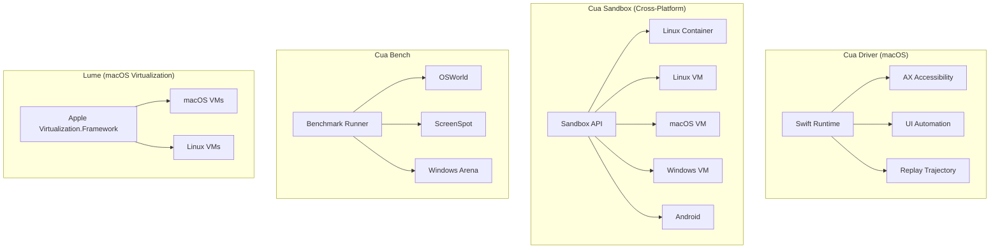

# Cua

**Type:** Computer-Use Agent Infrastructure
**Website:** https://cua.ai
**GitHub:** https://github.com/trycua/cua (16,749 stars)
**License:** MIT
**Created:** 2025-01-31
**Language:** Python (SDK), Swift (macOS driver), HTML (docs)

## Overview

Cua is an **open-source infrastructure for Computer-Use Agents** that provides sandboxes, SDKs, and benchmarks to train and evaluate AI agents capable of controlling full desktops (macOS, Linux, Windows). The name "Cua" comes from the organization's name "trycua" and the project aims to be a comprehensive platform for building, benchmarking, and deploying computer-use agents.

## Architecture



## Core Components

### 1. Cua Driver — Background Computer-Use on macOS

Drive any native macOS app **in the background** — agents click, type, and verify without stealing the cursor, focus, or Space. Works on non-AX surfaces like Chromium web content and canvas-based tools (Blender, Figma, DAWs, game engines).

```bash
/bin/bash -c "$(curl -fsSL https://raw.githubusercontent.com/trycua/cua/main/libs/cua-driver/scripts/install.sh)"
```

Features:
- Background operation without cursor interference
- Full macOS app control including non-accessible surfaces
- CLI and MCP server for Claude Code, Cursor, and custom clients
- Replayable trajectory recording

### 2. Cua — Agent-Ready Sandboxes for Any OS

Build agents that see screens, click buttons, and complete tasks autonomously. One API for any VM or container image — cloud or local.

```bash
pip install cua
```

```python
from cua import Sandbox, Image

async with Sandbox.ephemeral(Image.linux()) as sb:
    result = await sb.shell.run("echo hello")
    screenshot = await sb.screenshot()
    await sb.mouse.click(100, 200)
    await sb.keyboard.type("Hello from Cua!")
```

**Platform Support:**

| | Linux container | Linux VM | macOS | Windows | Android | BYOI |
|--|----------------|----------|-------|---------|---------|------|
| **Cloud (cua.ai)** | ✅ | ✅ | ✅ | ✅ | ✅ | 🔜 soon |
| **Local (QEMU)** | ✅ | ✅ | ✅ | ✅ | ✅ | ✅ |

### 3. CuaBot — Co-op Computer-Use for Any Agent

`cuabot` gives any coding agent a seamless sandbox for computer-use. Individual windows appear natively on your desktop with H.265 video, shared clipboard, and audio.

```bash
npx cuabot                 # Setup onboarding
cuabot claude              # Claude Code
cuabot openclaw            # OpenClaw in the sandbox
```

Built-in support for `agent-browser` and `agent-device` (iOS, Android).

### 4. Cua-Bench — Benchmarks & RL Environments

Evaluate computer-use agents on OSWorld, ScreenSpot, Windows Arena, and custom tasks. Export trajectories for training.

```bash
cd cua-bench
uv tool install -e . && cb image create linux-docker
cb run dataset datasets/cua-bench-basic --agent cua-agent --max-parallel 4
```

### 5. Lume — macOS Virtualization

Create and manage macOS/Linux VMs with near-native performance on Apple Silicon using Apple's Virtualization.Framework.

```bash
/bin/bash -c "$(curl -fsSL https://raw.githubusercontent.com/trycua/cua/main/libs/lume/scripts/install.sh)"
lume run macos-sequoia-vanilla:latest
```

## Packages

| Package | Description |
|---------|-------------|
| [cuabot](https://docs.trycua.com/cuabot/guide/getting-started/introduction) | Multi-agent computer-use sandbox CLI |
| [cua-agent](https://cua.ai/docs/cua/reference/agent-sdk) | AI agent framework for computer-use tasks |
| [cua-sandbox](https://cua.ai/docs/cua/reference/sandbox-sdk) | SDK for creating and controlling sandboxes |
| [cua-computer-server](https://cua.ai/docs/cua/reference/sandbox-sdk) | Driver for UI interactions and code execution in sandboxes |
| [cua-bench](https://cua.ai/docs/cuabench) | Benchmarks and RL environments for computer-use |
| [lume](https://cua.ai/docs/lume) | macOS/Linux VM management on Apple Silicon |
| [lumier](https://cua.ai/docs/lume/guide/advanced/lumier) | Docker-compatible interface for Lume VMs |

## Related

- [[raw/cua/README]] — Source documentation
- [[OpenHands]] — Similar computer-use agent platform
- [[agent-platforms/openspawn]] — Agent spawning system
