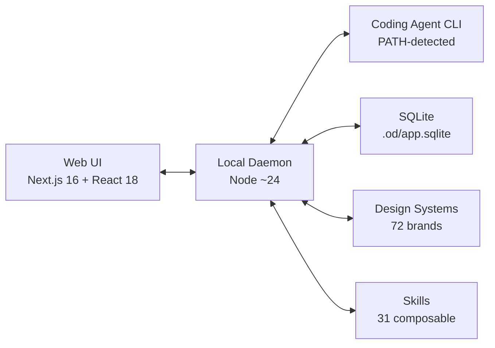

# Open Design

**Type:** AI Design Tool / Coding Agent UI
**Website:** https://github.com/nexu-io/open-design
**GitHub:** https://github.com/nexu-io/open-design (open-source)
**License:** Apache-2.0
**Version:** 0.3.0
**Language:** TypeScript / Node.js (~24)
**Package Manager:** pnpm (10.33.2)

## Overview

Open Design is a **local-first, open-source design product** that positions existing coding agents (Claude Code, Codex, Cursor Agent, etc.) as the design engine. It auto-detects 13 coding-agent CLIs on your `PATH`, runs composable design skills + brand design systems, and streams artifacts into a sandboxed preview iframe — positioned as "the open-source alternative to Claude Design."

Key differentiator: it doesn't ship its own agent. The strongest coding agents already live on your laptop; Open Design wires them into a skill-driven design workflow with a discovery-first prompt stack.

## Supported Coding Agent CLIs

|| CLI | Provider |
|----|-----|----------|
| Claude Code | `claude` | Anthropic |
| Codex CLI | `codex` | OpenAI |
| Devin for Terminal | `devin` | Cognius |
| Cursor Agent | `cursor-agent` | Cursor |
| Gemini CLI | `gemini` | Google |
| OpenCode | `opencode` | Anomaly |
| Qwen Code | `qwen` | Alibaba |
| GitHub Copilot CLI | `copilot` | GitHub |
| Hermes | `hermes` | Nous Research |
| Kimi CLI | `kimi` | Moonshot |
| Pi | `pi` | Pi |
| Kiro CLI | `kiro-cli` | Kiro |
| Mistral Vibe CLI | `mistral-vibe` | Mistral |

**BYOK Fallback:** OpenAI-compatible API proxy at `/api/proxy/{anthropic,openai,azure,google}/stream` — paste `baseUrl` + `apiKey` + `model` for Anthropic / OpenAI / Azure OpenAI / Google Gemini. Internal-IP/SSRF blocked at daemon edge.

## Architecture

### Components

| Component | Description |
|-----------|-------------|
| `apps/web` | Next.js 16 App Router + React 18 web runtime |
| `apps/daemon` | Local privileged daemon + `od` CLI bin; owns `/api/*`, agent spawning, skills, design systems, artifacts |
| `apps/desktop` | Electron shell with sandboxed renderer + sidecar IPC |
| `packages/contracts` | Pure TypeScript web/daemon app contract layer |
| `packages/sidecar-proto` | Open Design sidecar business protocol |
| `packages/sidecar` | Generic sidecar runtime |
| `packages/platform` | Generic OS process primitives |
| `tools/dev` | Local development lifecycle control plane |
| `tools/pack` | Packaged build/start/stop/logs control plane |

### Key Protocol

- **Sidecar stamps:** Exactly five fields: `app`, `mode`, `namespace`, `ipc`, `source`
- **IPC sockets:** Fixed at `/tmp/open-design/ipc/<namespace>/<app>.sock`
- **Runtime files:** Under `<project-root>/.tmp/<source>/<namespace>/...`

## Built-in Design Systems

**129 total:**
- 2 hand-authored starters
- 70 product systems (Linear, Stripe, Vercel, Airbnb, Tesla, Notion, Anthropic, Apple, Cursor, Supabase, Figma, Xiaohongshu, …) from `awesome-design-md`
- 57 design skills from `awesome-design-skills` added under `design-systems/`

## Built-in Skills (31 total)

**Prototype mode (27):** web-prototype, saas-landing, dashboard, mobile-app, gamified-app, social-carousel, magazine-poster, dating-web, sprite-animation, motion-frames, critique, tweaks, wireframe-sketch, pm-spec, eng-runbook, finance-report, hr-onboarding, invoice, kanban-board, team-okrs, …

**Deck mode (4):** guizang-ppt · simple-deck · replit-deck · weekly-update

Grouped in the picker by `scenario`: design / marketing / operation / engineering / product / finance / hr / sale / personal.

## Design Workflow

1. User picks a **skill** + **design system** + types the brief
2. **Discovery form** pops up (surface, audience, tone, brand context, scale) — locks the brief before model freestyle
3. **Direction picker** (if no brand): 5 curated schools (Editorial Monocle · Modern Minimal · Warm Soft · Tech Utility · Brutalist Experimental) — each ships deterministic OKLch palette + font stack
4. **Live TodoWrite** plan streams into UI — `in_progress` → `completed` updates in real time
5. Daemon builds real on-disk project folder with seed template + layout library + self-check checklist
6. Agent runs five-dimensional critique against its own output
7. **`<artifact>`** renders in sandboxed srcdoc iframe — downloadable as HTML / PDF / ZIP

## Visual Directions

| School | Palette | Feel |
|--------|---------|------|
| Editorial Monocle | OKLch-based | Sophisticated, print-like |
| Modern Minimal | OKLch-based | Clean, restrained |
| Warm Soft | OKLch-based | Approachable, friendly |
| Tech Utility | OKLch-based | Functional, technical |
| Brutalist Experimental | OKLch-based | Raw, bold |

## Media Generation

Integrated via prompt-templates:
- **gpt-image-2** (Azure / OpenAI): posters, avatars, infographics, illustrated maps
- **Seedance 2.0** (ByteDance): 15s text-to-video and image-to-video
- **HyperFrames** (heygen-com/hyperframes): HTML→MP4 motion graphics

**93 ready-to-replicate prompts:** 43 gpt-image-2 + 39 Seedance + 11 HyperFrames.

## Persistence

SQLite at `.od/app.sqlite`: projects · conversations · messages · tabs · saved templates.

## CLI Reference

| Command | Description |
|---------|-------------|
| `pnpm tools-dev` | Start local development (daemon + web + desktop) |
| `pnpm tools-dev start web` | Start web only |
| `pnpm tools-dev status --json` | Check runtime status |
| `pnpm tools-dev logs --json` | View daemon logs |
| `pnpm tools-dev stop` | Stop all services |
| `pnpm typecheck` | TypeScript validation |
| `pnpm test` | Run tests |
| `pnpm build` | Build web app |

## Compared to Claude Design

| | Open Design | Claude Design |
|---|-------------|---------------|
| Agent | BYOK — use any CLI on PATH | Anthropic-only |
| Deployment | Local-first, Vercel-deployable | Cloud-only |
| Skills | 31 composable, open | Closed, paid-only |
| Design Systems | 129 built-in, brand-grade | Limited |
| License | Apache-2.0 | Proprietary |
| Self-host | Yes | No |

## Related

- [[raw/open-design/README]] — Source README
- [[agent-platforms/Multica]] — Agent collaboration platform (related project)
- [[Cua]] — Computer-use agent infrastructure
