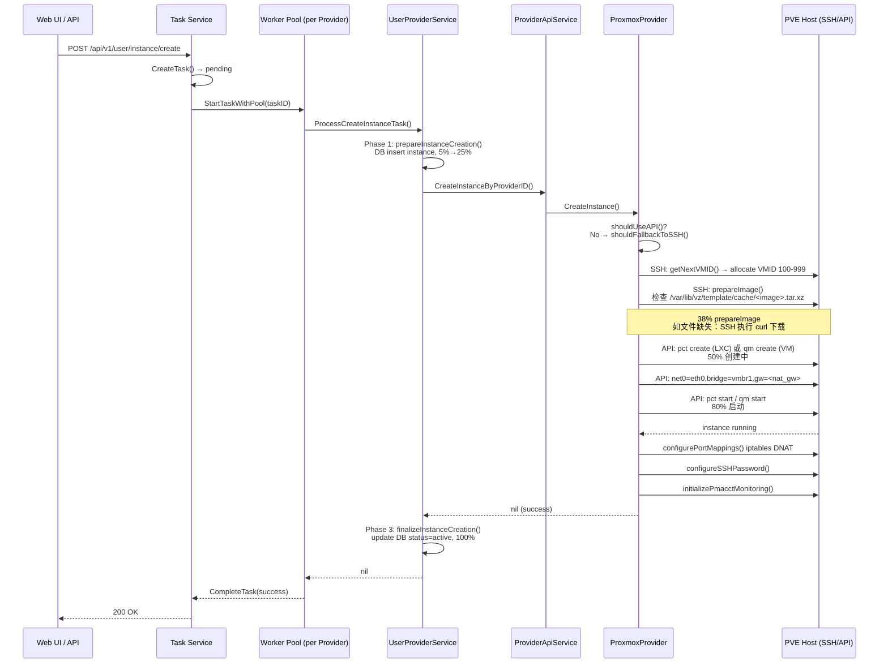
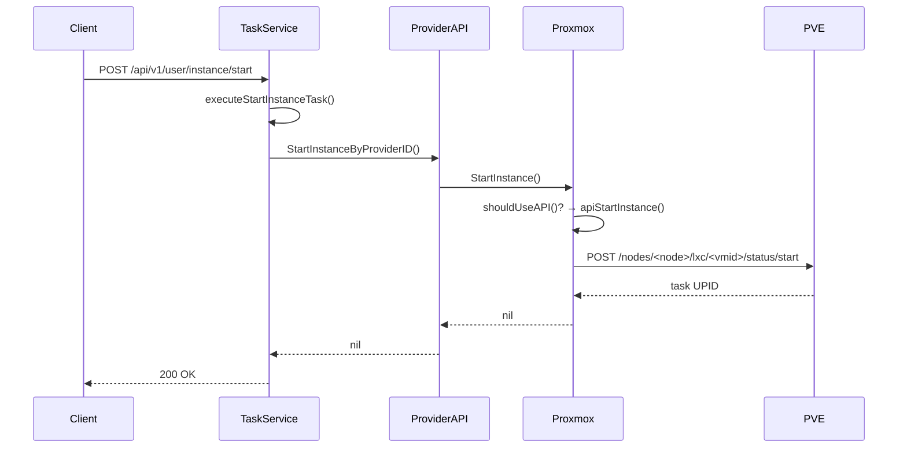

# OneClickVirt

OneClickVirt 是一个基于 Proxmox VE (PVE) 的**一键虚拟化管理平台**，支持通过 Web UI 或 API 创建/管理 LXC 容器和 QEMU 虚拟机。核心场景是在 PVE 上批量交付隔离的云实例。

## 核心概念

### 架构分层

```
┌─────────────────────────────────────────┐
│  Web UI (port 8000) / API              │
├─────────────────────────────────────────┤
│  Task Service (Worker Pool)            │
│  - 任务调度：pending → running → done  │
│  - 按 Provider 维度维护并发池           │
├─────────────────────────────────────────┤
│  Provider Service                       │
│  - 抽象层：屏蔽 PVE/QEMU/LXD 等差异    │
├─────────────────────────────────────────┤
│  Driver 层 (provider/proxmox/)         │
│  - API 模式：直调 PVE REST API         │
│  - SSH 模式：通过 SSH 执行 pct/qm 命令 │
└─────────────────────────────────────────┘
```

### Provider 执行规则

OneClickVirt 支持两种底层执行方式，**按任务类型和 Provider 配置自动选择**：

| 任务类型 | 默认策略 | 说明 |
|---------|---------|------|
| `create` | SSH（优先）→ API（回退）| 模板下载必须 SSH |
| `start/stop/restart` | API（优先）→ SSH（回退）| API 够用 |
| `delete` | API | 只调 API |
| `prepareImage` | **仅 SSH** | PVE 通过 SSH 从 GitHub 下载模板 |

关键：`prepareImage` 永远走 SSH，无法绕过。如果 PVE 到 GitHub 带宽不足（~35KB/s），任务会卡在 38% 长达数十分钟。

### 网络隔离模式

Provider 配置中的 `NetworkType` 决定 VM/LXC 的网络架构：

- **`flat`**：直接桥接 vmbr0，实例暴露在 LAN 中
- **`nat_ipv4`**：实例通过 NAT 上网，无法访问宿主 LAN。OneClickVirt 自动在 PVE 创建 `vmbr1`（NAT bridge），iptables 规则做 MASQUERADE + DROP 到 192.168.x.x
- **`podman`** / **`containerd`**：容器运行时专用网络

`nat_ipv4` 是最常用的隔离模式，其 NAT bridge **硬编码为 `vmbr1`**（无法配置），PVE 必须有 `vmbr1` 且有物理上行。

### 任务类型

| TaskType | 超时 (container) | 超时 (vm) | 说明 |
|----------|----------------|-----------|------|
| `create` | 180s | 300s | 创建实例 |
| `start` | 30s | 90s | 开机 |
| `stop` | 30s | 60s | 关机 |
| `restart` | 60s | 150s | 重启 |
| `delete` | 600s | 600s | 删除 |
| `reset` | 270s | 450s | 重置（删除+重建） |
| `reset-password` | 30s | 30s | 修改密码 |

## 创建实例完整流程

### 时序图



### 详细步骤（SSH 创建 LXC 为例）

#### 阶段 1：DB 预处理（5%→25%）

`s.prepareInstanceCreation()` — 快速数据库事务：

1. 解析 `taskData` JSON，获取 CPU/Memory/Disk/ImageId 配置
2. 在 `instances` 表插入记录，status=`pending`
3. 更新任务进度到 25%

#### 阶段 2：Provider 创建（30%→60%）

`s.executeProviderCreation()` — 这里开始调用 PVE：

**Step 1: 分配 VMID（SSH）**

`getNextVMID()` 通过 SSH 在 PVE 上执行：
```bash
qm list    # 获取已用 VMID
pct list   # 获取已用 CTID
iptables -t nat -L PREROUTING -n | grep -oP '10\.60\.\d+'  # 获取已用 IP
```
VMID 范围 100-999，每个 VMID 映射固定内网 IP（如 `10.60.<vmid>.x`）。

**Step 2: 准备镜像（SSH，38%）**

`prepareImage()` 通过 SSH 执行：
```bash
# 检查镜像是否已存在
[ -f /var/lib/vz/template/cache/ubuntu-24.04-64_cloud.tar.xz ] && echo exists

# 如果缺失，从数据库获取 ImageURL 后下载
curl -L -o /var/lib/vz/template/cache/<image>.tar.xz <ImageURL>
```
⚠️ **性能瓶颈**：PVE 到 GitHub 只有 35KB/s，104MB 模板需 ~50 分钟。OneClickVirt 无法从 LXC 中转下载（模板必须在 PVE 本地）。

**Step 3: 创建容器（API，50%）**

`apiCreateContainer()` 调用 PVE REST API：
```
POST https://<pve>:8006/api2/json/nodes/<node>/lxc
{
  "vmid": 174,
  "ostemplate": "local:vztmpl/ubuntu-24.04-64_cloud.tar.xz",
  "cores": 2,
  "memory": 2048,
  "rootfs": "local:8",
  "onboot": 1,
  "hostname": "my-instance",
  "unprivileged": 1
}
```

**Step 4: 配置网络（API，70%）**

`PUT /nodes/<node>/lxc/<vmid>/config`：
```
net0=name=eth0,ip=<internal_ip>/24,bridge=vmbr1,gw=<nat_gw>,rate=<bandwidth_MBps>
```

`nat_ipv4` 模式下：
- `bridge=vmbr1`（硬编码 NAT bridge）
- `gw` 为 `10.60.254.254`（NAT 网关）
- PVE 已有 iptables 规则做 MASQUERADE + DROP

**Step 5: 启动容器（API，80%）**

`pct start <vmid>` 或 API `POST /nodes/<node>/lxc/<vmid>/status/start`

**Step 6: 配置端口映射（API，91%）**

在 PVE 上通过 `iptables -t nat -A PREROUTING` 创建 DNAT 规则，将宿主端口映射到实例内网 IP。

#### 阶段 3：结果处理（60%→100%）

`s.finalizeInstanceCreation()` — 快速数据库事务：
1. 更新 `instances` 表，status=`active`
2. 写入 `port_mappings` 记录
3. 更新任务进度 100%，标记 `completed`

### 开虚拟机流程（简化）



进度更新：`5% → 15% → 25% → 35% → 50% → 100%`

## 关键数据结构

### Task 状态机

```
pending → running → processing → completed
                    ↓
                 failed / timeout / cancelled
```

- `pending`：等待调度
- `running`：已被 worker 取出执行
- `processing`：业务逻辑执行中
- `completed/failed/timeout`：终态

### Worker Pool 模型

每个 Provider 一个 goroutine pool，串行或并行（`MaxConcurrentTasks`）执行任务：

```go
type ProviderWorkerPool struct {
    ProviderID  uint
    TaskQueue  chan TaskRequest   // 有缓冲channel
    TaskService *TaskService
    // N 个 worker goroutine 并发消费 TaskQueue
}
```

### Provider 连接模式

```go
type ProxmoxProvider struct {
    sshClient  *SSHClient     // Go SSH 实现（非系统ssh命令）
    apiClient  *http.Client   // PVE REST API
    connected  bool
    // 执行规则
    shouldUseAPI() bool
    shouldUseSSH() bool
    shouldFallbackToSSH() bool
}
```

Go SSH client 执行命令时，如果命令耗时超过 3 分钟未响应，整个 session 会超时关闭。这是 `prepareImage` 卡住的技术根因。

## 已知问题与调试

### 任务卡在 38%（prepareImage）

**症状**：Web UI 显示 38%，进度条长期不动，task 日志只写"准备镜像和资源"。

**排查步骤**：

1. 检查 OneClickVirt 日志：
   ```bash
   docker exec oneclickvirt tail -f /data/oneclickvirt/log/xxx.log
   ```

2. 检查 PVE SSH 连接（从 LXC 发起）：
   ```bash
   docker exec oneclickvirt sh -c "ssh -i /data/oneclickvirt/key/xxx -o ConnectTimeout=5 root@192.168.4.252 'echo ok'"
   ```

3. 检查 PVE SSH 会话（从 PVE 自身）：
   ```bash
   # 实时监控 SSH 连接
   watch -n1 'ss -tn | grep :22'

   # 查看 SSH 详细日志
   journalctl -u ssh -f
   ```

4. 如果 PVE 到 GitHub 限速，模板文件已存在但检查命令 Hang：
   ```bash
   # 在 PVE 上手动测试
   [ -f /var/lib/vz/template/cache/ubuntu-24.04-64_cloud.tar.xz ] && echo exists
   # 如果秒回 → Go SSH client 问题
   # 如果超时 → 网络问题
   ```

### PVE API Token 401

**症状**：`invalid token format` 或 401 Unauthorized。

**原因**：Token 格式错误。PVE API Token 必须是完整格式：

```
PVEAPIToken=<user>!<tokenName>=<tokenSecret>
# 错误：oneclickvirt@pve=e64a800d...
# 正确：oneclickvirt@pve!oneclickvirt-token-e64a800d=e64a800d...
```

注意 `!` 和 `=` 之间的 `tokenName`（OneClickVirt 数据库存的是 `oneclickvirt@pve!oneclickvirt-token-e64a800d`）。

### Symlink 模板文件名不匹配

**症状**：`prepareImage` 报错"数据库中未找到镜像配置"。

**原因**：OneClickVirt 查找 `ubuntu-24.04-64_cloud.tar.xz`（dash 格式），但实际文件是 `ubuntu_24.04_noble_x86_64_cloud.tar.xz`（underscore 格式）。

**解法**：
```bash
ln -s ubuntu_24.04_noble_x86_64_cloud.tar.xz ubuntu-24.04-64_cloud
# 注意：放在 /var/lib/vz/template/cache/ 下，且不需要 .tar.xz 后缀
```

### vmbr1 物理上行被抢占

**症状**：`nat_ipv4` 模式实例无法上网。

**原因**：如果 enp7s0 被其他 vmbr 占用，vmbr1 就没有物理上行，NAT 不通。

**解法**：
```bash
# 确保 enp7s0 只属于 vmbr1
ip link set enp7s0 master vmbr1
# 不要同时属于 vmbr2
```

## 部署架构

当前生产环境配置（PVE 192.168.4.252）：

```
┌─────────────────────────────────────────────────┐
│  PVE Host (192.168.4.252)                       │
│  ├─ enp7s0 → vmbr1 (NAT, 192.168.66.x)        │
│  ├─ nic0 → vmbr0 (LAN, 192.168.4.x)           │
│  └─ PVE API: https://pve.is.nickdlk.cn:8006   │
├─────────────────────────────────────────────────┤
│  LXC 174 (192.168.4.82)                        │
│  └─ Docker: spiritlhl/oneclickvirt:latest      │
│      ├─ Port 80: OneClickVirt Web UI           │
│      └─ Port 3306: MySQL (数据持久化)           │
│                                                  │
│  OneClickVirt DB: /data/oneclickvirt/data.db   │
│  SSH Keys: /data/oneclickvirt/key/             │
│  Templates: /data/oneclickvirt/template/       │
└─────────────────────────────────────────────────┘
```

## 源码结构

```
server/
├── main.go                  # 入口
├── provider/                # 底层驱动抽象
│   ├── proxmox/
│   │   ├── instance.go      # CreateInstance/StartInstance 路由
│   │   ├── create.go       # SSH 方式创建（含 prepareImage）
│   │   ├── api_create.go   # API 方式创建
│   │   ├── ssh_instance.go # VMID 分配、IP 映射
│   │   ├── image.go        # prepareImage / downloadImage
│   │   ├── ssh_images.go   # SSH 下载镜像
│   │   ├── network.go      # 网络配置（vmbr1 NAT）
│   │   ├── ports.go        # 端口映射 iptables
│   │   ├── proxmox.go      # Provider 结构体、连接初始化
│   │   └── ssh.go          # Go SSH client 封装
│   └── provider.go          # Provider 接口定义
├── service/
│   ├── task/
│   │   ├── worker_pool.go  # Goroutine worker pool
│   │   ├── manager.go      # 任务创建/查询
│   │   ├── helpers.go      # executeTaskLogic 路由表
│   │   ├── instance_operations.go  # start/stop/restart 实现
│   │   └── context_manager.go # 任务上下文生命周期
│   ├── user/provider/
│   │   └── service.go      # ProcessCreateInstanceTask 三阶段
│   └── provider/
│       └── api.go          # CreateInstanceByProviderID 入口
└── model/                   # DB 模型
```

## 相关文档

- [OneClickVirt README_ZH.md](https://github.com/oneclickvirt/oneclickvirt/blob/main/README_ZH.md)
- [PVE LXC 模板目录](file:///var/lib/vz/template/cache/)
- [OneClickVirt 数据库](file:///data/oneclickvirt/data.db)
