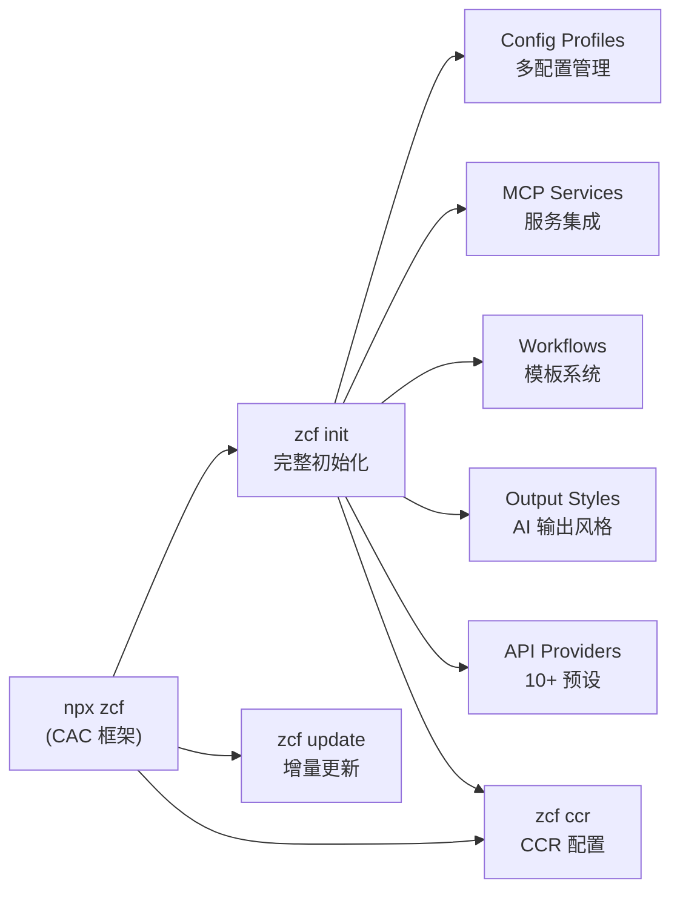

# zcf (Zero-Config Code Flow)

## Overview

zcf 是一个 npm CLI 工具，自动化 AI 编程工具（Claude Code / Codex）的安装、API 配置、MCP 服务集成、workflow 模板管理和输出风格配置。核心价值：**零配置渐进式初始化**——自动检测 OS、语言偏好、安装状态，按需增量配置。

## Architecture

## Key Features

- **双工具支持**：统一接口管理 Claude Code ↔ Codex，命令行 `zcf config-switch` 切换
- **渐进式初始化**：检测已有配置，只补全缺失部分
- **API 预设系统**：302ai、GLM、Minimax、Kimi、Custom 等 10+ 提供商预设
- **MCP 服务集成**：context7、mcp-deepwiki、Playwright、exa 等
- **Workflow 模板**：sixStepsWorkflow、featPlanUx、bmadWorkflow、gitWorkflow 等
- **Output Style 系统**：预设 AI 输出人格（nekomata-engineer、engineer-professional 等）
- **CCR 集成**：Claude Code Router 模型代理管理
- **CCusage 分析**：API 使用量统计
- **CCometixLine**：可视化状态栏
- **跨平台**：Windows、macOS、Linux、Termux、WSL
- **配置备份**：自动时间戳备份，配置冲突时保护用户定制
- **i18n**：界面支持 en、zh-CN、ja；AI 输出语言独立配置

## CLI Commands

| 命令 | 功能 |
|------|------|
| `npx zcf` | 交互式菜单（根据当前 code tool 动态调整） |
| `npx zcf init` / `zcf i` | 完整初始化（安装 + API + MCP + Workflows） |
| `npx zcf update` / `zcf u` | 只更新 workflow 模板和 prompts |
| `npx zcf ccr` | 配置 Claude Code Router |
| `npx zcf ccu [...args]` | 运行 CCusage 使用量分析 |
| `npx zcf uninstall` | 卸载配置（complete / custom / interactive） |
| `npx zcf check-updates` / `zcf check` | 检查 ZCF / Claude Code / Codex 更新 |
| `npx zcf config-switch [target]` | 切换配置（Claude Code ↔ Codex） |

### init 关键参数（CI/CD 用）

| 参数 | 说明 |
|------|------|
| `-l, --lang <lang>` | ZCF 界面语言（zh-CN、en） |
| `-c, --config-lang <lang>` | 配置语言 |
| `-a, --ai-output-lang <lang>` | AI 输出语言 |
| `-f, --force` | 强制覆盖已有配置 |
| `-s, --skip-prompt` | 非交互模式 |
| `-r, --config-action <action>` | 已有配置处理方式（new/backup/merge/docs-only/skip） |
| `-t, --api-type <type>` | API 类型（auth_token/api_key/ccr_proxy/skip） |
| `-k, --api-key <key>` | API Key |
| `-u, --api-url <url>` | 自定义 API URL |
| `-p, --provider <provider>` | 预设提供商（302ai/glm/minimax/kimi/custom） |
| `-m, --mcp-services <services>` | MCP 服务列表 |
| `-w, --workflows <workflows>` | 安装的 workflow 模板 |
| `-o, --output-styles <styles>` | 输出风格列表 |
| `-d, --default-output-style <style>` | 默认输出风格 |
| `-T, --code-type <type>` | 代码工具类型（claude-code/codex） |

## 与同类工具对比

| 工具 | 定位 | 核心差异 |
|------|------|----------|
| [[ralph-claude-code]] | Autonomous Loop Bash 实现 | 专注 agent 循环退出条件，不做环境配置 |
| [[gstack]] | Claude Code 技能包集合 | 技能库+团队模拟，不做初始化自动化 |
| [[open-ralph-wiggum]] | 多工具统一循环包装 | 包装层，不含初始化配置 |
| **zcf** | **环境配置自动化** | **专注初始化+配置管理，不做 agent loop** |

zcf 与上述工具**互补**：zcf 负责搭建环境，[[ralph-claude-code]] / [[open-ralph-wiggum]] 负责 agent 循环。

## License

MIT
