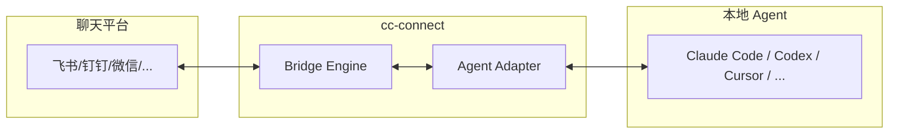

# cc-connect

**cc-connect** 是开源的 AI Coding Agent 桥接工具，将本地运行的 Agent（Claude Code、Codex、Cursor 等）接入聊天平台（飞书、钉钉、Telegram、Discord、微信等），实现**从任何设备远程控制本地 AI 编程助手**。

## Key facts

- **作者**: chenhg5
- **GitHub**: [chenhg5/cc-connect](https://github.com/chenhg5/cc-connect) — 7.9k ⭐, 731 forks
- **License**: MIT
- **技术栈**: Go 1.22+
- **安装方式**: npm (`npm install -g cc-connect`)、Homebrew、二进制下载、源码编译
- **最新版本**: v1.3.0

## 核心功能

### 平台支持

支持 **11 个聊天平台**：飞书、钉钉、Telegram、Discord、Slack、WeChat Work（企业微信）、Weibo、LINE、QQ、QQ Bot、个人微信（通过 ilink 长轮询）。

| 功能 | 飞书 | 钉钉 | Telegram | Discord | Slack | 个人微信 |
|------|:----:|:----:|:--------:|:-------:|:-----:|:--------:|
| 文本 & 斜杠命令 | ✅ | ✅ | ✅ | ✅ | ✅ | ✅ |
| Markdown / 卡片 | ✅ | ✅ | ✅ | ✅ | ✅ | ✅ |
| 流式/分块回复 | ✅ | ✅ | ✅ | ✅ | ✅ | ✅ |
| 图片 & 文件 | ✅ | ✅ | ✅ | ✅ | ⚠️ | ✅ |
| 语音 / STT / TTS | ⚠️ | ⚠️ | ✅ | ⚠️ | ⚠️ | ✅ |
| 群组 / 频道 | ✅ | ✅ | ✅ | ✅ | ✅ | ✅ |

### Agent 支持

支持 **10+ AI Agent**：Claude Code、Codex、Cursor Agent、Kimi CLI、Qoder CLI、Gemini CLI、OpenCode、iFlow CLI、Pi、Devin，以及支持 [ACP (Agent Client Protocol)](https://agentclientprotocol.com/get-started/) 的任何 Agent。

### 不需要公网 IP

大多数平台使用 WebSocket 长连接或长轮询，**无需公网 IP**，适合内网环境。

## 架构



## 安装与启动

```bash
# npm 安装
npm install -g cc-connect

# Homebrew
brew install cc-connect

# 二进制（Linux amd64）
curl -L -o cc-connect https://github.com/chenhg5/cc-connect/releases/latest/download/cc-connect-linux-amd64
chmod +x cc-connect && sudo mv cc-connect /usr/local/bin/

# Web UI 配置（推荐）
cc-connect web   # 打开浏览器配置项目

# 启动服务
cc-connect
```

## 配置

配置文件位于 `~/.cc-connect/config.toml`。推荐使用 `cc-connect web` 的 Web UI 可视化配置。

### 基本配置示例

```toml
[[projects]]
name = "my-project"

[[projects.agent]]
type = "claude-code"   # 或 "codex", "cursor", "opencode" 等

[[projects.platforms]]
type = "feishu"
app_id = "cli_xxx"
app_secret = "xxx"
```

## 斜杠命令

| 命令 | 说明 |
|------|------|
| `/new [名称]` | 创建新会话 |
| `/list` | 列出当前项目会话 |
| `/switch <id>` | 切换会话 |
| `/mode` | 查看/切换权限模式 |
| `/model [alias]` | 列出或切换模型 |
| `/dir [路径]` | 查看或切换 Agent 工作目录 |
| `/show <引用>` | 查看文件、目录、代码片段 |
| `/allow <工具名>` | 预授权工具 |
| `/stop` | 停止当前执行 |
| `/cron` | 定时任务管理 |
| `/tts` | 语音模式切换 |

## 权限模式

支持运行时切换权限模式：

| Claude Code 模式 | 行为 |
|----------------|------|
| `default` | 每次工具调用需确认 |
| `acceptEdits` | 文件编辑自动通过 |
| `auto` | Claude 自动判断 |
| `plan` | 只规划不执行 |
| `yolo` | 全部自动通过 |

## 定时任务 (Cron)

```bash
# 聊天内
/cron add 0 6 * * * 帮我收集 GitHub trending 并总结

# CLI
cc-connect cron add --cron "0 6 * * *" --prompt "总结 GitHub trending"
```

## 语音功能

- **语音转文字**：发送语音消息自动转文字（需要 OpenAI/Groq API Key + ffmpeg）
- **文字转语音**：AI 回复合成语音发送（仅飞书，支持 qwen/openai TTS）

## v1.3.0 新特性

- **Web Admin UI** — 内置管理后台，无需额外依赖
- **Lifecycle Event Hooks** — `[[hooks]]` 配置触发 shell 命令或 HTTP webhook
- **Skill Management** — `/skills` 页面本地 skill 浏览器
- **Personal WeChat** — 个人微信通过 ilink 长轮询接入
- **Weibo DM** — 微博私信 WebSocket 接入
- **Feishu 增强** — @name 自动解析、多层回复链识别、done emoji 反应

## 相关概念

- [[Harness Engineering]] — Agent 可靠工作的工程化方法论
- [[concepts-frameworks/gstack]] — Garry Tan 的 Claude Code 技能包（多角色工程团队）
- [[concepts-frameworks/agent-skills]] — Addy Osmani 出品的 20 工程技能库

## Sources

- [[cc-connect-github]] — 官方 GitHub 仓库
- [[cc-connect-usage-zh-CN]] — 中文使用指南
- [[juejin-cc-connect-tutorial]] — 掘金教程：10 分钟接飞书/钉钉/微信
