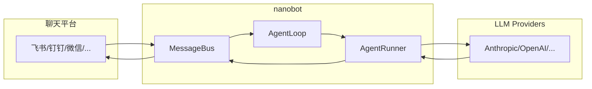

# NanoBot

**NanoBot** 是 HKUDS 出品的超轻量级 AI Agent（Python ≥3.11, MIT License），核心 agent loop 小而可读，支持聊天频道、记忆、MCP 和多种部署路径——从本地设置到长期运行的个人 agent 只需最小开销。

## Key Facts

- **作者**: Xubin Ren ([re-bin](https://github.com/re-bin))
- **GitHub**: [HKUDS/nanobot](https://github.com/HKUDS/nanobot) — Python, v0.1.5.post3
- **License**: MIT
- **技术栈**: Python 3.11+ / React TypeScript WebUI
- **安装方式**: `pip install nanobot-ai`、`uv tool install nanobot-ai`、源码编译
- **最新版本**: v0.1.5.post3 (2026-05-14)

## 核心定位

NanoBot 对标 [OpenClaw](https://github.com/openclaw/openclaw)、[Claude Code](https://www.anthropic.com/claude-code) 和 [Codex](https://www.openai.com/codex)，但刻意保持核心代码小而可读。不同于重量级 agent 框架，NanoBot 的核心理念是：

- **Research-ready**：代码足够简单，可供学习和修改
- **Ultra-lightweight**：稳定的长运行 agent 行为，核心可读性强
- **Practical**：聊天频道、API、记忆、MCP、部署路径开箱即用
- **Hackable**：快速起步，通过 repo docs 深入定制

## 核心功能

### 多聊天平台支持

| 平台 | 支持情况 |
|------|:--------:|
| 飞书 (Feishu/Lark) | ✅ 完整支持 |
| Telegram | ✅ 完整支持 |
| Discord | ✅ 完整支持 |
| Slack | ✅ 完整支持 |
| WhatsApp | ✅ 完整支持 |
| QQ | ✅ 完整支持 |
| WeChat | ✅ 完整支持 |
| DingTalk | ✅ 完整支持 |
| WeCom | ✅ 完整支持 |
| Matrix | ✅ 完整支持 |
| Email | ✅ 完整支持 |

### LLM Provider 支持

内置 Provider：Anthropic (Claude)、OpenAI (GPT-4/4o/o)、DeepSeek、Moonshot/Kimi、MiniMax、Xiaomi MiMo、AWS Bedrock、NVIDIA NIM、Azure OpenAI、VolcEngine、OpenRouter、LM Studio、Ollama、vLLM、Hugging Face、StepFun、GitHub Copilot。

### MCP (Model Context Protocol)

v0.1.4+ 支持 MCP，MCP resources 和 prompts 可作为 tools 暴露给 LLM。

### 记忆系统

Dream 两阶段记忆 consolidation，session history 持久化，atomic writes with fsync 保证 durability。

### 工具能力

文件系统读写编辑、shell 执行、网页搜索/抓取、MCP servers、cron 定时任务、notebook editing、subagent spawning、MyTool 自修改。

## 架构



核心是围绕小而可读的 agent loop：消息从聊天频道进入 → LLM 决定何时调用工具 → 记忆和 skills 按需注入上下文，而非成为重型编排层。

## 安装与启动

```bash
# pip
pip install nanobot-ai

# uv (推荐)
uv tool install nanobot-ai

# 源码
git clone https://github.com/HKUDS/nanobot.git
cd nanobot && pip install -e .

# 初始化
nanobot onboard

# 配置 (~/.nanobot/config.json)
# 只需要配置 providers.apiKey 和 agents.defaults.provider/model

# 启动
nanobot agent
```

## 配置文件示例

```json
{
  "providers": {
    "openrouter": { "apiKey": "sk-or-v1-xxx" }
  },
  "agents": {
    "defaults": {
      "provider": "openrouter",
      "model": "anthropic/claude-opus-4-6"
    }
  }
}
```

## WebUI

开发版 WebUI 需要源码 checkout（尚未随官方包发布）：

```bash
# 1. 启用 WebSocket channel
echo '{ "channels": { "websocket": { "enabled": true } } }' >> ~/.nanobot/config.json

# 2. 启动 gateway
nanobot gateway

# 3. 启动 webui dev server
cd webui && bun install && bun run dev
```

## 斜杠命令

| 命令 | 说明 |
|------|------|
| `/goal` | 长期目标，多步骤进度可见 |
| `/history` | 查看会话历史 |
| `/status` | 查看状态 |
| `/restart` | 重启 |
| `/show <引用>` | 查看文件、目录、代码片段 |
| `/stop` | 停止当前执行 |
| `/mode` | 查看/切换权限模式 |
| `/dir [路径]` | 查看或切换 Agent 工作目录 |

## 权限模式

| Claude Code 模式 | 行为 |
|----------------|------|
| `default` | 每次工具调用需确认 |
| `acceptEdits` | 文件编辑自动通过 |
| `auto` | Claude 自动判断 |
| `plan` | 只规划不执行 |
| `yolo` | 全部自动通过 |

## 最新特性 (2026-05)

- **2026-05-14** `/goal` 长期目标支持，进度可见
- **2026-05-13** 流式推理前显示思考过程，自动备份模型
- **2026-05-11** NVIDIA NIM 支持，终端 bot 名称和图标
- **2026-05-10** 流式推理和 MiMo toggle 清晰化

## 分支策略

| 分支 | 用途 |
|------|------|
| `main` | 稳定版本 — bug 修复和小改进 |
| `nightly` | 实验功能 — 新功能和 breaking changes |

## 相关概念

- [[cc-connect]] — AI Coding Agent 桥接工具（飞书/钉钉/微信/Telegram/Discord）
- [[Vibe-Remote]] — 另一个 IM 控制 AI Agent 的方案
- [[Harness Engineering]] — Agent 可靠工作的工程化方法论

## Sources

- [[HKUDS/nanobot-github]] — 官方 GitHub 仓库
