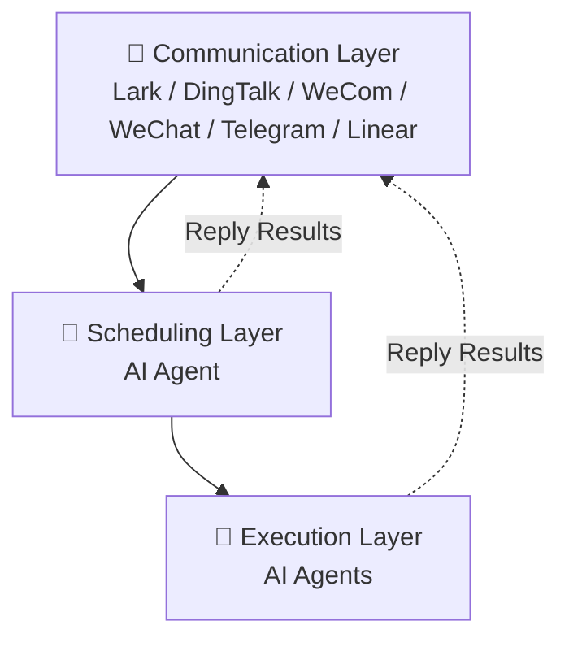

# OpenBee

**OpenBee** 是 around-the-clock 数字员工解决方案（Go, MIT License），致力于让 AI Agent 成为 7×24 在线的工作助手。支持 Lark、钉钉、企业微信、微信、Telegram 和 Linear，通过聊天平台接收任务并回复结果。

## Key Facts

- **作者**: 0xtyz ([@0xtyz](https://x.com/0xtyz))
- **GitHub**: [theopenbee/openbee](https://github.com/theopenbee/openbee) — Go, CLI via npm
- **License**: MIT
- **技术栈**: Go (后端) + npm CLI 前端
- **安装方式**: `npm install -g @theopenbee/cli`、Homebrew、Scoop、一键脚本、源码
- **最新版本**: v2026-05 (Go binary + npm CLI)

## 核心定位

OpenBee 的核心理念是 **"Run Agents as your digital workers"** — 将 AI Agent 作为真正的数字员工来使用，而不是玩具或演示项目。三层架构分离通信、调度和执行，每层职责清晰。

## 核心功能

### 支持的聊天平台

| 平台 | 支持情况 |
|------|:--------:|
| 飞书 (Lark) | ✅ 完整支持 |
| 钉钉 (DingTalk) | ✅ 完整支持 |
| 企业微信 (WeCom) | ✅ 完整支持 |
| 微信 (WeChat) | ✅ 完整支持 |
| Telegram | ✅ 完整支持 |
| Linear | ✅ 完整支持 |

### 支持的 AI 引擎

| 引擎 | 说明 |
|:----:|------|
| **Claude Code** | Anthropic 官方 agentic 编程工具，默认推荐引擎 |
| **Codex** | OpenAI 的 Codex agent，通过 plugin 引擎支持 |
| **Pi** | Pi agent，通过 plugin 引擎支持 |
| **Kimi** | Moonshot AI 的 Kimi agent，通过 plugin 引擎支持 |

## 架构



**三层架构**：

1. **Communication Layer（通信层）**
   - 集成 Lark、钉钉、企业微信、微信、Telegram、Linear
   - 用户从聊天平台发送消息，或在 Linear 创建/评论 issue
   - 在同一对话或 issue thread 中接收回复

2. **Scheduling Layer（调度层）**
   - 负责任务调度
   - 从通信层接收消息，理解用户意图
   - 将任务分派到执行层执行
   - 可直接向通信层回复结果

3. **Execution Layer（执行层）**
   - 每个 Worker 是一个独立 AI Agent
   - 配备工具调用（CLI）和多步骤任务规划能力
   - 自主执行分配的任务
   - 直接向通信层回复结果——就像真实员工一样

## 安装与启动

### Step 1: 安装

```bash
# npm (推荐)
npm install -g @theopenbee/cli

# 一键脚本
curl -fsSL https://raw.githubusercontent.com/theopenbee/openbee/main/install.sh | bash

# Homebrew (macOS)
brew install theopenbee/tap/openbee

# Scoop (Windows)
scoop bucket add theopenbee https://github.com/theopenbee/scoop-bucket
scoop install openbee/openbee

# 手动下载
# 访问 https://github.com/theopenbee/openbee/releases
```

### Step 2: 生成配置文件

```bash
openbee config
```

向导会引导你完成：
- Agent 可执行文件路径
- 要启用的平台（Lark / 钉钉 / 企业微信 / 微信 / Telegram / Linear）及凭据
- 高级选项（可跳过使用默认值）

配置文件默认写入当前目录的 `config.yaml`，使用 `-o` 指定自定义路径。

### Step 3: 启动服务

```bash
openbee server -d
```

### Step 4: 开始使用

- 打开 Web Console（默认 http://localhost:8080）管理 Workers 和查看任务状态
- 在任何配置的平台（Lark / 钉钉 / 企业微信 / 微信 / Telegram / Linear）直接发送消息与 OpenBee 交互

## Web Console

默认 http://localhost:8080，可用于：
- 管理 Workers
- 查看任务状态
- 配置管理

## 相关概念

- [[cc-connect]] — 另一个 AI Coding Agent 桥接工具
- [[Vibe-Remote]] — 类似的 IM 控制 AI Agent 方案
- [[NanoBot]] — 超轻量级 AI Agent 框架

## Sources

- [[theopenbee/openbee-github]] — 官方 GitHub 仓库
