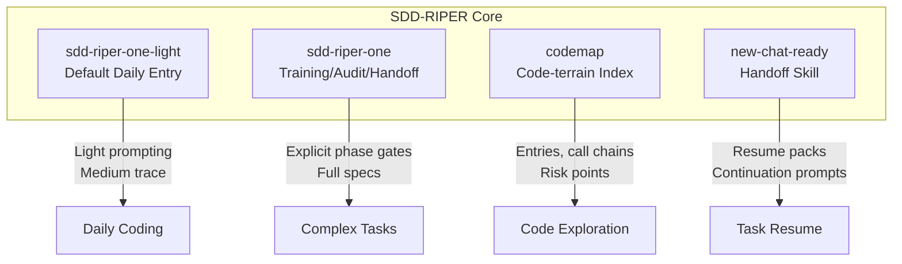

# SDD-RIPER

**SDD-RIPER** (Spec-Driven Development - Reverse Informed Progressive Exploration R平台) is a lightweight AI Agent Harness framework that enables strong coding models to explore autonomously while humans maintain control through minimal specs, checkpoints, approval gates, validation, and reverse sync.

> "Let the model become the actor that moves the event forward, while the human owns direction, boundaries, evidence, and acceptance."

## Overview

| Attribute | Value |
|-----------|-------|
| **Repository** | [huisezhiyin/sdd-riper](https://github.com/huisezhiyin/sdd-riper) |
| **Stars** | 202 |
| **Forks** | 42 |
| **Language** | Python |
| **License** | MIT |
| **Topics** | `agentic-coding`, `ai-agent-harness`, `checkpoint-driven`, `human-ai-collaboration`, `spec-driven-development` |

## Core Philosophy

SDD-RIPER represents a fundamental shift in how humans collaborate with AI coding agents:

### From Digging Canals to Farming Beside the River

| Paradigm | Human Role | Model Role | Control Method |
|----------|-----------|-----------|----------------|
| Traditional SDD | Person who writes the blueprint | Builder following the plan | Large spec, phase gates |
| **SDD-RIPER** | Operator who moves with the flow | Actor exploring the route | Checkpoints, evidence, reverse sync |

### From Assistant to Event Actor

A strong model is no longer just an assistant that fills in code. It proposes paths, tries approaches, exposes risks, and moves the task forward. The relationship is closer to a **rider and racehorse**:

- The horse is not a passive tool — its speed, force, and local judgment are the main engine
- The rider does not move the horse's legs
- The rider chooses the track, controls pace, watches risk, gives signals, and judges the finish

## Core Principles

The **sdd-riper-one-light** harness enforces only a few hard constraints, but they matter:

1. **Restate First** — restate the task before planning or changing code
2. **Core Goal as Loop Anchor** — every loop has a current core goal
3. **No Spec, No Code** — create or update the minimal source of truth before implementation
4. **No Approval, No Execute** — give a checkpoint and receive approval before code changes
5. **Done by Evidence** — completion is proven by tests, logs, manual checks, or external feedback
6. **Reverse Sync** — write verified results back into the spec so the next loop can resume

## Key Components



### skills/sdd-riper-one-light
Main entry point for everyday AI coding. Balances exploration ability with human control through checkpoint-based gates.

### skills/sdd-riper-one
Heavier, more explicit protocol for training, audit, handoff, and complex cross-project coordination. Useful when:
- Team is building AI coding discipline
- Model needs stronger floor
- Task involves complex refactoring
- Auditable Research → Plan → Execute → Review gates needed

### skills/codemap
Code-terrain indexing skill that creates agent-facing terrain maps: entries, call chains, risk points, validation entry points, and smallest code slice to read next.

### skills/new-chat-ready
Fresh-chat handoff skill for creating durable resume packs and paste-ready continuation prompts.

## The Harness Concept

**Harness** is not a rigid law forcing the model to follow a fixed step-by-step ritual. It means handing a verifiable task unit to the model for autonomous progress, while the human owns goals, boundaries, permissions, context, checkpoints, and acceptance evidence.

### Four Engineering Problems Solved

| Problem | Harness Answer |
|---------|----------------|
| How to hand work to the model | Slice the work into a minimum chaos unit the model can carry forward |
| How to keep the process under control | Checkpoint at critical moments instead of micromanaging every line |
| How to know it is done | Require evidence: tests, logs, screenshots, manual acceptance, or equivalent proof |
| How to resume later | Keep a minimal spec / summary / handoff as recoverable context |

## Minimal Agent Setup

```
<repo>/
  AGENTS.md
  skills/
    codemap/
    new-chat-ready/
    sdd-riper-one-light/
    sdd-riper-one/
```

## Relationship to Traditional SDD

SDD-RIPER keeps the useful part of traditional spec-driven development but changes the center of gravity:

- **Traditional SDD**: Spec is an operating system for the model — write a complete blueprint first, then ask the model to follow it
- **SDD-RIPER**: Spec is a **minimal source of truth for humans first** — records goals, boundaries, decisions, validation, and recovery context

## See Also

- [[spec-driven-development]]
- [[agentic-coding]]
- [[harness-engineering]]
- [spec-kitty](./spec-kitty.md) — Related spec-driven development CLI
- [huisezhiyin/sdd-riper](https://github.com/huisezhiyin/sdd-riper) — Official repository

## Tags

#agentic-coding #ai-agent #harness-engineering #spec-driven-development #human-ai-collaboration
