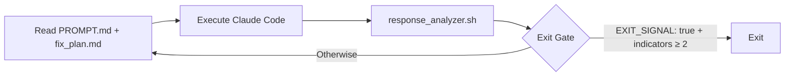

# Ralph for Claude Code — Summary

Ralph 是 Geoffrey Huntley 提出的 Autonomous AI Development Loop 模式的开源 Bash 实现，将 Claude Code 包装在持久循环中，迭代改进项目直到完成，同时内置多重保护机制。

## Key Takeaways

- **Install once, use everywhere**：全局安装后可在任何目录通过 `ralph` 命令启动
- **Dual-condition exit gate**：必须同时满足 completion indicators ≥ 2 AND explicit `EXIT_SIGNAL: true` 才能退出，防止 premature exit
- **JSON/Text 双模式**：新版 Claude Code CLI 的 `--output-format json` 支持结构化解析，旧版自动 fallback
- **Session 连续性**：`--resume <session_id>` 保持上下文，24h 过期自动重置
- **566 tests, 100% pass rate**：测试覆盖率高，版本成熟度可观

## Architecture Pattern

Ralph 的 loop 可以分解为三个阶段，与 [[Agentic Loop]] 的 Gather→Act→Verify 完全对应：

## What Makes It Interesting

1. **Dual-condition exit 是核心创新**：防止 "documentation says done" 类 false positive exit
2. **Circuit Breaker 三态**：CLOSED → HALF_OPEN → OPEN，auto-recovery 支持 unattended 模式
3. **5h API limit 三层检测**：timeout guard → JSON rate_limit_event → filtered text fallback，unattended 模式自动等待
4. **Task sources 灵活性**：支持 beads / GitHub Issues / PRD documents 多种任务来源

## Relevance to PAS

Ralph 的 Bash 实现足够轻量，适合作为 PAS 基础设施的 reference。与 [[gstack]] 的多角色团队相比，Ralph 是单人单 agent loop，但 exit gate 和 circuit breaker 的设计可以直接借鉴。

## 争议点

- Bash 实现的 session 管理不如 TypeScript 实现（open-ralph-wiggum）健壮，但 zero-dependency 带来极低的使用门槛
- Dual-condition exit 的 `completion_indicators` 依赖启发式正则，存在 false positive 风险（Issue #224 有详细讨论）

---

See [[ralph-claude-code]] entity page for full technical details.
