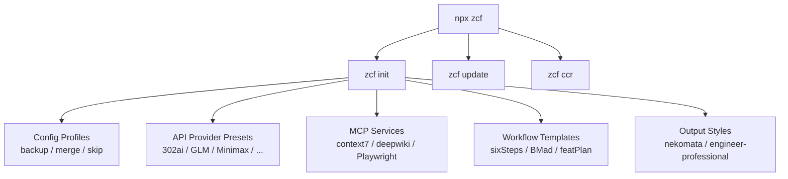

## One-line Summary

zcf（Zero-Config Code Flow）：一行命令完成 Claude Code / Codex 环境配置——API、MCP、Workflows、输出风格全自动。

## Key Takeaways

1. **零配置初始化**：`npx zcf init` 自动检测缺失项，增量配置不覆盖已有设置
2. **双工具统一管理**：Claude Code ↔ Codex 通过 `zcf config-switch` 切换，界面合一
3. **10+ API 预设**：302ai、GLM、Minimax、Kimi 等，API key 配置一行命令完成
4. **MCP + Workflow + Style 三位一体**：初始化时一并安装 context7、Playwright 等 MCP 服务和 workflow 模板
5. **CI/CD 友好**：`--skip-prompt` + `--force` + `--provider` 支持非交互式管道调用

## Architecture

## Related

- [[github-open-ralph-wiggum]] — Ralph Wiggum technique 开源实现（zcf 搭建环境后用它跑 agent loop）
- [[ralph-claude-code]] — Bash Autonomous Loop 实现（zcf 互补方案）
- [[gstack]] — Claude Code 技能包（zcf 初始化后可安装 gstack）
