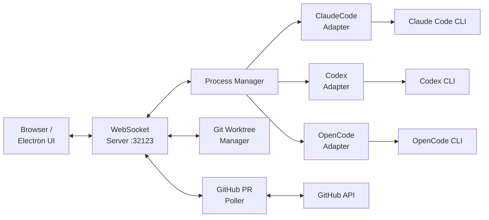

# Summary — horang-labs/tessera

开源 AI 编码 Agent 可视化工作区，同时运行 Claude Code / Codex / OpenCode 并行面板，支持 Git worktree 管理、实时 WebSocket 状态推送、Kanban 任务板、PR 追踪，Electron 桌面 + npm 浏览器双模式。

## 核心要点

1. **Provider Adapter 统一协议**：三个 CLI（Claude Code `stream-json`、Codex `app-server`、OpenCode ACP）各自封装为 `CliProvider` Adapter，协议归一化为共享实时消息模型，前端无感知底层差异。
2. **Managed Git Worktree**：不是简单调用 git，而是完整的 worktree 生命周期管理——创建/删除/关联 session，支持从 chat 无缝转入 worktree-backed 实现任务。
3. **GitHub PR 轮询 + WebSocket 广播**：`task-pr-poller.ts` 定期拉取 PR 状态，通过 `task-pr-broadcast.ts` 推送给所有连接的客户端，覆盖 opened/merged/closed/draft/review-required 等状态。
4. **Electron + Next.js 共用后端**：桌面端和浏览器端共享同一个 Node.js HTTP + WebSocket 服务端，Electron preload 暴露 IPC 桥接，仅 UI 渲染进程有差异。
5. **v0.1.3 Apache-2.0**：Horang Labs 出品，支持 Windows/macOS/Linux，npm 全局安装或下载 portable exe。

## 架构图

## 与 wiki 其他实体的关联

- [[Chorus]] — 同样是 Agent 任务管理工具，但 Chorus 侧重任务追踪，Tessera 侧重多 Agent 并行 + 工作区可视化
- [[agent-skills]] — Tessera 的 Skills Dashboard 对接 Claude Code skills discovery，与 Addy Osmani 的 20 工程技能体系有潜在整合空间

## 相关链接

- GitHub: https://github.com/horang-labs/tessera
- npm: https://www.npmjs.com/package/@horang-labs/tessera
- Releases: https://github.com/horang-labs/tessera/releases
