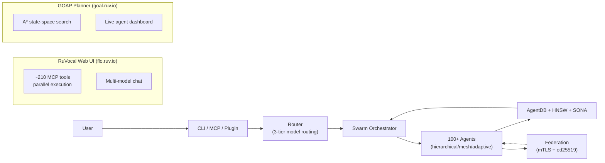

# Summary — ruvnet/ruflo

为 Claude Code 增加多 agent 编排能力的 npm 包/CLI 框架（原名 Claude Flow，v3.5 更名）。MIT License。

## 一句话

**在 Claude Code 上叠加蜂群协调 + 向量记忆 + 联邦安全 = 让 100+ agents 跨机器协作。**

## 核心要点

- **蜂群编排**: hierarchical/mesh/adaptive 拓扑，Raft 共识，Anti-drift 机制防止 agent 漂移
- **三层模型路由**: Tier 1 WASM 旁路 LLM（<1ms/$0）→ Tier 2 Haiku → Tier 3 Sonnet，按复杂度自动分流
- **自进化记忆**: AgentDB + HNSW + SONA 神经模式学习，从成功轨迹中提取 pattern
- **联邦协作**: mTLS + ed25519 无密钥共享，14 类 PII 自动过滤，行为信任评分驱动权限升降
- **~210 MCP 工具**: Core/Intelligence/Agents/Memory/DevTools 5 组，工具并行触发

## 架构图

## 与同类工具的差异

| 特性 | ruflo | agent-skills | Hermes |
|------|-------|-------------|--------|
| 基础 | Claude Code 插件 | 独立 Skill 库 | 独立 Agent 框架 |
| Agent 数量 | 100+ | 3 personas | 自定义 |
| 联邦协作 | 原生 zero-trust | 无 | 无 |
| 向量记忆 | AgentDB + HNSW + SONA | 无 | Agent Memory |
| Web UI | RuVocal + GOAP | 无 | 无 |
| 插件市场 | 32 官方插件 | 无 | 自定义 Skill |

## 关键文件

- `raw/refs/ruflo/CLAUDE.md` — 6,000+ commits 的 Agent 行为规则总结（ Ruflo 对 Claude Code 的指导）
- `raw/refs/ruflo/AGENTS.md` — Swarm 命令速查表
- `raw/refs/ruflo/v3/@claude-flow/` — monorepo 核心包（cli/codex/guidance/hooks/memory/security/swarm）

## 相关链接

- GitHub: https://github.com/ruvnet/ruflo
- Web UI: https://flo.ruv.io/
- GOAP Planner: https://goal.ruv.io/
- Live Agents: https://goal.ruv.io/agents
