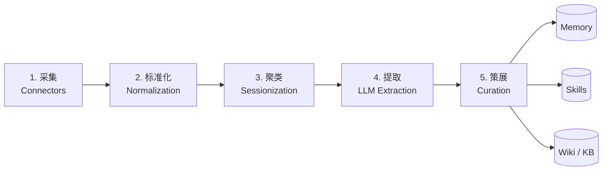

# Session Extraction Pipeline（会话扫描 → 记忆/Skill 提取范式）

> **核心范式**：把 AI Agent 的历史会话（Claude Code / Codex / iMessage / IDE chat 等）作为**未结构化的真实活动记录**，通过"采集 → 标准化 → 聚类 → 提取 → 策展"五步流水线，转换为 **Memory + Skill + Wiki** 三类产物，供下游 agent runtime 消费。

## 调研背景（2026-08）

调研目标：找到类似 `kayba-ai/agentic-context-engine`（ACE）但**专注"扫描历史会话"**的开源项目。结论：**ACE 是下游运行时，不是上游扫描器**。真正的上游有 7 个核心项目。

## 五步流水线



### Step 1: 采集（Connectors）

| 源 | 工具 | 备注 |
|----|------|------|
| Claude Code JSONL | [[cc-analyst]] / [[reflect-skill-claude]] | 每 session 一 JSONL |
| Codex CLI | [[cc-analyst]] | JSONL |
| iMessage | [[Open-Amnesia|Open Amnesia]] | chat.db |
| Trace（ACE 格式）| [[Agentic-Context-Engine-ACE|Agentic Context Engine (ACE)]] | `agent.learn_from_traces()` |

### Step 2: 标准化（Event IR）

- 统一 turn-by-turn + tool call/result 结构
- 每个来源 schema 不同（tool calls、metadata、timestamps、nesting）
- 输出稳定的 Event IR（中间表示）

### Step 3: 聚类（Sessionization + Clustering）

- 按时间窗口 + project 标签分组
- 形成 "**Moment**" = (intent → actions/tool calls → outcomes → artifacts)
- 去重（banners/retries/tool spam）
- 过滤（PII/secret redaction）

### Step 4: 提取（LLM Enrichment）

**只在前 3 步确定性处理完后**才跑 LLM——避免 noise amplification。

提取目标：

| 类型 | 例子 |
|------|------|
| **Facts** | 项目/决策/人物/配置等稳定上下文 |
| **Skills** | triggers/steps/checks 的可重复 workflow |
| **Corrections** | "stop doing X" / "always do Y" 持续纠正 |
| **Insights** | 反复出现的 pattern、值得 codify 的多步流程 |

### Step 5: 策展（Curation）

| 产物 | 消费侧 |
|------|--------|
| 每日 Markdown `YYYY_MM_DD.md` | PKM/Obsidian 人类阅读 |
| CLAUDE.md / AGENTS.md patch | Agent 运行时 |
| Skill 文件 | Agent skill 系统 |
| SQLite / Vector DB | API 拉取 |
| Anki 卡片 | 人类 SRS（[[ccflash]] 路线）|

## 调研核心项目映射

| Step | 主导项目 | 输出 |
|------|----------|------|
| 1 采集 | [[Open-Amnesia|Open Amnesia]] (多源) | raw events |
| 1 采集 | [[cc-analyst]] (Claude/Codex JSONL) | raw events |
| 2 标准化 | [[Open-Amnesia|Open Amnesia]] | Event IR |
| 3 聚类 | [[Open-Amnesia|Open Amnesia]] | Moments |
| 4 提取 | [[Open-Amnesia|Open Amnesia]] / [[cc-analyst]] | Facts/Skills |
| 5 策展 | [[reflect-skill-claude]] | Skill + CLAUDE.md |
| 5 策展 | [[cc-analyst]] | patch 提议 + rollback |
| 5 策展 | [[ccflash]] | Anki 卡片 |
| 5 策展 | [[Open-Amnesia|Open Amnesia]] | 日期 MD + FastAPI |
| 5 策展 | [[claude-memory-compiler]] | Karpathy wiki + daily |
| 5 策展 | [[llmwiki-lucasastorian]] | Karpathy wiki + MCP server |
| 4 提取（验证）| [[prism-prosusai]] | engram + quality gate |
| 4 提取（保守）| [[total-recall-davegoldblatt]] | write-gate + 人类晋升 |
| 4 提取（确定性）| [[open-second-brain]] | dream pass + evidence count |
| 1 采集（多 harness）| [[code-session-memory]] | 6 harness 统一向量记忆 |
| 1 采集（多 harness）| [[obelisk]] | 含 subagent + workflow |
| 4 提取（自演化）| [[hermes-agent-self-evolution]] | GEPA 演化 Hermes prompt/skill |
| 5 策展（skill 库）| [[SkillClaw]] / [[hermes-skill-factory]] | 改 vs 生成 |
| 5 策展（改进追踪）| [[agent-usage-analyze]] | 本地 dashboard + 实践库 |
| 5 策展（漂移检测）| [[orbit]] | drift/gap/alignment + claim validation |
| 4 提取（增量复盘）| [[agent-retrospective]] | Codex skill + CLI 增量式 |

## 设计权衡

| 决策 | 选项 | 推荐 |
|------|------|------|
| **LLM 何时介入** | 早期 vs 晚期 | **晚期**（先确定性预处理）|
| **聚类粒度** | 按 turn / session / day / project | day + project（Open Amnesia 路线）|
| **Skills 提取门槛** | 高（保守）/ 低（激进）| **保守**——Phase 1 Bucket 3 过"会再跑吗"门槛（reflect-skill-claude 路线）|
| **回滚** | 有 vs 无 | **必须**有（cc-analyst 路线，备份+rollback）|
| **本地 vs 云** | local-first vs cloud | **local-first**（隐私/数据主权）|
| **下游 runtime** | 独立 vs 注入 | **下游 runtime 注入**（ACE / H-MEM 路线）|

## 推荐的端到端组合

```
扫描层：Open Amnesia
  采集多源 → Event IR → Moment 聚类 → YYYY_MM_DD.md + FastAPI
  ↓
提炼层：reflect-skill-claude（按 skill 节奏触发，复用 Claude Code skill 机制）
  把 repeat workflow 提升为 skill
  ↓
运行时增强：Agentic Context Engine (ACE) / H-MEM
  Skillbook 注入下一次 session 的 system prompt
  ↓
可视化：Obsidian（直接打开 wiki 目录）
```

## 与 Hermes 自有方案的对比

Hermes 自有：
- [[Honcho]] — 下游 memory runtime
- [[Hindsight]] — 向量记忆存储
- session_search — 历史 session FTS5 检索
- llm-wiki skill — 知识库策展

差距：
- ❌ 缺**自动化 session → facts/skills** 流水线（需要手动 ingest）
- ❌ 缺**deduplication + redaction**（Honcho Neuromancer 有部分但只提事实）
- ✅ [[llm-wiki]] 本身已具备"产物落 wiki"能力

**结论**：用 [[Open-Amnesia|Open Amnesia]] 做采集层 → 喂给 llm-wiki skill 做策展（替代手动 ingest），与 [[Honcho]] 形成"摄入 vs 检索"分工。

## 关键设计原则

1. **Data consistency beats prompt cleverness** — 提取质量取决于稳定的预处理
2. **Late LLM binding** — 确定性步骤全跑完再 LLM，避免 noise amplification
3. **Conservative skill promotion** — skill 提升有门槛，避免污染
4. **Rollback by default** — 任何 patch 提议必须能回滚
5. **Local-first** — 隐私敏感数据不出本地

## 相关页面

### 核心项目
- [[Open-Amnesia|Open Amnesia]] ⭐ 最完整
- [[cc-analyst]]
- [[reflect-skill-claude]]
- [[Agentic-Context-Engine-ACE|Agentic Context Engine (ACE)]]
- [[ccflash]]
- [[agent-memory-engine]]
- [[Meterless]]
- [[ace-agent-ace|ace-agent/ace]]

### 概念对比
- [[Memory-Systems]] — 下游 memory layer 总览
- [[agentmemory]] — 同名但不同项目（jayzeng 版）

### 平台适配
- Claude Code JSONL → [[cc-analyst]] / [[reflect-skill-claude]] / [[claude-mem-thedotmack]] / [[claude-memory-compiler]]
- Codex JSONL → [[cc-analyst]] / [[code-session-memory]]
- 多源（Claude/Codex/iMessage）→ [[Open-Amnesia|Open Amnesia]]
- 多 harness（OpenCode/Claude/Cursor/VSCode/Codex/Gemini）→ [[code-session-memory]]
- 跨 agent 共享 → [[cass-memory]]
- Hermes Agent → [[open-second-brain]] / [[hermes-agent-self-evolution]] / [[SkillClaw]] / [[hermes-skill-factory]]

### 第二批调研（2026-08-12）新增项目

详见各实体页与 [[Skill-Distillation-Research]] 学术层。关键新增：

- **[[claude-mem-thedotmack]]** — 90k⭐ 规模之王
- **[[hermes-agent-self-evolution]]** — 4.9k⭐ 官方 GEPA 演化
- **[[open-second-brain]]** — Hermes-primary 集成
- **[[claude-memory-compiler]]** — Karpathy wiki 套到 session
- **[[SkillClaw]]** / **[[hermes-skill-factory]]** — Hermes skill 生命周期
- **[[prism-prosusai]]** — 唯一带 quality gate 验证
- **[[total-recall-davegoldblatt]]** — 写入门控的反例设计
- **[[Skill-Distillation-Research]]** — 学术层总览（GEPA / AWM / Voyager / MemRL / SkillBench）
- **[[code-session-memory]]** / **[[obelisk]]** — 多 harness 覆盖


## Update Log

### 2026-08-12 (second batch, +20 repos)

调研关键词从 8 个扩到 80+ 个，新增关键词方向：自演化 agent / 学术 paper 索引 / Hermes 周边的子项目 / cross-harness session 迁移 / Karpathy wiki 的多实现 / 安全研究 / 评测基准。

**新增的工程实现**（按 stars 降序）：
- 90k⭐ thedotmack/claude-mem
- 10.7k⭐ MemTensor/MemOS
- 4.9k⭐ NousResearch/hermes-agent-self-evolution（官方 GEPA 落地）
- 4k⭐ eugeniughelbur/obsidian-second-brain
- 2.4k⭐ AMAP-ML/SkillClaw
- 1.5k⭐ lucasastorian/llmwiki
- 1.3k⭐ coleam00/claude-memory-compiler
- 5278⭐ 0xNyk/awesome-hermes-agent
- 633⭐ TsinghuaC3I/Awesome-Memory-for-Agents
- 560⭐ ViktorAxelsen/MemSkill
- 456⭐ zorazrw/agent-workflow-memory
- 411⭐ Dicklesworthstone/cass-memory
- 345⭐ delexw/claude-code-trace
- 314⭐ tommy0103/obelisk
- 200⭐ davegoldblatt/total-recall
- 164⭐ MemTensor/MemRL
- 153⭐ itechmeat/open-second-brain
- 106⭐ SkillNerds/xskill
- 19⭐ ProsusAI/prism
- 18⭐ djannot/code-session-memory

**关键发现**：
1. **缺少 ≠ 缺陷**——本 wiki 已收录 8 个 session-mining 项目，扩展到 20+ 后覆盖度从「够用」到「完备」
2. **学术-工程 gap**：失败信号利用、skill 验证、评测基准——这三条工程层普遍缺失
3. **Hermes 生态完整**：官方 self-evolution + 社区 SkillClaw/skill-factory/open-second-brain 覆盖了 skill 生命周期
4. **「先验证再入库」只有 prism 一家**——这可能是 session-mining 走向生产的关键缺口
5. **学术侧 wmmthu/awesome-llm-agent-skills-papers** 是目前为止最对题目的论文索引

**新增 54 个 raw source 文件到 `raw/articles/`**（带 sha256 校验），**20 个新 wiki 页面**（13 实体 + 1 概念 + 6 早前批次补全）。


### 2026-08-12 (third batch, +3 repos, user-driven)

用户（Nick）直接提供了 `zm2529/agent-usage-analyze` 链接，暴露了 sort=stars 调研的盲区：
- 2 ⭐ + 中文 README 双重门槛下，主流搜索排序把它完全淹没

补搜以中文关键词 + sort=updated 模式后，又发现 2 个对题项目（`weak-fox/agent-retrospective`、`krzemienski/orbit`），以及 12 个**不对题**的「session telemetry / cost dashboard」项目。

**新增**：
- [[agent-usage-analyze]]（2 ⭐，**改进追踪 + 实践库**，Codex 优先 + 多 CLI 导入）
- [[agent-retrospective]]（1 ⭐，增量式复盘 + 反思报告，Codex skill + CLI）
- [[orbit]]（0 ⭐，**drift / gap / alignment 三件套** + claim validation）
- [[_session-telemetry-dashboards]] — 「这是 dashboard，不是 miner」的反向索引页（收录 12 个相关但不对题的项目，并标注识别特征）

**调研方法修订**（沉淀为未来 procedure）：
1. GitHub 搜索必须做**三次排序**：stars / recently updated / relevance
2. 中文 README 关键词搜索（改进追踪 / 复盘 / 用法分析）作为独立 query 系列
3. 用户主动提供 URL 时，**必须**回溯自己为什么漏掉 + 补搜同模式
4. 「dashboard only」类项目不强行塞进 [[Memory-Systems]]，单独立反向索引页

**未变结论**：2 ⭐ 不等于不重要。[[agent-usage-analyze]] 的「改进可追踪」思路在我前两轮收录的 20+ 项目里**只有这一家**——说明「stars 主导搜索」会漏掉关键设计意图不同的反潮流项目。
