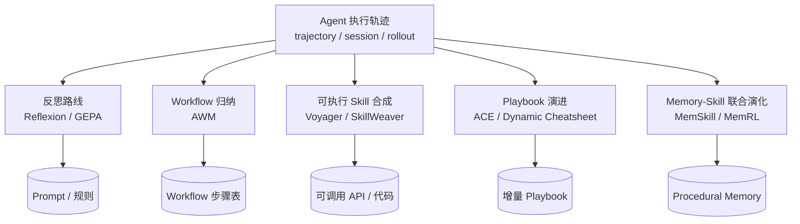

# Skill Distillation Research（会话/轨迹 → Skill 的学术层）

> [[Session-Extraction-Pipeline]] 记录的是**工程实现**；这一页记录支撑它的**学术方法论**。核心问题：如何把 agent 的执行轨迹（trajectory / session / rollout）蒸馏成可复用、可验证、可组合的 skill？

## 为什么补这一页

2026-08 第一批调研只覆盖了工程项目（Open Amnesia / cc-analyst 等），缺了学术层。而学术层给出了工程层普遍缺失的三样东西：

1. **失败信号的利用**——工程项目大多只学"做对了什么"
2. **skill 的验证方法**——如何知道提取出的 skill 真的有用
3. **评测基准**——用什么衡量 skill 系统的好坏

## 核心索引仓库

| 仓库 | ⭐ | 定位 |
|------|-----|------|
| [wmmthu/awesome-llm-agent-skills-papers](https://github.com/wmmthu/awesome-llm-agent-skills-papers) | 3 | **专注 skill 作为一等公民**的论文集，CC0，分类最贴合本主题 |
| [TsinghuaC3I/Awesome-Memory-for-Agents](https://github.com/TsinghuaC3I/Awesome-Memory-for-Agents) | 633 | 清华 C3I，agent memory 论文/benchmark 全目录 |
| [XMUDeepLIT/Awesome-Self-Evolving-Agents](https://github.com/XMUDeepLIT/Awesome-Self-Evolving-Agents) | 392 | 厦大，自演化 agent survey |
| [Shiyao-Huang/awesome-agent-evolution](https://github.com/Shiyao-Huang/awesome-agent-evolution) | 174 | 开放式 survey + evidence map |

## 方法论谱系

## 关键论文

### 奠基（2022–2023）

| 论文 | arXiv | 贡献 |
|------|-------|------|
| **Code as Policies** | [2209.07753](https://arxiv.org/abs/2209.07753) | LLM 直接写代码作为策略——skill 即代码的起点 |
| **Voyager** | [2305.16291](https://arxiv.org/abs/2305.16291) | **开放式 agent 的 skill library 范式奠基**，[code](https://github.com/MineDojo/Voyager) |
| **ReAct** | [2210.03629](https://arxiv.org/abs/2210.03629) | 推理与行动交织 |
| **Reflexion** | [2303.11366](https://arxiv.org/abs/2303.11366) | **语言化强化学习**——用自然语言反思代替梯度 |

### 会话/轨迹 → Skill（2024–2026）

| 论文 | arXiv | 贡献 |
|------|-------|------|
| **Agent Workflow Memory (AWM)** | [2409.07429](https://arxiv.org/abs/2409.07429) | 从过往轨迹归纳可复用 workflow（list-of-steps 形式），ICML 2025，[code](https://github.com/zorazrw/agent-workflow-memory) 456⭐ |
| **SkillWeaver** | [2504.07079](https://arxiv.org/abs/2504.07079) | Web agent 自主发现 skill → **合成为 API** → **自动生成 test case 验证（honing）**；WebArena +31.8%/+39.8%，跨 agent transfer +54.3%，[code](https://github.com/OSU-NLP-Group/SkillWeaver) 151⭐ |
| **GEPA** | [2507.19457](https://arxiv.org/abs/2507.19457) | **Genetic-Pareto 进化 + 自然语言反思**：读 rollout 的 reasoning trace / tool call / error message 演化指令。**ICLR 2026 Oral**，是 [[hermes-agent-self-evolution]] 的底层方法 |
| **ACE（Agentic Context Engineering）** | [2510.04618](https://arxiv.org/abs/2510.04618) | context 当 evolving playbook，Generator/Reflector/Curator 三角色 + ADD/UPDATE/REMOVE 增量 delta。见 [[Agentic-Context-Engine-ACE]] / [[ace-agent-ace]] |
| **MemSkill** | — | Learning and Evolving Memory Skills for Self-Evolving Agents，[code](https://github.com/ViktorAxelsen/MemSkill) 560⭐ Apache-2.0 |
| **MemRL** | — | 「自演化 agent via **runtime RL on episodic memory**」，[code](https://github.com/MemTensor/MemRL) 164⭐，出自 [[MemOS]] 同一团队 |
| **Ctx2Skill** | [2604.27660](https://arxiv.org/abs/2604.27660) | From Context to Skills，[code](https://github.com/S1s-Z/Ctx2Skill) |
| **SEAgent** | [2508.04700](https://arxiv.org/abs/2508.04700) | 自演化 computer-use agent，从经验自主学习，[code](https://github.com/SunzeY/SEAgent) |

### Skill 策展与治理（2026）

| 论文 | arXiv | 贡献 |
|------|-------|------|
| **SkillOS: Learning Skill Curation for Self-Evolving Agents** | [2605.06614](https://arxiv.org/abs/2605.06614) | **策展**本身作为学习目标——对应本 wiki 的 curator 概念 |
| **SkillX: Automatically Constructing Skill Knowledge Bases** | [2604.04804](https://arxiv.org/abs/2604.04804) | 自动构建 skill 知识库 |
| **Graph of Skills** | [2604.05333](https://arxiv.org/abs/2604.05333) | **依赖感知的结构化检索**，解决 skill 数量爆炸后的选择问题，[code](https://github.com/davidliuk/graph-of-skills) |
| **SKILL0 / SkillZero** | [2604.02268](https://arxiv.org/abs/2604.02268) | In-context agentic RL 做 skill 内化，[code](https://github.com/ZJU-REAL/SkillZero) |
| **RL for Self-Improving Agent with Skill Library** | [2512.17102](https://arxiv.org/abs/2512.17102) | RL + skill library 结合 |

### 综述（一次性把地图看全）

| 论文 | arXiv | 覆盖 |
|------|-------|------|
| **SoK: Agentic Skills — Beyond Tool Use** | [2602.20867](https://arxiv.org/abs/2602.20867) | skill 全生命周期：discovery / practice / distillation / storage / composition / evaluation / update + 7 种系统级设计模式 |
| **Agent Skills for LLMs: Architecture, Acquisition, Security** | [2602.12430](https://arxiv.org/abs/2602.12430) | 含**安全**维度 |
| **Externalization in LLM Agents** | [2604.08224](https://arxiv.org/abs/2604.08224) | 统一 review：memory / skills / protocols / **harness engineering**——与本 wiki 主域直接对应 |

## 评测基准（工程层普遍忽略的一环）

| Benchmark | arXiv | 测什么 |
|-----------|-------|--------|
| **SkillsBench** | [2602.12670](https://arxiv.org/abs/2602.12670) | skill 跨任务通用性，[site](https://www.skillsbench.ai/) |
| **SWE-Skills-Bench** | [2603.15401](https://arxiv.org/abs/2603.15401) | **skill 在真实软件工程里到底有没有用**，[code](https://github.com/GeniusHTX/SWE-Skills-Bench) |
| **SkillLearnBench** | [2604.20087](https://arxiv.org/abs/2604.20087) | **持续学习**方法在真实任务上的 skill 生成，[code](https://github.com/cxcscmu/SkillLearnBench) |
| **SkillTester** | [2603.28815](https://arxiv.org/abs/2603.28815) | utility **和 security** 双测，[site](https://skilltester.ai) |
| **Skill-Usage in the Wild** | [2604.04323](https://arxiv.org/abs/2604.04323) | 真实环境下的 skill 使用，[code](https://github.com/UCSB-NLP-Chang/Skill-Usage) |
| **CL-bench** | [2602.03587](https://arxiv.org/abs/2602.03587) | Context Learning 基准（腾讯混元）|

## 安全：被工程层严重低估的维度

| 论文 | arXiv | 结论 |
|------|-------|------|
| **Agent Skills Enable Trivially Simple Prompt Injections** | [2510.26328](https://arxiv.org/abs/2510.26328) | skill 机制本身**制造了一类新的、极易实施的 prompt injection** |
| **Agent Skills in the Wild** | [2601.10338](https://arxiv.org/abs/2601.10338) | 大规模实证安全漏洞研究 |
| **Malicious Agent Skills in the Wild** | [2602.06547](https://arxiv.org/abs/2602.06547) | 恶意 skill 的大规模实证 |

⚠️ **对本 wiki 的直接含义**：自动从 session 提取 skill 的流水线，如果 session 里含被污染的内容（抓取的网页、外部文档），提取出的 skill 就成了持久化的注入载荷。[[prism-prosusai]] 的 quality gate 和 [[Session-Extraction-Pipeline]] 的 redaction 步骤是必要防线，不是可选项。

## 与工程实现的对应关系

| 学术方法 | 工程实现 |
|----------|----------|
| GEPA | [[hermes-agent-self-evolution]]（官方）|
| ACE | [[Agentic-Context-Engine-ACE]] / [[ace-agent-ace]] |
| AWM | [[welshe-traceforge]]（capture-distill-inject）|
| Voyager skill library | [[SkillClaw]] / [[xskill]] |
| Reflexion | [[reflect-skill-claude]] |
| Procedural memory | [[cass-memory]] / [[heeere-pmu-graph]] |
| Skill curation (SkillOS) | [[prism-prosusai]]（confidence decay + validation）|

## 开放研究问题（本 wiki 视角）

- **skill 提取的验证**：SkillWeaver 用自动生成 test case 验证 skill，工程项目里只有 [[prism-prosusai]] 做了类似的 quality gate——能否把 test-case honing 移植到 Claude Code / Hermes skill 提取？
- **失败信号**：GEPA 和 ReasoningBank 明确利用失败轨迹，但本 wiki 收录的工程项目几乎都只学成功路径。Hermes 的 session DB 里有大量失败记录，未被利用。
- **skill 爆炸后的检索**：Graph of Skills 指出 skill 多了以后选择本身成为瓶颈。本 wiki 所在 Hermes 实例已有 100+ skills，这个问题已经现实存在。
- **注入防线**：自动 skill 提取 + 不可信 session 内容 = 持久化注入。目前无成熟方案。

## 相关页面

- [[Session-Extraction-Pipeline]] — 工程实现范式（本页的对偶）
- [[hermes-agent-self-evolution]] — GEPA 的 Hermes 落地
- [[Memory-Systems]] — 下游 memory layer 总览
- [[harness-engineering]] — 本 wiki 主域
