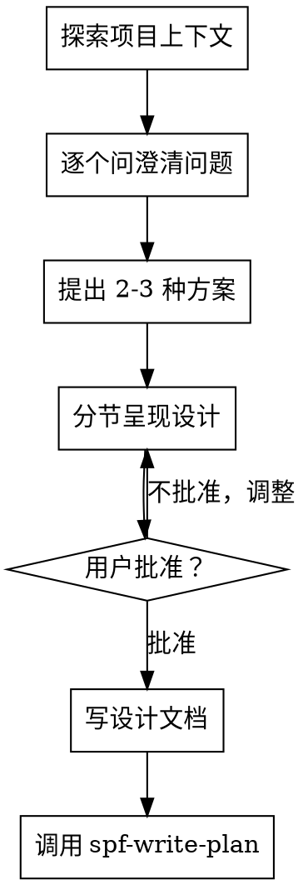

# brainstorming

> **任何创造性工作前的强制 gate**——创建功能、构建组件、添加功能或修改行为之前必须执行。通过自然协作对话将创意探索为完整设计和规格。

## 硬性门槛（HARD-GATE）

**在呈现设计并获得用户批准之前，不得调用任何实现 skill、不得写任何代码、不得搭建任何项目、或采取任何实现行动。**

这适用于**每个项目**，无论感知复杂度。

## Anti-Pattern：不需要设计？

**每个项目都走这个流程。** Todo list、单函数工具、配置变更——全部。"简单"项目正是未审视假设造成最大浪费的地方。设计可以很短（真正简单的项目几句话），但必须呈现并获得批准。

## 流程

## Checklist（强制逐项完成）

1. ✅ **探索项目上下文** — 检查文件、文档、最近提交
2. ✅ **逐个问澄清问题** — 一次一个，理解目的/约束/成功标准
3. ✅ **提出 2-3 种方案** — 含权衡 + 推荐
4. ✅ **分节呈现设计** — 规模匹配复杂度，节后获取批准
5. ✅ **写设计文档** — 保存到 `.superpower-with-files/design/YYYY-MM-DD-<topic>.md` 并提交
6. ✅ **过渡到实现** — 调用 spf-write-plan 创建实现计划

## 理解创意

- 先检查当前项目状态（文件、文档、最近提交）
- **一次问一个问题**，逐步细化创意
- 尽量用多选题（比开放式容易回答）
- 关注理解：目的、约束、成功标准

## 探索方案

- 提出 2-3 种不同方案 + 权衡
- 会话式呈现选项 + 推荐 + 理由
- 先说推荐方案 + 解释原因

## 呈现设计

- 确认理解要构建什么后呈现设计
- 每节规模匹配复杂度：直接项目几句话，微妙项目 200-300 词
- 每节后问"这样对吗"
- 覆盖：架构、组件、数据流、错误处理、测试
- 有问题随时回去澄清

## 之后

**文档**：将批准的设计写入 `.superpower-with-files/design/YYYY-MM-DD-<topic>.md`，提交到 git

**实现**：调用 `spf-write-plan` 创建详细实现计划。不要调用其他 skill。

## 关键原则

- **一次一个问题** — 不要用多问题轰炸
- **多选优先** — 可能时比开放式容易
- **YAGNI 严格** — 从所有设计中移除不必要功能
- **探索替代方案** — 敲定前总要提出 2-3 种方案
- **增量验证** — 呈现设计，获得批准再推进
- **保持灵活** — 有问题回去澄清

## 超级记忆集成

**终止状态是调用 spf-write-plan。** 不要调用前端-design、mcp-builder 或任何其他实现 skill。

## 在 superpower-with-files 中的角色

brainstorming 是**设计 gate**——确保在编码前真正理解要构建什么、为什么构建、如何构建。它是 Planning Phase 的第一步，与 using-superpowers（入口）配合形成完整的"先想后做"循环。
