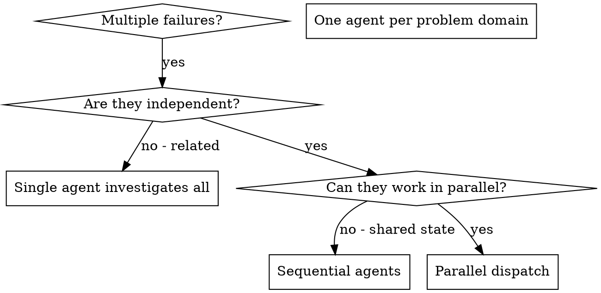

# dispatching-parallel-agents

> 当有 2+ 独立任务且无共享状态或顺序依赖时，并行调度子 agent 调查，每个问题域一个 agent。

## 何时使用



**使用当：**
- 3+ 测试文件失败，根因不同
- 多子系统独立坏
- 每个问题可在无其他上下文下理解
- 无问题间共享状态

**不用当：**
- 失败相关（修一个可能修其他）
- 需要完整系统状态
- Agent 会互相干扰

## 模式

### 1. 识别独立域

按问题分组失败：
- File A tests: Tool approval flow
- File B tests: Batch completion behavior
- File C tests: Abort functionality

### 2. 创建聚焦 Agent Task

每个 agent 获得：
- **具体范围**：一个测试文件或子系统
- **清晰目标**：让这些测试 pass
- **约束**：不修改其他代码
- **期望输出**：发现什么 + 修复什么的总结

### 3. 并行调度

```typescript
Task("Fix agent-tool-abort.test.ts failures")
Task("Fix batch-completion-behavior.test.ts failures")
Task("Fix tool-approval-race-conditions.test.ts failures")
// All three run concurrently
```

### 4. 审查和整合

Agent 返回时：
- 读每个总结
- 验证修复不冲突
- 运行完整测试套件
- 整合所有变更

## Agent Prompt 结构

好 agent prompt：
1. **聚焦** — 一个清晰问题域
2. **自包含** — 理解问题所需全部上下文
3. **具体输出** — agent 应返回什么

```markdown
Fix the 3 failing tests in src/agents/agent-tool-abort.test.ts:

1. "should abort tool with partial output capture" - expects 'interrupted at' in message
2. "should handle mixed completed and aborted tools" - fast tool aborted instead of completed
3. "should properly track pendingToolCount" - expects 3 results but gets 0

These are timing/race condition issues. Your task:

1. Read the test file and understand what each test verifies
2. Identify root cause - timing issues or actual bugs?
3. Fix by:
   - Replacing arbitrary timeouts with event-based waiting
   - Fixing bugs in abort implementation if found
   - Adjusting test expectations if testing changed behavior

Do NOT just increase timeouts - find the real issue.

Return: Summary of what you found and what you fixed.
```

## 常见错误

**❌ 太宽泛**："Fix all the tests" — agent 迷失
**✅ 具体**："Fix agent-tool-abort.test.ts" — 聚焦范围

**❌ 无上下文**："Fix the race condition" — agent 不知道在哪
**✅ 有上下文**：粘贴错误信息和测试名

**❌ 无约束**：Agent 可能重构一切
**✅ 有约束**："Do NOT change production code" 或 "Fix tests only"

## 真实案例

**场景**：重构后 6 个测试失败跨 3 个文件

**失败**：
- agent-tool-abort.test.ts: 3 failures（timing）
- batch-completion-behavior.test.ts: 2 failures（tools 不执行）
- tool-approval-race-conditions.test.ts: 1 failure（execution count = 0）

**决策**：独立域 — abort 逻辑与 batch completion 分离，与 race conditions 分离

**调度**：
```
Agent 1 → Fix agent-tool-abort.test.ts
Agent 2 → Fix batch-completion-behavior.test.ts
Agent 3 → Fix tool-approval-race-conditions.test.ts
```

**结果**：
- Agent 1: 用 event-based waiting 替换 timeouts
- Agent 2: 修复 event structure bug（threadId 位置错误）
- Agent 3: 加 wait for async tool execution 完成

**整合**：所有修复独立，无冲突，完整套件 green

## 验证

Agent 返回后：
1. 审查每个总结
2. 检查冲突
3. 运行完整套件
4. 抽查 — agent 可能犯系统性错误

## 在 superpower-with-files 中的角色

dispatching-parallel-agents 是**加速工具**，用于 debugging 场景。当 systematic-debugging 发现多个独立问题域时用它并行调查。它是 superpower-with-files 框架中"分而治之"思想的极致体现——不是串行解决 3 个问题，而是同时解决 3 个问题。
