# subagent-driven-development

> 在当前 session 内执行实现计划，通过 fresh subagent per task 实现，**每任务两阶段审查**（spec 合规先，code quality 后）。

**核心原则**：每任务 fresh subagent + 两阶段审查 = 高质量、快迭代。

## vs. Executing Plans（并行 session）

| 维度 | subagent-driven-development | executing-plans |
|------|---------------------------|-----------------|
| Session | 同 session（无上下文切换） | 单独 session |
| Subagent | 每任务 fresh（无上下文污染） | 批量执行 |
| 审查 | 每任务两阶段（spec → quality） | 批次间审查 |
| 迭代 | 快（无 human-in-loop between tasks） | 中（批次间暂停） |

## 流程

```dot
digraph process {
    rankdir=TB;

    subgraph cluster_per_task {
        label="Per Task";
        "调度 implementer subagent" [shape=box];
        "Implementer 提问？" [shape=diamond];
        "Answer questions" [shape=box];
        "Implementer implements, tests, commits, self-reviews" [shape=box];
        "调度 spec reviewer subagent" [shape=box];
        "Spec reviewer 确认代码符合 spec？" [shape=diamond];
        "Implementer 修复 spec gaps" [shape=box];
        "调度 code quality reviewer subagent" [shape=box];
        "Code quality reviewer 批准？" [shape=diamond];
        "Implementer 修复 quality issues" [shape=box];
        "Mark task complete" [shape=box];
    }

    "Read plan, extract all tasks, create TodoWrite" [shape=box];
    "More tasks remain?" [shape=diamond];
    "调度最终 code reviewer subagent" [shape=box];
    "使用 finishing-a-development-branch" [shape=box style=filled fillcolor=lightgreen];

    "Read plan..." -> "调度 implementer subagent";
    "调度 implementer subagent" -> "Implementer 提问？";
    "Implementer 提问？" -> "Answer questions" [label="yes"];
    "Answer questions" -> "调度 implementer subagent";
    "Implementer 提问？" -> "Implementer implements..." [label="no"];
    "Implementer implements..." -> "调度 spec reviewer subagent";
    "Spec reviewer..." -> "Implementer 修复 spec gaps" [label="no"];
    "Implementer 修复 spec gaps" -> "调度 spec reviewer subagent" [label="re-review"];
    "Spec reviewer..." -> "调度 code quality reviewer subagent" [label="yes"];
    "调度 code quality reviewer..." -> "Code quality reviewer 批准？";
    "Code quality reviewer 批准？" -> "Implementer 修复 quality issues" [label="no"];
    "Implementer 修复 quality issues" -> "调度 code quality reviewer subagent" [label="re-review"];
    "Code quality reviewer 批准？" -> "Mark task complete" [label="yes"];
    "Mark task complete" -> "More tasks remain?";
    "More tasks remain?" -> "调度 implementer subagent" [label="yes"];
    "More tasks remain?" -> "调度最终 code reviewer subagent" [label="no"];
    "调度最终 code reviewer..." -> "使用 finishing-a-development-branch";
}
```

## 两阶段审查

### Stage 1: Spec Compliance Review

检查：
- 所有 spec 要求都实现了？
- 没有任何 extra（spec 没要求但实现添加的）？
- 进度报告等 spec 细节都有？

### Stage 2: Code Quality Review

检查：
- 代码质量（命名、结构、可读性）
- 没有明显技术债
- 测试覆盖充分

**顺序固定**：先 spec 再 quality。顺序错了会导致质量审查在合规性未确认时进行。

## Prompt 模板

- `./implementer-prompt.md` — 调度 implementer subagent
- `./spec-reviewer-prompt.md` — 调度 spec compliance reviewer subagent
- `./code-quality-reviewer-prompt.md` — 调度 code quality reviewer subagent

## 关键规则

**绝不：**
- 在 main/master 分支上开始实现（无用户明确同意）
- 跳过审查（spec 合规或 code quality）
- 有未修复问题继续
- 并行调度多个 implementer subagent（冲突）
- 让 implementer 读 plan 文件（提供完整文本）
- 在 Code Quality 审查前移动到下一任务

**如果 subagent 提问：**
- 清晰完整回答
- 不要 rush 他们到实现

**如果 reviewer 发现问题：**
- Implementer（同一 subagent）修复
- Reviewer 再次审查
- 重复直到批准

## 优势

- **无上下文切换**：同 session，连续进度
- **新鲜上下文**：每任务无混淆
- **并行安全**：subagent 不互相干扰
- **子 agent 可提问**：实现前/中都能问
- **质量门禁**：spec 合规 + code quality 双保险
- **自动 checkpoint**：审查 loops 确保修复有效

## 在 superpower-with-files 中的角色

subagent-driven-development 是**执行引擎**——当计划存在、任务独立、想同 session 内完成时使用。它与 spf-exec-plan 的区别在于：
- spf-exec-plan：批次执行，人类在批次间反馈
- subagent-driven-development：连续执行，agent 内部两阶段审查

两者是执行层的双轨，共同服务 Planning Phase → Execution Phase 的过渡。
