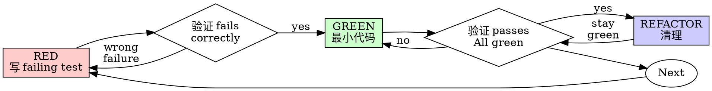

# test-driven-development

> **铁律**：`NO PRODUCTION CODE WITHOUT A FAILING TEST FIRST`。写实现代码前必须有 failing test。违反条文字面即违反精神。

## 适用场景

**始终使用**：
- 新功能
- Bug 修复
- 重构
- 行为变更

**例外（需用户确认）**：
- Throwaway 原型
- 生成的代码
- 配置文件

## 红-绿-重构循环



### RED — 写 Failing Test

写一个最小测试，展示应该发生什么。

**好**：
```typescript
test('retries failed operations 3 times', async () => {
  let attempts = 0;
  const operation = () => {
    attempts++;
    if (attempts < 3) throw new Error('fail');
    return 'success';
  };

  const result = await retryOperation(operation);
  expect(result).toBe('success');
  expect(attempts).toBe(3);
});
```
清晰名称，测试真实行为，一次一件事

**坏**：
```typescript
test('retry works', async () => {
  const mock = jest.fn()
    .mockRejectedValueOnce(new Error())
    .mockRejectedValueOnce(new Error())
    .mockResolvedValueOnce('success');
  await retryOperation(mock);
  expect(mock).toHaveBeenCalledTimes(3);
});
```
模糊名称，测试 mock 而非代码

### 验证 RED — Watch It Fail

**强制。绝不跳过。**

```bash
npm test path/to/test.test.ts
```

确认：
- Test fails（不是 errors）
- 失败信息符合预期
- 因为 feature 缺失而 fail（不是 typo）

**Test passes？** 你在测试已有行为。修复测试。

**Test errors？** 修复错误，重新运行直到正确 fail。

### GREEN — 最小代码

写最简单的代码让测试通过。

**好**：只够通过测试
**坏**：过度工程（选项对象、backoff 等）

不要添加功能、修改其他代码、或超出测试范围"改进"。

### 验证 GREEN — Watch It Pass

**强制。**

```bash
npm test path/to/test.test.ts
```

确认：
- Test passes
- 其他测试仍 pass
- 输出干净（无 errors、warnings）

**Test fails？** 修代码，不是测试。

**其他测试 fails？** 立即修复。

### REFACTOR — 清理

只有在 green 后：
- 移除重复
- 改进名称
- 提取辅助函数

保持测试 green。不添加行为。

## 好测试

| 质量 | 好 | 坏 |
|------|----|----|
| **Minimal** | 一次一件事。名称有"and"？拆分。 | `test('validates email and domain and whitespace')` |
| **Clear** | 名称描述行为 | `test('test1')` |
| **Shows intent** | 展示期望的 API | 掩盖代码应该做什么 |

## 常见合理化

| 借口 | 真相 |
|------|------|
| "太简单不需要测试" | 简单代码会坏。测试花 30 秒。 |
| "我之后再测试" | 之后写的测试立即 pass，什么都证明不了。 |
| "之后测试也能达到同样目标" | 之后测试 = "这做什么？" 先写测试 = "应该做什么？" |
| "已经手动测试了" | 手动测试是随意的。不能重跑。 |
| "删 X 小时工作浪费" | 沉没成本谬误。保留不可信代码是技术债务。 |
| "保留作为参考，之后写测试" | 你会 adapt 它。这叫之后测试。Delete means delete。 |
| "TDD 是教条，我更实用" | TDD 是实用的。生产调试更慢。 |
| "不同情况因为..." | 全部是合理化。Delete。Start over。 |

## 红线 — 停止并重来

- 先写代码后写测试
- 实现后写测试
- 测试立即 pass
- 不能解释为什么测试 fail
- "之后"添加测试
- "就这一次"合理化
- "我已经手动测试了"
- "之后测试达到同样目的"
- "这是精神不是仪式"
- "保留作为参考"或"adapt 现有代码"
- "已经花了 X 小时，删了浪费"
- "TDD 是教条，我很实用"
- "这不同因为..."

**全部意味着：删代码。用 TDD 重来。**

## Bug 修复示例

**Bug**: 空 email 被接受

**RED**：
```typescript
test('rejects empty email', async () => {
  const result = await submitForm({ email: '' });
  expect(result.error).toBe('Email required');
});
```

**验证 RED**：`FAIL: expected 'Email required', got undefined`

**GREEN**：
```typescript
function submitForm(data: FormData) {
  if (!data.email?.trim()) {
    return { error: 'Email required' };
  }
  // ...
}
```

**验证 GREEN**：`PASS`

**REFACTOR**：如需要，提取多字段验证。

## 在 superpower-with-files 中的角色

TDD 是 superpower-with-files 框架的**核心工程纪律**。它渗透在所有执行类 skill 中：
- `spf-exec-plan` 按 TDD 步骤执行
- `subagent-driven-development` 中子 agent 必须遵循 TDD
- `systematic-debugging` 要求修复前写 failing test 再现 bug

没有 TDD，就没有 superpower-with-files 工作流。
