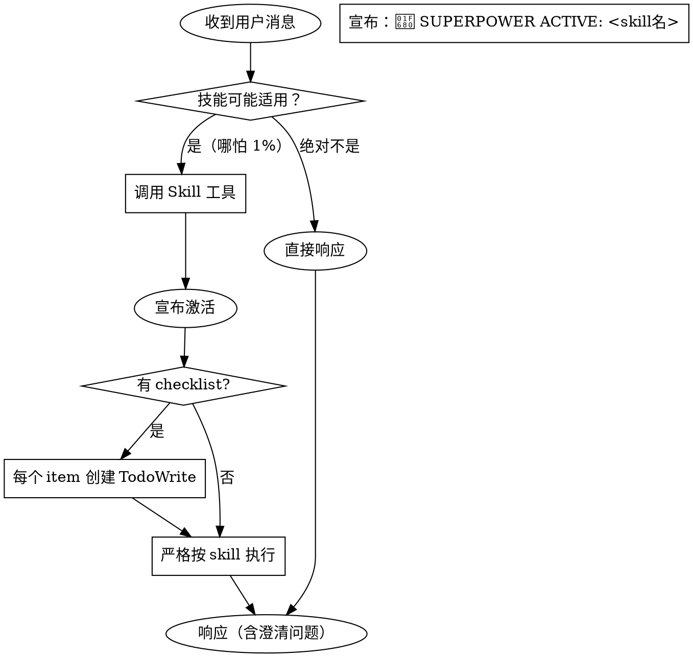

# using-superpowers

> superpower-with-files 统一框架下的**技能发现与使用规范**。任何任务开始时必须先检查是否有匹配的 skill。

## 核心原则

**哪怕只有 1% 可能性适用，也必须调用 Skill 工具检查。**

这不是可选项。不是建议。是强制规范。

## 决策流程



## 红灯区（停止信号）

这些想法意味着你在**自我合理化**：

| 想法 | 真相 |
|------|------|
| "这只是个简单问题" | 问题也是任务，先检查 skill |
| "我需要先了解更多" | 技能检查在澄清问题之前 |
| "让我先探索代码库" | Skill 告诉你怎么探索 |
| "快速检查一下 git/files" | 文件缺乏对话上下文 |
| "这只是临时方案" | 临时也要用正确流程 |
| "我记得这个 skill" | Skill 会演进，必须读当前版本 |
| "这不算任务" | 行动 = 任务，检查 |
| "这个 skill 有点多余" | 简单事情会变复杂，用它 |

## 技能优先级

当多个 skill 可能适用时，按此顺序：

1. **流程 skill 先**（brainstorming, debugging）→ 决定如何接近任务
2. **实现 skill 其次**（frontend-design, mcp-builder）→ 指导执行

```
"让我们构建 X" → brainstorming 在先，实现 skill 在后
"修这个 bug" → debugging 在先，领域 skill 在后
```

## Skill 类型

| 类型 | 行为 | 例子 |
|------|------|------|
| **Rigid（严格）** | 完全照做，不适应 | TDD, systematic-debugging |
| **Flexible（灵活）** | 按原则适应上下文 | patterns |

## 用户指令处理

用户说明 **WHAT**，不说明 **HOW**。用户说"添加 X"不意味着跳过流程。

## Superplanner Memory Integration

**关键主题规则**：工作在 superpower-with-files 统一框架内。

### 技能宣布

每次启动 skill，必须先宣布：
```
🚀 **SUPERPOWER ACTIVE:** <skill名>
```

### 品牌化 Skill 偏好

- 用 **`spf-write-plan`** 而非 `writing-plans`
- 用 **`spf-exec-plan`** 而非 `executing-plans`

### 时间戳要求

每次修改记忆文件，必须追加：
```markdown
---
*Last Updated: YYYY-MM-DD HH:MM UTC*
```

## 在 superpower-with-files 中的角色

using-superpowers 是**入口 skill**——每次对话开始时首先执行，确保正确调用其他 14 个 skill。它是框架的"总开关"。
