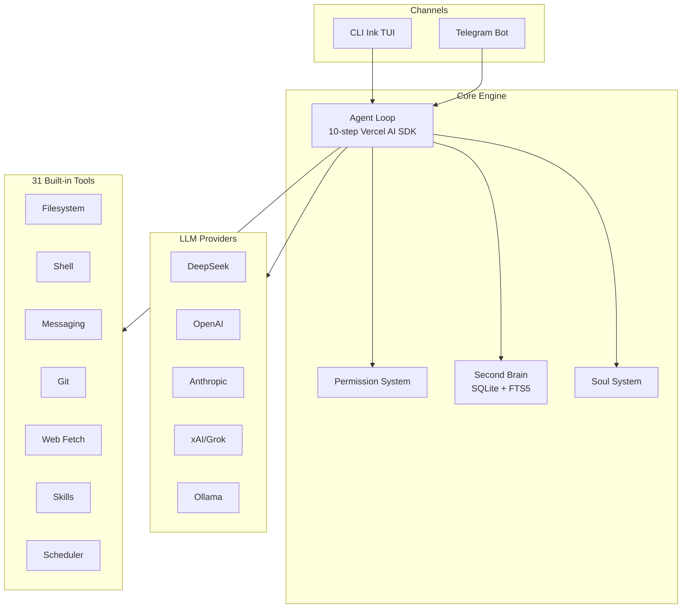

# Mercury Agent

> Soul-driven AI agent with permission-hardened tools, token budgets, and multi-channel access. Runs 24/7 from CLI or Telegram.

## 一句话定义

Mercury 是一个**灵魂驱动的个人 AI Agent**，核心特点是**权限强化**（ask before acting）和**第二大脑记忆系统**（SQLite + FTS5），通过 personality 文件（soul.md、persona.md 等）定义人格，支持 CLI 和 Telegram 双通道，24/7 常驻运行。

## 定位

```
Mercury = 个人 AI 助手（第二大脑 + 权限强化）
         ≠ 通用 Agent 框架
         ≠ 团队协作平台

Mercury 特点：问之前做，记住重要的事
```

## 核心特性

### 权限强化（Permission-Hardened）

| 机制 | 说明 |
|------|------|
| Shell 黑名单 | `sudo`、`rm -rf /` 等危险命令永不执行 |
| 文件夹级别作用域 | 读/写操作限定在指定目录 |
| 待批准流程 | 敏感操作需要用户确认 |
| 双模式 | `Ask Me`（每次确认）或 `Allow All`（全信任） |

### 第二大脑（Second Brain）

Mercury 在每次对话后自动提取 0-3 条事实（fact），存储到 SQLite + FTS5 数据库，10 种记忆类型：

| 类型 | 用途 |
|------|------|
| identity | 用户身份信息 |
| preference | 偏好设置 |
| goal | 目标 |
| project | 项目 |
| habit | 习惯 |
| decision | 决策 |
| constraint | 约束条件 |
| relationship | 关系 |
| episode | 事件记录 |
| reflection | 反思 |

关键机制：
- **自动提取**：对话后自动提取事实，带 confidence、importance、durability 评分
- **相关召回**：每条消息前注入 top 5 相关记忆（900 char budget）
- **自动整合**：每 60 分钟构建 profile summary、active-state summary
- **冲突解决**：高 confidence 或更新者优先
- **自动修剪**：21 天后 stale 记忆过期

### 灵魂系统（Soul-Driven）

Personality 定义完全由用户控制的 markdown 文件：

| 文件 | 作用 |
|------|------|
| `soul.md` | 核心价值观 |
| `persona.md` | 行为模式 |
| `taste.md` | 审美偏好 |
| `heartbeat.md` | 活跃节奏 |

### Token 预算

- **每日预算强制执行**
- 超过 70% 自动 concise 模式
- `/budget` 命令查看/重置/覆盖

## 架构



## 技术栈

| 层次 | 技术 |
|------|------|
| 语言 | TypeScript + Node.js 18+ (ESM) |
| Agent SDK | Vercel AI SDK v4 (`generateText` + `streamText`) |
| Telegram | grammY（typing indicators、editable streaming、file uploads）|
| 记忆 | SQLite + FTS5 |
| Daemon | Background spawn + PID file + watchdog crash recovery |
| 系统服务 | macOS LaunchAgent、Linux systemd、Windows Task Scheduler |

## 内置工具（31 个）

| 类别 | 工具 |
|------|------|
| **文件系统** | `read_file`, `write_file`, `create_file`, `edit_file`, `list_dir`, `delete_file`, `send_file`, `approve_scope` |
| **Shell** | `run_command`, `cd`, `approve_command` |
| **消息** | `send_message` |
| **Git** | `git_status`, `git_diff`, `git_log`, `git_add`, `git_commit`, `git_push` |
| **Web** | `fetch_url` |
| **Skills** | `install_skill`, `list_skills`, `use_skill` |
| **调度** | `schedule_task`, `list_scheduled_tasks`, `cancel_scheduled_task` |
| **系统** | `budget_status` |

## Daemon 模式

```bash
mercury up          # 推荐：安装服务 + 启动守护进程
mercury restart     # 重启后台进程
mercury stop        # 停止后台进程
mercury start -d    # 后台启动（不安装服务）
mercury logs        # 查看守护进程日志
mercury status      # 显示配置和守护进程状态
```

崩溃恢复：指数退避最多每分钟 10 次重启。

### 系统服务（自启动）

| 平台 | 方法 |
|------|------|
| macOS | LaunchAgent (`~/Library/LaunchAgents/`) |
| Linux | systemd user unit (`~/.config/systemd/user/`) |
| Windows | Task Scheduler (`schtasks`) |

## Provider 降级机制

配置多个 LLM Provider，按顺序自动降级：

| Provider | 默认模型 | API Key |
|----------|---------|---------|
| DeepSeek | deepseek-chat | `DEEPSEEK_API_KEY` |
| OpenAI | gpt-4o-mini | `OPENAI_API_KEY` |
| Anthropic | claude-sonnet-4 | `ANTHROPIC_API_KEY` |
| xAI/Grok | grok-4 | `GROK_API_KEY` |
| Ollama Cloud | gpt-oss:120b | `OLLAMA_CLOUD_API_KEY` |
| Ollama Local | gpt-oss:20b | 无需 Key |

## 与其他个人 Agent 对比

| | Mercury | OpenHands | Agent-Skills |
|---|---|---|---|
| **权限强化** | ✅ 黑名单 + 作用域 | ❌ | ❌ |
| **第二大脑** | ✅ SQLite + FTS5 | ❌ | ❌ |
| **Soul 人格** | ✅ markdown 文件 | ❌ | ❌ |
| **多通道** | CLI + Telegram | CLI only | CLI only |
| **Token 预算** | ✅ 每日强制 | ❌ | ❌ |
| **Provider 降级** | ✅ 自动 | ❌ | ❌ |

## 安装与使用

```bash
# 快速开始
npx @cosmicstack/mercury-agent

# 全局安装
npm i -g @cosmicstack/mercury-agent
mercury

# 守护进程模式
mercury up
```

## 相关页面

- [[Agent Review Pattern]] — Agent 审 Agent 机制
- [[Harness Engineering]] — Agent 可靠工作工程化方法论
- [[paperclip]] — 心跳驱动的 Agent 编排平台
