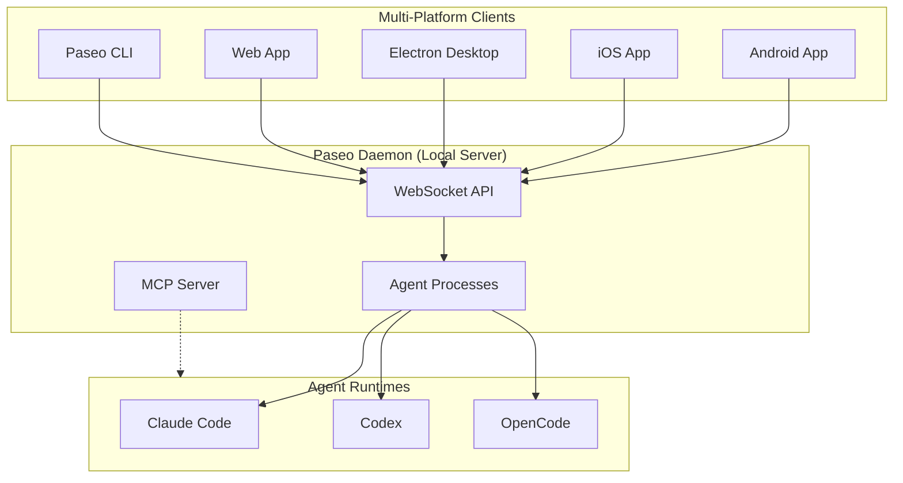

# Paseo

> One interface for all your Claude Code, Codex and OpenCode agents — orchestrate coding agents remotely from your phone, desktop and CLI.

## 一句话定义

Paseo 是一个**跨设备 Agent 编排平台**，通过本地 daemon + 多端客户端（iOS/Android/Web/Desktop/CLI）实现对 Claude Code、Codex、OpenCode 的远程控制和并行编排，支持语音操作，强调隐私优先（无遥测、无追踪、无强制登录）。

## 定位

```
Paseo = Agent 编排控制平面（远程控制 + 多 Agent 协调）
       ≠ Agent 运行时（执行在本地机器）
       ≠ 团队协作平台

核心价值：同一界面控制多 provider Agent，跨设备无缝切换
```

## 核心架构



### Monorepo 结构

| Package | 说明 |
|---------|------|
| `packages/server` | Paseo daemon（Agent 进程编排、WebSocket API、MCP Server）|
| `packages/app` | Expo Client（iOS、Android、Web）|
| `packages/cli` | `paseo` CLI（daemon 和 agent 工作流）|
| `packages/desktop` | Electron 桌面应用 |
| `packages/relay` | 远程连接 relay 包 |
| `packages/website` | 官网和文档（paseo.sh）|

## 核心特性

### 多 Provider 支持

| Provider | 模型 |
|----------|------|
| Claude Code | Claude 系列 |
| Codex | GPT 系列 |
| OpenCode | 开源模型 |

### 跨设备同步

- **iOS、Android**：移动端随时检查和控制
- **Desktop**：Electron 桌面应用
- **Web**：浏览器访问
- **CLI**：终端脚本化操作

同一 daemon 在本地运行，QR 码连接移动端。

### 语音控制

支持语音输入任务或对话式操作，解放双手。

### Skills 系统

Paseo 提供 Agent Skills 用于编排子 Agent：

| Skill | 功能 |
|-------|------|
| `/paseo-handoff` | 在 Agent 之间移交工作 |
| `/paseo-loop` | 循环 Agent 对抗明确验收标准（aka Ralph loops）|
| `/paseo-advisor` | 启动单个 Agent 作为顾问 |
| `/paseo-committee` | 组建两人委员会做根因分析和规划 |

### 隐私优先

- ❌ 无遥测（No telemetry）
- ❌ 无追踪（No tracking）
- ❌ 无强制登录（No forced log-ins）

## CLI 用法

```bash
# 运行 Agent
paseo run --provider claude/opus-4.6 "implement user authentication"
paseo run --provider codex/gpt-5.4 --worktree feature-x "implement feature X"

# 列表和监控
paseo ls                           # 列出运行中的 Agent
paseo attach abc123                # 流式查看实时输出
paseo send abc123 "also add tests" # 发送跟进任务

# 远程 daemon
paseo --host workstation.local:6767 run "run the full test suite"
```

## 远程连接（Relay）

对于不在同一网络的设备，Paseo 支持 self-hosted relay：

```bash
# 启动带 TLS 的 relay
PASEO_RELAY_ENDPOINT=127.0.0.1:8080 \
PASEO_RELAY_PUBLIC_ENDPOINT=relay.example.com:443 \
PASEO_RELAY_USE_TLS=true \
paseo daemon start
```

### Nginx WebSocket 代理配置

```nginx
server {
    listen 443 ssl;
    server_name relay.example.com;

    ssl_certificate /etc/letsencrypt/live/relay.example.com/fullchain.pem;
    ssl_certificate_key /etc/letsencrypt/live/relay.example.com/privkey.pem;

    location /ws {
        proxy_pass http://127.0.0.1:8080;
        proxy_http_version 1.1;
        proxy_set_header Upgrade $http_upgrade;
        proxy_set_header Connection "upgrade";
        proxy_set_header Host $host;
    }
}
```

## 技术栈

| 层次 | 技术 |
|------|------|
| 语言 | TypeScript |
| 移动端 | React Native (Expo) |
| 桌面端 | Electron |
| 实时通信 | WebSocket |
| Agent 接口 | Claude Code / Codex / OpenCode CLI |

## 与 Paperclip 对比

| 维度 | Paseo | Paperclip |
|------|-------|-----------|
| 核心定位 | 跨设备远程控制 | 企业级编排平台 |
| Agent 运行时 | 本地 CLI（Claude Code/Codex/OpenCode）| 适配器层对接 |
| 租户模型 | 个人/团队 | 多公司隔离 |
| 预算治理 | ❌ | ✅ 月度预算 + 成本追踪 |
| 移动端 | ✅ iOS/Android | ❌ |
| 隐私 | 无遥测/追踪/登录 | 企业级合规 |

## 安装

```bash
# CLI
npm install -g @getpaseo/cli
paseo

# Desktop app
# 下载地址：paseo.sh/download 或 GitHub releases
```

## 相关页面

- [[paperclip]] — 心跳驱动的 Agent 编排平台
- [[Multica]] — 开源多 Agent 队友平台
- [[Harness Engineering]] — Agent 可靠工作工程化方法论
