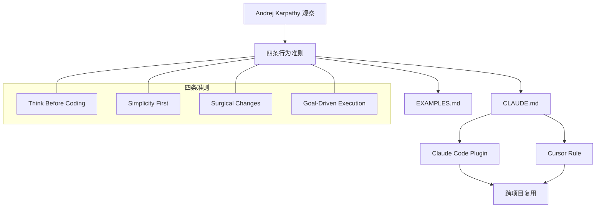

# andrej-karpathy-skills

> GitHub: https://github.com/multica-ai/andrej-karpathy-skills
> MIT · 155k ⭐ · by multica-ai (fork from forrestchang)

## 一句话描述

一个 `CLAUDE.md` 文件，将 Andrej Karpathy 对 LLM 编码陷阱的观察提炼为四条行为准则，直接约束 Claude Code 的编码行为。

## 基本信息

- **作者**: forrestchang（原作）→ multica-ai（维护）
- **版本**: 1.0.0
- **License**: MIT
- **入口方式**: Claude Code Plugin（推荐）或直接复制 CLAUDE.md
- **平台**: Claude Code、Cursor（含 .cursor/rules）

## 核心架构



## 四条准则详解

### 1. Think Before Coding

**解决的问题**: LLM 静默选择假设、隐藏困惑、缺失权衡

- 显式声明假设，不确定时提问
- 存在多种解读时全部呈现，不静默选择
- 有更简单方案时主动反驳
- 困惑时停下来，明确说什么不清楚

### 2. Simplicity First

**解决的问题**: 过度工程、膨胀抽象、投机性代码

- 不做超出需求的功能
- 单次使用的代码不做抽象
- 不加未请求的"灵活性"或"可配置性"
- 不为不可能的场景做错误处理
- 200 行能缩到 50 行就重写

### 3. Surgical Changes

**解决的问题**: 修改无关代码、副作用、破坏性变更

- 不"改进"相邻代码/注释/格式
- 不重构没坏的东西
- 匹配现有风格，即使你会写得不同
- 发现无关死代码只提不删

### 4. Goal-Driven Execution

**解决的问题**: 指令式任务缺乏验证闭环

- 将指令转化为声明式目标 + 验证循环
- "Add validation" → "Write tests for invalid inputs, then make them pass"
- 多步任务用 `step → verify` 格式规划

## 安装和使用

```bash
# Claude Code Plugin（推荐）
/plugin marketplace add forrestchang/andrej-karpathy-skills
/plugin install andrej-karpathy-skills@karpathy-skills

# 或直接下载 CLAUDE.md
curl -o CLAUDE.md https://raw.githubusercontent.com/multica-ai/andrej-karpathy-skills/main/CLAUDE.md
```

## 与同类工具对比

| 维度 | andrej-karpathy-skills | [[gstack]] | [[agent-skills]] |
|------|----------------------|------------|-----------------|
| **定位** | 行为准则（what NOT to do） | 角色化工程团队（who does what） | 工程技能库（how to do） |
| **粒度** | 4 条原则，单文件 | 11 个角色定义 | 20 个技能模块 |
| **核心洞见** | LLM 倾向过度工程 + 静默假设 | 多角色分工 + 反自合理化 | Google eng-practices 嵌入 |
| **安装复杂度** | 极低（单文件） | 中等（多文件） | 中等（多文件） |
| **适用场景** | 所有 LLM 编码任务的基线约束 | 需要完整团队协作的项目 | 需要结构化工程流程的项目 |

## 关键设计决策

1. **单文件哲学**: 所有准则浓缩在一个 CLAUDE.md 中，降低采纳门槛
2. **反面教材驱动**: 每条原则都针对 LLM 的具体失败模式，而非泛泛的最佳实践
3. **Karpathy 背书**: 直接引用 Karpathy 的 X 推文作为理论基础，增强说服力
4. **Plugin 生态**: 通过 Claude Code Plugin 机制实现跨项目自动加载

## 关键文件索引

| 文件 | 用途 |
|------|------|
| `CLAUDE.md` | 核心准则文件，可直接放入项目 |
| `README.md` | 项目说明和安装指南 |
| `EXAMPLES.md` | 真实代码示例，展示常见错误和正确做法 |
| `CURSOR.md` | Cursor 集成说明 |
| `.claude-plugin/plugin.json` | Claude Code Plugin 配置 |
| `.cursor/rules/karpathy-guidelines.mdc` | Cursor 项目规则 |
