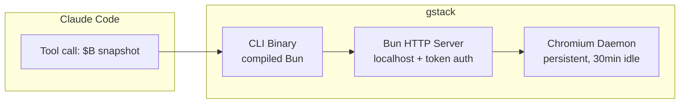

# gstack

**gstack** 是 Y Combinator CEO Garry Tan 开源的 Claude Code 技能包（79k+ GitHub ⭐），将单个 AI 助手转变为多角色虚拟工程团队。核心定位：**Harness Engineering 的生产级实现**。

## Key facts

- **作者**: Garry Tan — Y Combinator CEO / Founder @garryslist / Palantir early eng / Posterous cofounder
- **GitHub**: [garrytan/gstack](https://github.com/garrytan/gstack) — 75k+ stars, 14,965 installations, 305k skill invocations
- **License**: Open source
- **技术栈**: Bun (compiled binary), Playwright (persistent Chromium daemon), TypeScript
- **安装路径**: `~/.claude/skills/gstack/`（全局）或 `.claude/skills/gstack/`（vendored）
- **成功率**: 95.2% across all skill runs

## 为什么重要

gstack 是目前最完整的 **AI Coding Agent Harness** 参考实现：

1. **Persistent Browser Daemon** — 解决了 AI browser tool 的根本问题：冷启动延迟（3-5s/次）和状态丢失（cookies/tabs）
2. **Multi-Role Agent Pattern** — 用 SKILL.md 实现角色切换，CEO/EM/Staff Eng/QA/SRE/Design 各司其职
3. **Cross-Session Memory** — learnings.jsonl 让 agent 从历史 session 中学习，不重复犯错
4. **Review Pipeline** — CEO review → design review → eng review 三层审查，Codex 作为 second opinion
5. **Testing as the unlock** — 测试从 100 条增长到 2000+ 条，是 AI coding 真正安全的前提

## 核心架构

**关键技术决策**:
- **Bun 而非 Node.js**: compiled binary（无 runtime node_modules）、native SQLite（cookie 解密）、native HTTP server
- **State file**: `.gstack/browse.json`（pid/port/token/version），atomic write，mode 0600
- **Bearer token auth**: UUID per session，401 on mismatch
- **Version auto-restart**: binary version ≠ running server → kill + restart
- **Ref system**: ARIA tree → @e1/@e2 refs → Playwright Locators（无 DOM mutation，CSP-safe）
- **Prompt injection defense**: 6 层防御（L1 content security → L4 ML classifier 22MB BERT-small → L5 canary token → L6 ensemble combiner）

## 与 Hermes/Agent Harness 的关系

gstack 和 Hermes 的 acp-client 项目解决的是同一类问题：**如何让 AI Coding Agent 可靠工作**。关键对标：

| 维度 | gstack | Hermes acp-client |
|------|--------|-------------------|
| Agent 抽象 | SKILL.md + slash commands | ACP protocol + dataclass spawner |
| Browser | Playwright persistent daemon | via OpenClaw/Chorus |
| Memory | learnings.jsonl (per project) | cross-session via wiki |
| Review | CEO/EM/Design/Codex multi-layer | manual/agentic |
| Testing | /qa (Playwright) | 需集成 |

**gstack 的优势**: 完整的产品化（79k stars 验证），skill 生态丰富，开箱即用
**Hermes 的优势**: 更灵活的 agent 抽象，LLM wiki 作为 memory layer，browser 可复用 OpenClaw

## Commands

gstack 通过 Claude Code 的 `/` 命令触发，所有 skill 存储为 `SKILL.md`，日志自动写入 `~/.gstack/projects/<slug>/learnings.jsonl`。

### Product & Planning

| Command | Role | 功能 |
|---------|------|------|
| `/office-hours` | YC Office Hours | 6 个强制问题，在写代码前重新审视产品方向 |
| `/plan-ceo-review` | CEO/Founder | 找到 10 星产品；4 种模式：Expansion/SelExp/Hold/Reduction |
| `/plan-eng-review` | Eng Manager | 锁定架构、数据流、图表、边界情况、测试 |
| `/plan-design-review` | Senior Designer | Plan 模式设计审查，0-10 评分，7 轮设计审查 |
| `/design-consultation` | Design Partner | 从零构建设计系统，识别创意风险 |
| `/design-review` | Designer Who Codes | 实时网站 80 项视觉审计 + 修复循环 |
| `/design-shotgun` | Design Explorer | 多个 AI 变体，对比板，迭代至批准 |
| `/design-html` | Design Engineer | 从已批准设计稿生成生产级 Pretext HTML |
| `/autoplan` | Review Pipeline | CEO → Design → Eng 审查链，自动决议 |

### Execution & Verification

| Command | Role | 功能 |
|---------|------|------|
| `/review` | Staff Engineer | 结构性审查：N+1、竞态条件、信任边界、完整性缺口 |
| `/investigate` | Debugger | 根因调试，铁律：未调查不修复 |
| `/qa` | QA Lead | Playwright 测试，diff 感知，自动回归测试 |
| `/qa-only` | QA Reporter | 同方法论，纯报告 |
| `/browse` | QA Engineer | 持久化 Chromium daemon，约 100ms/命令，真实浏览器状态 |
| `/setup-browser-cookies` | Session Manager | 从真实浏览器（Chrome/Arc/Brave/Edge）导入 cookies |
| `/canary` | SRE | 部署后监控循环，控制台错误，性能回归 |
| `/benchmark` | Performance Engineer | Core Web Vitals，真实 Chromium 测量，对比 diff |

### Release & Operations

| Command | Role | 功能 |
|---------|------|------|
| `/ship` | Release Engineer | 同步 → 测试 → 覆盖率审计 → 推送 → PR |
| `/land-and-deploy` | Release Engineer | 合并 → CI → 部署 → canary 验证，一命令完成 |
| `/setup-deploy` | Deploy Configurator | 检测平台（Fly/Render/Vercel/Netlify/Heroku/GHA），写入 CLAUDE.md |
| `/cso` | Chief Security Officer | OWASP Top 10 + STRIDE 威胁模型 |
| `/document-release` | Technical Writer | 同步文档与 diff，捕捉过时 README |
| `/retro` | Eng Manager | 周回顾：commit 历史、发版速度、测试健康趋势 |

### Memory & Learning

| Command | Role | 功能 |
|---------|------|------|
| `/learn` | Memory | 管理 learnings.jsonl — 搜索、裁剪、导出、按类型统计（pattern/pitfall/preference/architecture） |

### Multi-AI

| Command | Role | 功能 |
|---------|------|------|
| `/codex` | Second Opinion | OpenAI Codex CLI 审查，3 种模式：review/challenge/consult |

### Safety

| Command | Role | 功能 |
|---------|------|------|
| `/careful` | Safety Guardrails | 危险命令警告（`rm -rf`、`DROP TABLE`、force-push） |
| `/freeze` | Edit Lock | 限制编辑至单一目录 |
| `/guard` | Full Safety | `/careful` + `/freeze` 组合 |
| `/unfreeze` | Unlock | 解除冻结边界 |
| `/open-gstack-browser` | Co-presence | 有头 Chromium + 侧边栏，实时观察 agent 行为 |
| `/gstack-upgrade` | Self-Updater | 升级全局 + vendored 安装，显示 changelog |

> **Usage stats**（2026-04）：75k+ ⭐ · 14,965 安装 · 305,309 总调用 · 95.2% 成功率
> Top skills: `/qa` (57,650)、`/plan-eng-review` (28,014)、`/office-hours` (24,817)、`/ship` (18,899)

## Skill Concept Pages（详细文档）

| Skill | Concept | 职责 |
|-------|---------|------|
| `/office-hours` | [[concepts/gstack/office-hours]] | YC Office Hours — 6 个强制问题重新审视产品想法 |
| `/review` | [[concepts/gstack/review]] | Pre-landing PR 审查 — N+1/竞态/信任边界/完整性 |
| `/investigate` | [[concepts/gstack/investigate]] | 根因调试 — 四阶段，铁律：未调查不修复 |
| `/qa` | [[concepts/gstack/qa]] | 真实浏览器 QA — Playwright 三层测试深度 |
| `/ship` | [[concepts/gstack/ship]] | Release Engineer — sync → test → review → PR |
| `/learn` | [[concepts/gstack/learn]] | 跨会话记忆 — learnings.jsonl 管理 |

## 相关概念

- [[entities/concepts-frameworks/OpenClaw]] — gstack 与 OpenClaw ACP 深度集成（spawned session、Conductor MCP）
- [[concepts/superpower-with-files/planning-with-files]] — 同样解决 AI coding harness，superpower 用 TDD，gstack 用 multi-role review pipeline

## Sources

- [[summaries/gstack]] — gstack 一句话总结、核心要点、架构图
- [[concepts/gstack/office-hours]] — /office-hours 详细文档
- [[concepts/gstack/review]] — /review 详细文档
- [[concepts/gstack/investigate]] — /investigate 详细文档
- [[concepts/gstack/qa]] — /qa 详细文档
- [[concepts/gstack/ship]] — /ship 详细文档
- [[concepts/gstack/learn]] — /learn 详细文档
