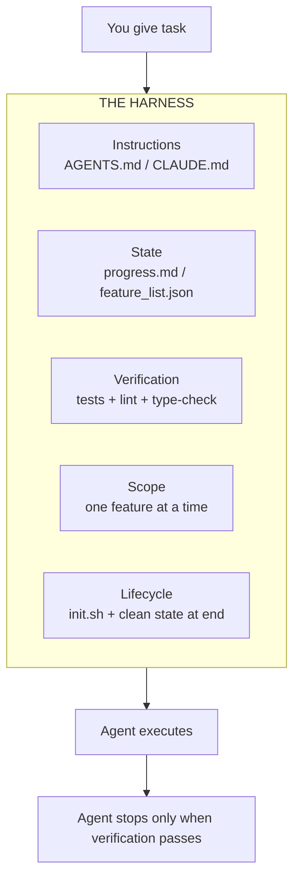

# learn-harness-engineering

> GitHub: https://github.com/walkinglabs/learn-harness-engineering
> MIT · 6.6k stars · 13 种语言 · walkinglabs

## 一句话描述

Harness Engineering 官方风格入门课程——12 讲 + 6 个项目，教你从零构建让 AI Coding Agent 可靠工作的环境：指令、状态、验证、范围、生命周期五大子系统。

## 核心论点

**模型很聪明，Harness 让它可靠。** Anthropic 实验：同一模型（Opus 4.5），无 harness 花 $9/20min 产出不可用；有 harness 花 $200/6h 产出可玩的游戏。模型没变，Harness 变了。

## 五大子系统



| 子系统 | 产出 | 职责 |
|--------|------|------|
| **Instructions** | AGENTS.md / CLAUDE.md / docs/ | 告诉 agent 做什么、什么顺序、开始前读什么 |
| **State** | progress.md / feature_list.json / git log | 追踪已完成、进行中、下一步，持久化到磁盘 |
| **Verification** | tests / lint / type-check / smoke runs | 只有测试通过才算完成，agent 不能自说自话 |
| **Scope** | feature_list.json + done criteria | 一次只做一个功能，不过界、不半途而废 |
| **Lifecycle** | init.sh + session-handoff.md | 每次 session 开始初始化，结束清理，留下干净重启路径 |

## Agent Session 生命周期

```
START
  1. 读 AGENTS.md / CLAUDE.md
  2. 跑 init.sh（安装 + 验证 + 健康检查）
  3. 读 progress.md（上次做了什么）
  4. 读 feature_list.json（哪些完成了、哪些下一个）
  5. 检查 git log（最近变更）
SELECT
  6. 选一个未完成的功能
  7. 只做这个功能
EXECUTE
  8. 实现功能
  9. 跑验证（tests / lint / type-check）
  10. 验证失败：修复重跑
  11. 验证通过：记录证据
WRAP UP
  12. 更新 progress.md
  13. 更新 feature_list.json
  14. 记录未修复/未验证的内容
  15. 提交（仅在安全可恢复时）
  16. 留下干净重启路径
```

## 课程大纲

### 12 讲（概念）

| # | 核心问题 | 关键洞见 |
|---|---------|---------|
| L01 | 为什么强模型在真实任务上失败？ | benchmark 和真实工程之间的能力鸿沟 |
| L02 | Harness 到底是什么？ | 五大子系统：指令/状态/验证/范围/生命周期 |
| L03 | 为什么 repo 必须是唯一真相源？ | agent 看不到的信息 = 不存在 |
| L04 | 为什么一个巨大的指令文件会失败？ | 渐进式披露：给地图，不给百科全书 |
| L05 | 为什么长任务丢失连续性？ | 持久化进度到磁盘，断点续做 |
| L06 | 为什么初始化需要独立阶段？ | 在 agent 开始工作前验证环境健康 |
| L07 | 为什么 agent 过界又做不完？ | 一次一个功能 + 显式完成定义 |
| L08 | 为什么功能列表是 harness 原语？ | 机器可读的范围边界，agent 无法忽略 |
| L09 | 为什么 agent 过早宣布完成？ | 验证鸿沟：自信 ≠ 正确 |
| L10 | 为什么端到端测试改变结果？ | 只有完整 pipeline 运行才算真正验证 |
| L11 | 为什么可观测性属于 harness？ | 看不到 agent 做了什么，就修不了它坏了什么 |
| L12 | 为什么每个 session 必须留干净状态？ | 下次 session 的成功取决于这次的清理 |

### 6 个项目（实践）

| # | 做什么 | Harness 机制 |
|---|--------|-------------|
| P01 | prompt-only vs rules-first 对比 | 最小 harness：AGENTS.md + init.sh + feature_list.json |
| P02 | 重构 repo 让 agent 能读懂 | Agent 可读工作区 + 持久化状态文件 |
| P03 | 让 agent 断点续做 | 进度日志 + session handoff + 多 session 连续性 |
| P04 | 防止 agent 做太多或太少 | 运行时反馈 + 范围控制 + 增量索引 |
| P05 | 让 agent 自己验证自己的工作 | 自验证 + 基于证据的完成声明 |
| P06 | 从零构建完整 harness（毕业项目） | 全部机制 + 可观测性 + 消融实验 |

每个项目的 solution 是下一个项目的 starter，应用随课程进化。

## 毕业项目

所有 6 个项目围绕同一个产品：**Electron 个人知识库桌面应用**——导入文档、管理文档库、AI 问答（带引用）。选择理由：实用价值 + 足够复杂度 + 适合观察 harness 改进前后对比。

## 快速开始（不用读完 12 讲）

直接把 4 个文件放进项目：

```
YOUR PROJECT ROOT
+-- AGENTS.md              <-- agent 操作手册
+-- CLAUDE.md              <-- (Claude Code 用这个)
+-- init.sh                <-- 跑安装 + 验证 + 启动
+-- feature_list.json      <-- 哪些功能完成了
+-- claude-progress.md     <-- 每次 session 发生了什么
```

模板在 [Resource Library](https://walkinglabs.github.io/learn-harness-engineering/en/resources/)。

## Harness Creator Skill

仓库自带 `skills/harness-creator/` skill，一条命令为你的项目生成生产级 harness：

```bash
node skills/harness-creator/scripts/create-harness.mjs --target /path/to/project
```

自动生成 AGENTS.md / CLAUDE.md + feature_list.json + init.sh + verification workflows + session handoff。

## 核心参考

- [OpenAI: Harness engineering — leveraging Codex in an agent-first world](https://openai.com/index/harness-engineering/)
- [Anthropic: Effective harnesses for long-running agents](https://www.anthropic.com/engineering/effective-harnesses-for-long-running-agents)
- [Anthropic: Harness design for long-running application development](https://www.anthropic.com/engineering/harness-design-long-running-apps)
- [[awesome-harness-engineering]] — walkinglabs 维护的 awesome list

## 与同类课程对比

| | learn-harness-engineering | [[learn-claude-code]] | [[gstack]] |
|---|---|---|---|
| **定位** | Harness 工程系统课程 | Bash 脚本教程 | 多角色技能包 |
| **深度** | 12 讲 + 6 项目 + 毕业项目 | 1 个长视频 | 23 个 SKILL.md |
| **核心洞见** | 五大子系统 + session 生命周期 | Bash is all you need | CEO/EM/QA/SRE 角色分工 |
| **实用产出** | 模板 + harness-creator skill | bash 脚本 | 即用 skill 包 |
| **Stars** | 6.6k | 54k | 79k |

## 相关项目

- [[Harness Engineering]] — 核心概念
- [[gstack]] — Harness Engineering 的生产级参考实现
- [[agent-skills]] — 20 工程技能库
- [[ralph]] / [[ralphy]] — 自主 Agent 循环（PRD 驱动）
- [[OpenHarness]] — 开源 harness 执行框架
