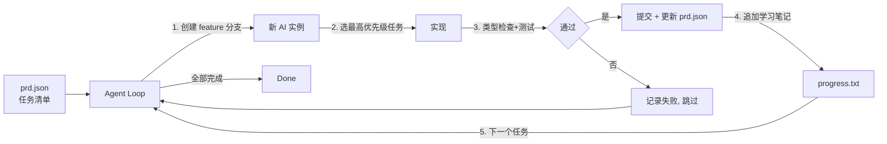

# ralph

> GitHub: https://github.com/snarktank/ralph
> MIT · 19.5k · TypeScript

## 一句话描述

自主 AI Agent 循环——反复运行 AI 编程工具（Amp / Claude Code），每轮都是全新上下文，直到 PRD 中所有任务完成。灵感来自 Geoffrey Huntley 的 [Ralph Wiggum technique](https://ghuntley.com/ralph/)。

## 核心机制



**关键设计**：每轮迭代是**全新 AI 实例**，避免上下文污染。迭代间记忆只靠三个文件：
- `prd.json` — 任务状态（passes: true/false）
- `progress.txt` — 追加式学习笔记
- Git 历史 — 代码变更

## 安装

```bash
# Claude Code Plugin（推荐）
/plugin marketplace add snarktank/ralph
/plugin install ralph@ralph

# 或全局 skills
cp ralph.sh ~/.claude/skills/ralph/

# 或复制到项目
cp ralph.sh prompt.md scripts/ralph/
```

前置：Amp CLI 或 Claude Code + `jq` + Git

## 使用流程

```bash
# 1. 用 AI 生成 PRD
# 2. 转成 JSON -> prd.json
# 3. 跑循环
./ralph.sh 10  # 默认 10 轮
```

## 关键文件

| 文件 | 用途 |
|------|------|
| `ralph.sh` | Bash 循环脚本，启动新 AI 实例 |
| `prompt.md` / `CLAUDE.md` | 提示词模板（Amp / Claude Code） |
| `prd.json` | 用户故事任务列表 |
| `progress.txt` | 追加式学习笔记 |
| `skills/prd/` | PRD 生成技能 |
| `skills/ralph/` | PRD 转 JSON 技能 |

## 设计理念

- **任务粒度要小**：每个故事应在单个上下文窗口内完成
- **反馈循环必不可少**：没有类型检查和测试，代码质量会跨迭代恶化
- **AGENTS.md 更新至关重要**：记录发现的模式、陷阱和约定

## 与 ralph-claude-code 的关系

| | snarktank/ralph | frankbria/ralph-claude-code |
|---|---|---|
| **来源** | snarktank 团队 | frankbria 个人 |
| **Stars** | 19.5k | 566 tests |
| **AI 引擎** | Amp / Claude Code | Claude Code only |
| **定位** | 社区主流实现 | 早期实现 |

## 相关项目

- [[ralphy]] — Ralphy，Ralph 的增强版 CLI，支持 8 种 AI 引擎 + 并行执行
- [[ralph-claude-code]] — 早期 Ralph 实现（frankbria）
- [[Harness Engineering]] — Agent 可靠工作工程化方法论
- [[gstack]] — 多角色工程团队，含 Ralph Wiggum Loop
