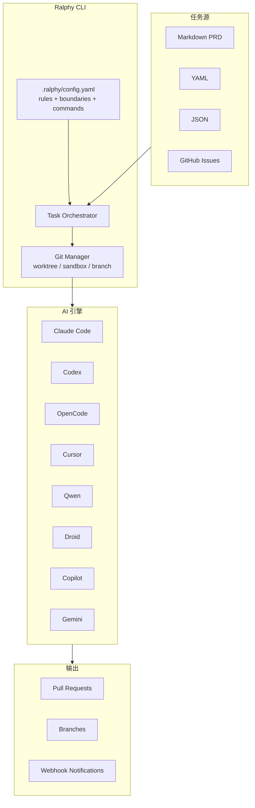

# ralphy

> GitHub: https://github.com/michaelshimeles/ralphy
> 2.9k stars · TypeScript · npm: `ralphy-cli`

## 一句话描述

Ralph Wiggum 模式的增强版 CLI——自主 AI 编码循环，支持 **8 种 AI 引擎**（Claude / Codex / OpenCode / Cursor / Qwen / Droid / Copilot / Gemini），**并行执行**，**GitHub Issues** 作为任务源。

## 与 snarktank/ralph 的对比

| | snarktank/ralph | ralphy |
|---|---|---|
| **语言** | Bash 脚本 | TypeScript CLI (npm) |
| **安装** | 复制文件 | `npm i -g ralphy-cli` |
| **AI 引擎** | Amp / Claude Code | 8 种：Claude / Codex / OpenCode / Cursor / Qwen / Droid / Copilot / Gemini |
| **任务源** | prd.json | Markdown / YAML / JSON / GitHub Issues / 文件夹 |
| **并行执行** | 无 | `--parallel --max-parallel 5`，每个 agent 独立 worktree |
| **沙箱模式** | 无 | `--sandbox`，symlink 共享 node_modules 省空间 |
| **浏览器验证** | 无 | `--browser`，agent-browser 自动化 UI 测试 |
| **分支管理** | 手动 | `--branch-per-task --create-pr` 自动 |
| **通知** | 无 | Discord / Slack / 自定义 webhook |
| **项目配置** | 无 | `.ralphy/config.yaml`：rules / boundaries / commands |
| **Stars** | 19.5k | 2.9k |

## 核心架构



## 安装

```bash
npm install -g ralphy-cli
```

## 两种模式

```bash
# 单任务
ralphy "add dark mode"
ralphy --opencode "fix the auth bug"

# PRD 驱动
ralphy --prd PRD.md
ralphy --opencode --prd tasks.md
```

## AI 引擎

```bash
ralphy              # Claude Code (default)
ralphy --opencode   # OpenCode
ralphy --cursor     # Cursor
ralphy --codex      # Codex
ralphy --qwen       # Qwen-Code
ralphy --droid      # Factory Droid
ralphy --copilot    # GitHub Copilot
ralphy --gemini     # Gemini CLI
```

## 任务源格式

| 格式 | 命令 | 说明 |
|------|------|------|
| Markdown | `--prd PRD.md` | `- [ ]` checklist |
| Markdown 文件夹 | `--prd ./prd/` | 多文件聚合，按文件追踪进度 |
| YAML | `--yaml tasks.yaml` | 支持 `parallel_group` |
| JSON | `--json PRD.json` | 支持 `parallel_group` + description |
| GitHub Issues | `--github owner/repo` | 可按 label 过滤 |

## 并行执行

```bash
ralphy --parallel                  # 默认 3 个 agent
ralphy --parallel --max-parallel 5 # 5 个 agent
```

每个 agent 获得独立 worktree + 分支：
```
Agent 1 -> /tmp/xxx/agent-1 -> ralphy/agent-1-create-auth
Agent 2 -> /tmp/xxx/agent-2 -> ralphy/agent-2-add-dashboard
```

## Sandbox 模式（大仓库优化）

```bash
ralphy --parallel --sandbox
```

用 symlink 共享 `node_modules`、`.git`、`vendor` 等只读依赖，只复制源文件。比 git worktree 快很多。

## 项目配置

```bash
ralphy --init              # 自动检测项目设置
ralphy --config            # 查看配置
ralphy --add-rule "use TypeScript strict mode"
```

`.ralphy/config.yaml`：
```yaml
project:
  name: "my-app"
  language: "TypeScript"

commands:
  test: "npm test"
  lint: "npm run lint"
  build: "npm run build"

rules:
  - "use server actions not API routes"
  - "follow error pattern in src/utils/errors.ts"

boundaries:
  never_touch:
    - "src/legacy/**"
    - "*.lock"
```

## 浏览器自动化

```bash
ralphy "test the login flow" --browser
```

AI 获得 agent-browser 命令：`open` / `snapshot` / `click` / `type` / `screenshot`

## 实用场景：修复单元测试

```bash
# 方法一：直接一句话
ralphy --opencode "运行 npm test，修复所有失败的单元测试，每修一个跑一次确认通过再修下一个"

# 方法二：先生成 PRD 再修
ralphy --opencode "读取 test-output.txt，把所有失败测试转成 PRD.md checklist"
ralphy --opencode --prd PRD.md
```

## 相关项目

- [[ralph]] — snarktank/ralph，Ralph Wiggum 模式的社区主流实现（19.5k stars）
- [[ralph-claude-code]] — 早期 Ralph 实现（frankbria）
- [[Harness Engineering]] — Agent 可靠工作工程化方法论
- [[gstack]] — 多角色工程团队，含 Ralph Wiggum Loop
