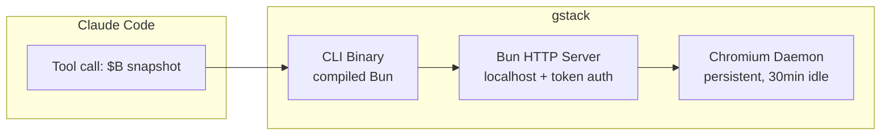

# gstack

**gstack** 是 Y Combinator CEO Garry Tan 开源的 Claude Code 技能包（79k+ GitHub ⭐），将单个 AI 助手转变为多角色虚拟工程团队。核心定位：**Harness Engineering 的生产级实现**。

## Key facts

- **作者**: Garry Tan — Y Combinator CEO / Founder @garryslist / Palantir early eng / Posterous cofounder
- **GitHub**: [garrytan/gstack](https://github.com/garrytan/gstack) — 75k+ stars, 14,965 installations, 305k skill invocations
- **License**: Open source
- **技术栈**: Bun (compiled binary), Playwright (persistent Chromium daemon), TypeScript
- **安装路径**: `~/.claude/skills/gstack/`（全局）或 `.claude/skills/gstack/`（vendored）
- **成功率**: 95.2% across all skill runs

## 为什么重要

gstack 是目前最完整的 **AI Coding Agent Harness** 参考实现：

1. **Persistent Browser Daemon** — 解决了 AI browser tool 的根本问题：冷启动延迟（3-5s/次）和状态丢失（cookies/tabs）
2. **Multi-Role Agent Pattern** — 用 SKILL.md 实现角色切换，CEO/EM/Staff Eng/QA/SRE/Design 各司其职
3. **Cross-Session Memory** — learnings.jsonl 让 agent 从历史 session 中学习，不重复犯错
4. **Review Pipeline** — CEO review → design review → eng review 三层审查，Codex 作为 second opinion
5. **Testing as the unlock** — 测试从 100 条增长到 2000+ 条，是 AI coding 真正安全的前提

## 核心架构

**关键技术决策**:
- **Bun 而非 Node.js**: compiled binary（无 runtime node_modules）、native SQLite（cookie 解密）、native HTTP server
- **State file**: `.gstack/browse.json`（pid/port/token/version），atomic write，mode 0600
- **Bearer token auth**: UUID per session，401 on mismatch
- **Version auto-restart**: binary version ≠ running server → kill + restart
- **Ref system**: ARIA tree → @e1/@e2 refs → Playwright Locators（无 DOM mutation，CSP-safe）
- **Prompt injection defense**: 6 层防御（L1 content security → L4 ML classifier 22MB BERT-small → L5 canary token → L6 ensemble combiner）

## 与 Hermes/Agent Harness 的关系

gstack 和 Hermes 的 acp-client 项目解决的是同一类问题：**如何让 AI Coding Agent 可靠工作**。关键对标：

| 维度 | gstack | Hermes acp-client |
|------|--------|-------------------|
| Agent 抽象 | SKILL.md + slash commands | ACP protocol + dataclass spawner |
| Browser | Playwright persistent daemon | via OpenClaw/Chorus |
| Memory | learnings.jsonl (per project) | cross-session via wiki |
| Review | CEO/EM/Design/Codex multi-layer | manual/agentic |
| Testing | /qa (Playwright) | 需集成 |

**gstack 的优势**: 完整的产品化（79k stars 验证），skill 生态丰富，开箱即用
**Hermes 的优势**: 更灵活的 agent 抽象，LLM wiki 作为 memory layer，browser 可复用 OpenClaw

## 相关概念

- [[Harness Engineering]] — 让 Agent 可靠工作的五大子系统
- [[Agent Review Pattern]] — Agent 审 Agent 的机制
- [[Four-Layer Feedback Loop]] — 编译→单测→e2e→CI 四层反馈闭环
- [[Chorus]] — Agent 任务管理系统

## Sources

- [[gstack-skills]] — 完整 skill 参考（33 个 skill 列表、learnings 数据模型）
- [[gstack-loc-controversy]] — Garry Tan 的 LOC 争议回应 + 生产力数据
- [[gstack-architecture]] — 架构设计文档（daemon model、security、Bun 选型、ref system）
