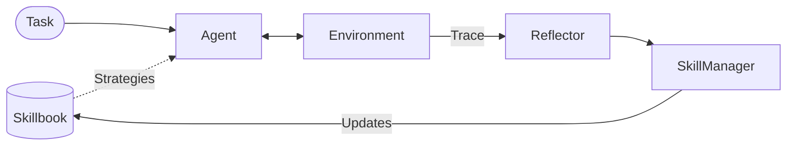

# Agentic Context Engine (ACE)

**Agentic Context Engine (ACE)** 是 [kayba-ai](https://kayba.ai) 开源的 agent 持续学习引擎（2,550 ⭐，2026-08），是 ACE 论文（Stanford & SambaNova）的参考实现 + 商业包装。**它不是"会话扫描器"，而是给 agent 装一个会学习的脑**：维护一个持久化 **Skillbook**（策略集），每次执行后用 Reflector 反思、用 SkillManager 策展。

## 与"会话扫描器"的关系

| 角色 | 说明 |
|------|------|
| **agent 框架** | 改造 agent 自身（注入 Skillbook、Learn from feedback）|
| **trace 摄入** | 支持 `agent.learn_from_traces(your_existing_traces)`，但要求传入它自定义 trace 格式 |
| **托管服务** | [kayba.ai](https://kayba.ai) 把整套 loop（failure investigation → fixes shipped as PRs）做成 SaaS |

> ⚠️ 调研定位：ACE 是**下游运行时**，不是**上游扫描器**。上游扫描应看 [[Open-Amnesia|Open Amnesia]]、[[cc-analyst]]、[[reflect-skill-claude]]。

## 核心机制：三角色闭环



| 角色 | 职责 |
|------|------|
| **Agent** | 执行任务，运行时注入 Skillbook 中的策略 |
| **Reflector** | 分析执行 trace，提取成功/失败模式（**Recursive Reflector** 关键创新：写 Python 在沙箱里程序化搜索）|
| **SkillManager** | 策展 Skillbook——增、删、合并、refine |

## 关键能力

- **Skillbook**：持久化策略集合，跨 session 累积
- **Recursive Reflector**：不再单次总结，而是写 Python 程序在沙箱里迭代搜索模式
- **PydanticAI 集成**：所有角色用 PydanticAI agent + structured output 验证；通过 LiteLLM 路由 100+ LLM
- **多种 Runner**：`ACELiteLLM`（开箱即用）/ `ACE`（批量 epoch）/ `TraceAnalyser`（吃历史 trace）/ `BrowserUse` / `LangChain` / `ClaudeCode`

## 验证成绩

| 指标 | 结果 | 场景 |
|------|------|------|
| 2× consistency | Tau2 airline 基准 pass^4 翻倍 | 15 learned strategies，no reward signal |
| 49% token reduction | browser automation 成本近乎砍半 | 10-run learning curve |
| $1.50 learning cost | Claude Code 翻译 14k 行 → TypeScript | 0 build errors, all tests passing |

## 快速试用

```bash
uv add ace-framework
export OPENAI_API_KEY="..."

from ace import ACELiteLLM
agent = ACELiteLLM(model="gpt-4o-mini")
answer = agent.ask("Is there a seahorse emoji?")
agent.learn_from_feedback("There is no seahorse emoji in Unicode.")
answer = agent.ask("Is there a seahorse emoji?")  # 答对了
print(agent.get_strategies())
```

## 论文基础

- [ACE: Agentic Context Engineering](https://arxiv.org/abs/2510.04618)（Stanford & SambaNova）
- [Dynamic Cheatsheet](https://arxiv.org/abs/2504.07952)

## 相关页面

- [[ace-agent-ace|ace-agent/ace]] — ACE 论文官方复现（社区驱动，纯研究用）
- [[Open-Amnesia|Open Amnesia]] — 上游 ingest 层（多源会话→Event IR）
- [[cc-analyst]] — Claude Code/Codex JSONL → CLAUDE.md patch
- [[Session-Extraction-Pipeline]] — 整体范式概念
