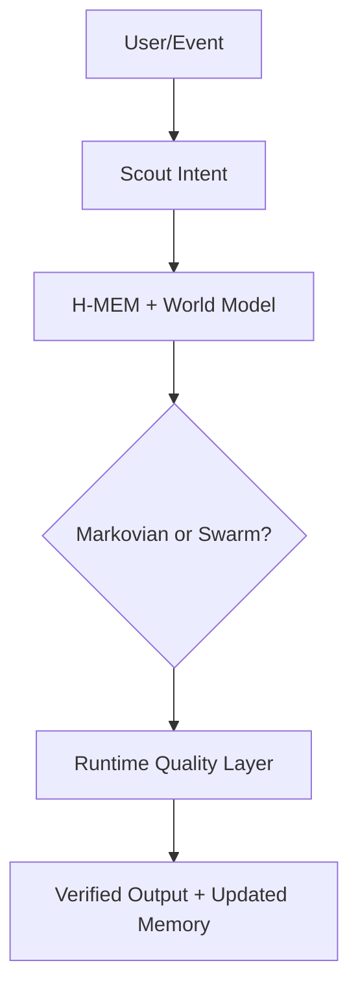

# Meterless

**Meterless** 是 [Meterless](https://github.com/Meterless/Meterless) 团队的 **local-first 上下文栈**（218 ⭐，2026-08）。**核心理念："agents fail on thin context, not weak models"**——把 memory、world modeling、reasoning compression、coordination、execution、runtime quality 整合成 AGENTS.md 驱动的引擎规范。

## 架构

## 三大引擎

| 引擎 | 作用 | 关键能力 |
|------|------|---------|
| **H-MEM** | 三层记忆（金字塔：short/working/long-term）| capture from every interaction, consolidate, dream/sleep, audit with trust ledger |
| **World Model** | 共享世界模型（实体+上下文+关系图）| 文档/对话/信号/动作统一为 living graph |
| **Markovian Reasoning** | 推理压缩 | 20 步时输入 token 节省 86% vs naive history |

## 关键数据

- **H-MEM demo**: 12 步任务 cold 12 chunks vs warm 8 chunks（4 chunk 节省）
- **Markovian 效率**: 86% 输入 token 节省（vs naive history accumulation）
- **runnable**: `npx degit meterless/meterless/engines/hmem my-hmem && cd my-hmem/reference && npm test`

## 与本调研的契合点

| 调研需求 | 契合度 |
|---------|--------|
| "扫描历史会话" | ⚠️ 部分——有 H-MEM 摄入，但不强调查 JSONL |
| "Memory 提取" | ✅ H-MEM 三层 |
| "Skill 提取" | ❌ 不直接做 |
| "本地" | ✅ |
| **可作"下游运行时"** | ✅ |

> **推荐组合**：上游 ingest 用 [[Open-Amnesia|Open Amnesia]] / [[cc-analyst]]；下游 runtime 用 H-MEM/Meterless。

## 三大产品面

- **Gaia** — Interface
- **Relay** — Execution
- **Swarms** — Coordination

## 相关页面

- [[Open-Amnesia|Open Amnesia]] — 上游 ingest
- [[cc-analyst]] — 上游 ingest
- [[Agentic-Context-Engine-ACE|Agentic Context Engine (ACE)]] — 另一个 runtime
