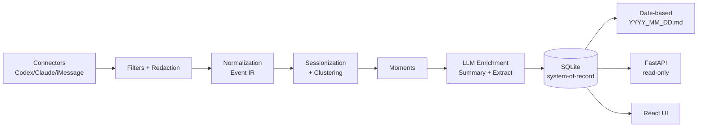

# Open Amnesia

**Open Amnesia** 是 [vincentkoc](https://github.com/vincentkoc) 的 **local-first continual learning context engine**（30 ⭐，2026-08）。**它正好是"扫描历史会话→提取 memory/skill"这件事的标杆开源项目**：多源 ingest → 标准化 → 聚类 → 提取 facts+skills → 按日导出 Markdown + FastAPI。

> 🎯 **调研核心结论**：这次调研里，**Open Amnesia 是"会话扫描→记忆/Skill 提取"方向最完整、最对口的开源实现**。

## 核心能力

| 能力 | 说明 |
|------|------|
| **多源 ingest** | Codex / Claude / iMessage 三种 connector |
| **Schema 标准化** | 把不同来源的"turn"格式统一为单一 Event IR（turn-by-turn + tool call/result）|
| **Sessionization + Clustering** | 聚类成 "Moment"（intent → actions → outcomes → artifacts）|
| **LLM 提取** | 提取 Facts（稳定上下文：项目/决策/人物/配置）+ Skills（重复 workflow：triggers/steps/checks）|
| **日期文件导出** | 按 `YYYY_MM_DD.md` 导出——天然适配 PKM/agent 消费 |
| **Read-only API** | FastAPI 暴露 `/api/memory/daily?date=...` 供其他 agent 拉取 |
| **隐私脱敏** | 过滤 + redaction（PII/secret patterns）|
| **React UI** | 检查/过滤/导出控制台 |

## 架构流水线



## 与本调研的契合点

| 需求维度 | Open Amnesia 能力 |
|---------|-----------------|
| 多源 ingest | ✅ Codex + Claude + iMessage |
| 标准化 | ✅ 统一 Event IR |
| Memory 提取 | ✅ Facts + Skills |
| 每日聚合 | ✅ `YYYY_MM_DD.md` |
| 服务化 | ✅ FastAPI |
| 本地优先 | ✅ SQLite + local-first |
| 隐私 | ✅ Redaction filters |

## 快速试用

```bash
git clone https://github.com/vincentkoc/openamnesia
cd openamnesia
python -m venv .venv && source .venv/bin/activate
pip install -e .

# 交互式 SDK
amnesia

# 端到端 demo（最近窗口全源）
make e2e-all

# 启动 API / UI
make api    # FastAPI
make ui     # React + Vite
```

## Roadmap 中已声明的能力

- Continual learning loops：friction signals → skill patches → eval → promote
- **Skill Gym**：自动生成并管理 skill（triggers/steps/checks/metrics 的版本化 artifact）
- Per-project memory streams + 时间轴回放 UI
- 实时 ingest：local watchers + LaunchAgent（opt-in）

## 技术栈

- **Backend**: Python, FastAPI, SQLite
- **Frontend**: TypeScript, React, Vite, Tailwind, TanStack Query
- **LLM**: LiteLLM（OpenAI 为主）+ You.com API + Composio
- **Deployment**: Render, Akash

## 相关页面

- [[Session-Extraction-Pipeline]] — 范式
- [[cc-analyst]] — 同类但只吃 Claude Code/Codex JSONL
- [[reflect-skill-claude]] — Claude Code 单文件 skill
- [[Agentic-Context-Engine-ACE|Agentic Context Engine (ACE)]] — 下游运行时
- [[Memory-Systems]] — 整体对比表
