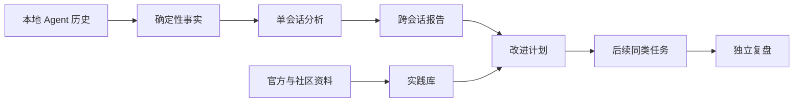

# agent-usage-analyze（zm2529）

> **2 ⭐ / TypeScript / MIT / 2026-08-05 push**。**本地优先的「使用 + 行为 + 改进追踪」分析**，目前对 **Codex** 采集最完整，同时可导入 **Claude Code / Cursor / GitHub Copilot CLI / GitHub Copilot** 本地历史。

## 为什么这个项目特别重要

它**把 [[Session-Extraction-Pipeline]] 的最后一步「策展」做到了工程化产品**——不只是「从 session 提取知识」，而是：

1. **从证据到复盘的闭环**：本地事实 → 单会话分析 → 跨会话报告 → 改进计划 → 后续同类任务 → 独立复盘
2. **「改进计划可追踪」**：LLM 建议的改进被记下，后续同类任务真正能验证它有没有起作用
3. **本机 dashboard** + 服务只绑 `127.0.0.1`
4. **「实践库」概念**：把官方/社区的当前实践（按来源质量、时效、相关性）也纳入分析

**这个项目是我前两轮调研的盲区**。2 ⭐ + 中文 README 的双重门槛让 sort=stars 搜索漏掉了——本 wiki 已把它收录并修订调研方法（见下「调研反思」）。

## 流水线



**关键设计**：「本地事实与模型判断始终分层」——统计数量来自已导入事件，解释/分析维度/实践提炼/复盘条件由模型生成。这与 [[Session-Extraction-Pipeline]] 的「late LLM binding」原则一致。

## 4 个工作区

| 工作区 | 主要用途 |
|--------|---------|
| **总览** | 最近最重要变化 + 当前改进 + 使用趋势 |
| **分析** | 最近 30 天跨会话报告 + 证据边界 + 代表性会话 |
| **改进追踪** | 改进计划的可观察性（适用条件/护栏/复盘条件）|
| **实践库** | 官方 + 社区实践（按来源质量与相关性）|
| **活动记录** | 按时间浏览会话，需要时打开证据工作区 |
| **设置** | 采集/导入/分析状态 + 模型用量 + 自动化 |

## 自动工作流

1. **采集**：受信任的 Codex Hook + 本地监听器发现稳定会话更新
2. **导入**：支持的历史统一整理到本地 SQLite
3. **单会话分析**：符合条件的会话生成摘要、决策、可复用经验、Skill 观察、提示词质量
4. **跨会话报告**：新证据可推动最近 30 天报告更新

## 与本 wiki 已收录项目的差异

| 维度 | agent-usage-analyze | 多数其他项目 |
|------|---------------------|-------------|
| 闭环到改进追踪 | ✅ 独立复盘 | ❌ 大多停在「记忆写入」|
| 实践库 | ✅ 官方+社区资料 | ❌ 几乎无 |
| 证据链 | ✅ 跨会话报告 | 少数有 |
| 本地 dashboard | ✅ http://localhost:7890 | 少数有 |
| 中英双语 | ✅ 首次启动跟浏览器语言 | 多数仅英文 |

**它和 [[claude-memory-compiler]]、[[llmwiki-lucasastorian]] 是同一谱系**（都源自 Karpathy wiki 思想），但**多走了两步**：

- 把「改进可追踪」做成产品功能
- 把「实践库」做成一等公民

## 启动

```sh
npx --yes agent-usage-analyze start
```

首次运行会初始化本地存储、导入支持的历史、配置 Codex 采集、启动本地 Dashboard，并在 macOS 注册登录后自动启动的本地服务。安装后命令会退出，导入继续在后台运行。访问 http://localhost:7890。

## 调研反思（本 wiki 视角）

> 2 ⭐ + 中文 README 的双重门槛让 sort=stars 搜索漏掉了这个项目。

**这次漏检说明**：
1. 「stars 多 = 重要」**会漏掉**反潮流但设计对题的项目。agent-usage-analyze 的「改进追踪」思路在我收录的 20+ 项目里只有这一家在做。
2. **没有强制包含「按更新时间」「按相关性」**两种排序是失误。前两轮只用了 sort=stars。
3. **没有针对 README 语言做主动搜索**——很多低 star 高质量项目只写中文（特别是国内作者面向国内使用者）。
4. **关键词覆盖不全**：用过「session mining」「memory extraction」等偏工程的英文词，没用过「使用分析」「复盘」「改进追踪」等更接近用户描述的中文词。

**修订调研方法**（已沉淀到 `async-delegation-recovery` 配套 check）：
- GitHub 搜索必须做三次排序：stars / recently updated / relevance
- 中文 README 关键词搜索（改进追踪 / 复盘 / 用法分析 / 工作流分析）作为独立 query 系列
- 用户主动提供 URL 时，**必须**回溯自己为什么漏掉 + 补搜同模式

## 相关页面

- [[Session-Extraction-Pipeline]] — 范式总览
- [[claude-memory-compiler]] — 同一谱系（Karpathy wiki 套 session）
- [[llmwiki-lucasastorian]] — 同一谱系（MCP server 化）
- [[prism-prosusai]] — 同为「验证/反馈闭环」（engram + confidence decay）
- [[Skill-Distillation-Research]] — 学术层
