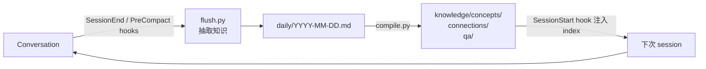

# claude-memory-compiler（coleam00 / LLM Personal Knowledge Base）

> **本调研中与 Nick 当前 llm-wiki 路径最同构的项目**：1,275 ⭐ / 320 forks / Python。把 **Karpathy 的 LLM Wiki 架构直接套到 Claude Code 会话 transcript 上**——原料不是网页剪藏，而是你自己和 agent 的对话。

## 为什么这个项目对本 wiki 特别重要

本 wiki 用的 [[llm-wiki]] skill 也是 Karpathy 那篇 gist 的实现，但**原料是人工投喂的 URL/文章**。
`claude-memory-compiler` 把同一架构的**原料换成了 session transcript，并全自动化**。

即：它 = `llm-wiki skill` + `自动 session 采集`。这正是 [[Session-Extraction-Pipeline]] 里指出的 Hermes 现存缺口。

## 流水线

## 脚本职责

| 脚本 | 作用 |
|------|------|
| `flush.py` | 调 Claude Agent SDK 判断哪些值得存；**18:00 后自动触发当日编译** |
| `compile.py` | daily log → 带交叉引用的 concept 文章 |
| `query.py` | index 引导式检索回答问题（**无 RAG**）|
| `lint.py` | 7 项健康检查：broken links / orphans / contradictions / staleness |

`lint.py` 的 7 项检查与 [[llm-wiki]] skill 的 lint 操作**几乎一一对应**（orphan / broken wikilink / index 完整性 / contradiction / stale）。

## 核心论点：为什么不用 RAG

> Karpathy 的洞察：在个人规模（50–500 篇文章）下，LLM 读一份结构化 `index.md` 优于向量相似度。LLM 理解你真正在问什么，余弦相似度只是找词形相近的。RAG 要到 ~2,000+ 篇才必要。

这与本 wiki 的 index.md 优先策略完全一致，是对现有做法的**第三方独立验证**。

## 成本说明

README 明确：Claude Agent SDK 的个人使用被 Max/Team/Enterprise 订阅覆盖，**无需另买 API credits**——与 OpenClaw 的 memory flush 需要 API 计费不同。

## 与本 wiki 的关系（可直接借鉴）

| 借鉴点 | 说明 |
|--------|------|
| **SessionEnd + PreCompact 双 hook** | PreCompact 作为 auto-compact 的安全网，防丢数据 |
| **18:00 后触发日编译** | 用时间阈值代替「每 session 都编译」，省 token |
| **daily → concepts 两段式** | 先落 daily log（廉价、确定性），再编译（贵、LLM）——即 late LLM binding |
| **lint.py 7 检查** | 可直接对标本 wiki 的 lint 清单 |

## 相关页面

- [[llm-wiki]] — 本 wiki 用的 skill，同源架构
- [[Session-Extraction-Pipeline]] — 范式总览
- [[llmwiki-lucasastorian]] — 另一个 Karpathy wiki 工程实现（MCP 路线）
- [[claude-mem-thedotmack]] — 同为 hook 驱动但不出 wiki
