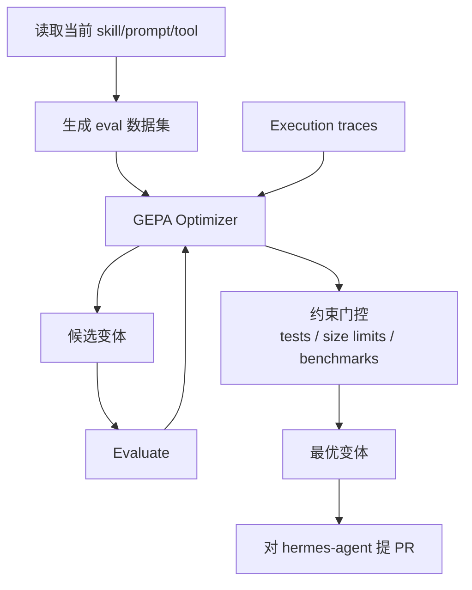

# hermes-agent-self-evolution（NousResearch 官方）

> **4,987 ⭐ / Python / NousResearch 官方**。用 **DSPy + GEPA（Genetic-Pareto Prompt Evolution）** 自动演化 Hermes Agent 的 skill、tool description、system prompt 和代码。**这是 Hermes 官方给出的「session → skill 进化」答案。**

## 为什么对 Nick 最直接相关

本 wiki 所在的 Hermes 实例就有 MEMORY.md + skills/ + session DB。这个仓库是**官方维护的、专门优化这三者的离线管线**——不是第三方猜测 Hermes 内部结构，而是官方自己做的。

## 机制



## 关键特性

| 特性 | 说明 |
|------|------|
| **无需 GPU 训练** | 全部通过 API 调用完成——变异文本、评估结果、择优 |
| **成本** | ~$2–10 / 次优化 run |
| **方法论背书** | GEPA 是 **ICLR 2026 Oral**，MIT 许可 |
| **产出形式** | 直接对 `hermes-agent` 提 PR |
| **约束门控** | tests + size limits + benchmarks 三道闸 |

## GEPA 的核心洞察

> GEPA 读**执行轨迹**来理解*为什么*失败（不只是失败了），然后提出针对性改进。

这与 [[Session-Extraction-Pipeline]] 的 Step 4 完全同构，但更进一步：不只提取「做过什么」，而是提取「**为什么错**」——把失败信号也当一等公民。这是本 wiki 已收录项目普遍缺失的一环。

## 用法

```bash
git clone https://github.com/NousResearch/hermes-agent-self-evolution.git
cd hermes-agent-self-evolution
pip install -e ".[dev]"
export HERMES_AGENT_REPO=~/.hermes/hermes-agent
python -m evolution.skills.evolve_skill   # 演化一个 skill
```

## 与本 wiki 已收录 Hermes 周边的关系

| 项目 | 定位 | Stars |
|------|------|-------|
| **hermes-agent-self-evolution** | 官方，GEPA 演化 prompt/skill | 4,987 |
| [[SkillClaw]] | 社区，post-task evolution loop 改 skills/ | 2,413 |
| [[hermes-skill-factory]] | 社区，meta-skill 生成新 skill | 511 |
| [[open-second-brain]] | 社区，Obsidian vault 作 memory 层 | 153 |
| [[Hindsight]] | Nick 当前部署的向量记忆 | — |

## 相关页面

- [[Skill-Distillation-Research]] — 方法论详解
- [[Session-Extraction-Pipeline]] — 范式总览
- [[SkillClaw]] / [[hermes-skill-factory]] / [[open-second-brain]] — Hermes 生态同方向
