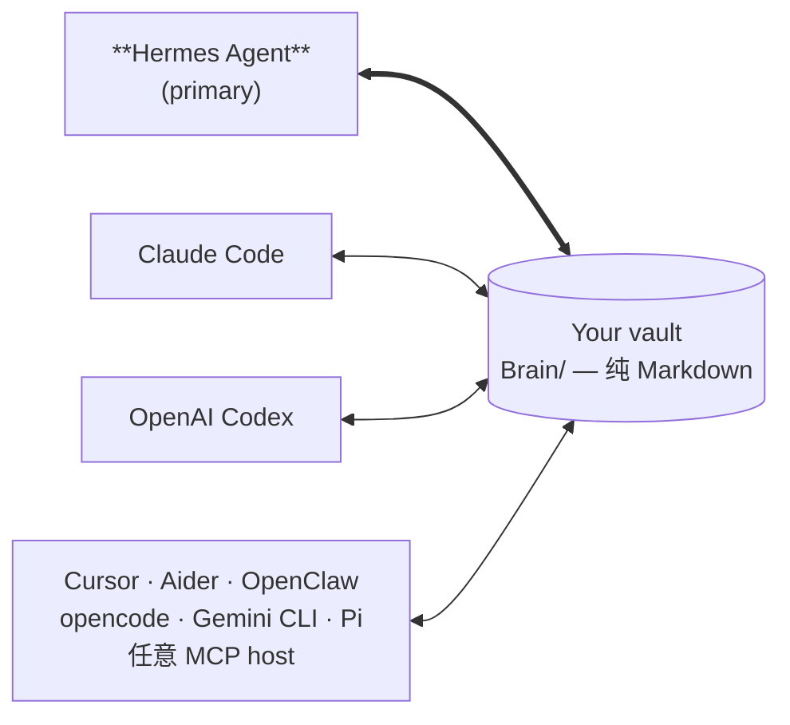

# open-second-brain（itechmeat）

> **153 ⭐ / TypeScript / MIT**。**Hermes Agent 为首要集成对象**的 Obsidian-native 记忆层。纯 Markdown 落在你已有的 vault 里，通过确定性 CLI / MCP 工具读写。

## 为什么值得单列

本调研中**极少数把 Hermes Agent 作为 primary integration**（而非事后适配）的项目，且架构选择与本 wiki 高度一致：**纯 Markdown + Obsidian vault + 无 LLM 参与核心算法**。

## 核心主张

| 主张 | 说明 |
|------|------|
| **住在你的 Obsidian vault** | 打开 `Brain/preferences/pref-*.md` 就能**肉眼看到** agent 学到了什么（title / status / evidence count / confidence band / body）。Wikilink、backlink、graph view 全部可用 |
| **数据归你** | 纯 Markdown 在本地文件系统。无服务可注销、无云账号、厂商转向也不需要 schema 迁移 |
| **确定性学习** | `dream` pass 把重复信号变成规则，并退役不再适用的。**纯计数器 + 原子文件移动——算法里没有 LLM，记忆里不会有幻觉** |
| **一个 vault，所有 runtime** | Hermes 为主；Claude Code / Codex / Cursor / Aider / OpenClaw / opencode / Grok Build / kiro / Copilot CLI / Gemini CLI / Pi 全部通过 MCP 接入同一个 Brain |

## 架构

Hermes 掌管调度（**dream cron、每日 digest、Telegram 投递**），其他 runtime 作为同一 Brain 的读写方参与——**记忆层不按 runtime 分叉**。

## `dream` pass —— 最值得借鉴的设计

「重复信号 → 规则」的**晋升**，加上「不再适用 → 退役」的**淘汰**，且**完全确定性**（计数器 + 原子文件移动，无 LLM）。

这直接回应了 [[Session-Extraction-Pipeline]] 里的两个开放问题：
1. **skill/rule 晋升门槛怎么定** → 用 evidence count + confidence band，而非 LLM 判断
2. **记忆如何不无限膨胀** → 显式退役机制（本 wiki 的 MEMORY.md 字符上限是另一种解法）

## 工程文化亮点

README 里明确记录「**这个版本故意没做什么，以及为什么**」——把「缺失是决策而非遗漏」写进发布说明。同时记录了一个真实 bug：短暂的索引打开失败被误判为 corruption，而 corruption 触发静默重建，于是一次数据库瞬时加锁就可能损失全部 embedding。

## 安装（Hermes 路线）

README 给出的最简路径是把安装交给 agent 自己：

> Install Open Second Brain for me by following the steps at https://github.com/itechmeat/open-second-brain/blob/main/install/hermes.md. My vault is at `/path/to/your-vault`.

## 相关页面

- [[hermes-agent-self-evolution]] — 官方 GEPA 演化路线
- [[Session-Extraction-Pipeline]] — 范式总览
- [[obsidian-second-brain]] — 同为 Obsidian 路线但不以 Hermes 为主
- [[llm-wiki]] — 本 wiki 的 skill，同为纯 Markdown 哲学
