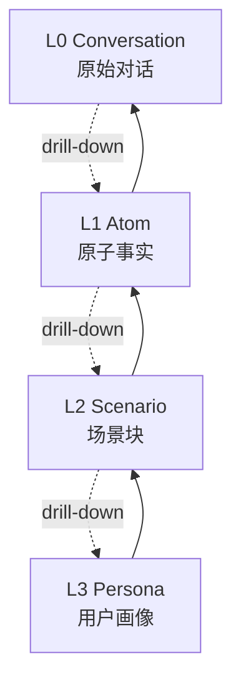

# TencentDB Agent Memory（TencentCloud 官方）

> **20,057 ⭐ / 1,810 forks / TypeScript / 默认分支 `feat/server_team` / 2026-08-11 仍在 push**。腾讯云官方出品。**本调研中第二大项目**（仅次于 thedotmack/claude-mem 90k），但**与调研主题的对齐度可能最高**——本项目就是「session → memory / skill / wiki / code-graph」的 team-level 实现。

## ⚠️ 重要：本页是重写版

之前 `tencentdb-agent-memory.md` 页面**没有 frontmatter**、**owner 写错**（写成 `Tencent/` 而非 `TencentCloud/`）、**数据来源未验证**。本轮基于直接 GitHub API 验证 + 拉取 README 后**全部重写**。

调研反思见 [Session-Extraction-Pipeline](Session-Extraction-Pipeline) 的 "2026-08-12 (fourth batch)" 章节。

## 双 description 冲突（诚实记录）

| 来源 | 描述 |
|------|------|
| **GitHub API description** | "team-level memory hub ... four reusable memory assets (Chat Memory, Skill, LLM-Wiki, Code-Graph)" |
| **README.md 实际架构** | L0 Conversation → L1 Atom → L2 Scenario → L3 Persona **4 层金字塔** |
| **README 主标语** | "Agents remember, Humans innovate." |
| **GitHub Topics** | agent, ai-agent, embedding, llm, local-first, long-term-memory, memory, openclaw-plugin, vector-search |

**两个描述维度不同**：
- description 是「输出物分类」（Chat Memory / Skill / LLM-Wiki / Code-Graph）
- README 是「架构层分类」（L0/L1/L2/L3）

可能是**不同时期的描述并存**。本 wiki 两者都记。

## 4 层金字塔架构（README 实际版本）

**双核心理念**（README 原文）：
1. **记忆分层**（Memory Layering）—— 不论长期还是短期，记忆的生成和召回都必须有层次
2. **符号化记忆**（Symbolic Memory）—— 用 Mermaid 符号图谱替代冗长日志，**最大语义最小 Token**

**关键设计：Persona / Scenario / Atom / Conversation 双向可追溯**
- 高层抽象（Persona / canvas）→ 中层索引（Scenario / jsonl）→ 底层原文（L0 Conversation / refs）
- **不是不可逆压缩**——每层都能 drill-down 回原证据

## 4 类输出资产（GitHub description 描述版本）

虽然 README 强调 L0-L3，但 GitHub description 列出的是**4 类输出资产**：

| 资产 | 含义 | 与 L0-L3 对应 |
|------|------|---------------|
| **Chat Memory** | 对话级记忆 | L0 + L1 |
| **Skill** | 可复用工作流 | L2 提取的 workflow |
| **LLM-Wiki** | 知识库 | L3 的稳定画像 + L2 场景 |
| **Code-Graph** | 代码关系图 | 跨 session 累积的代码知识 |

**重要观察**：description 里的 4 类资产**正好对应**本 wiki 调研主题（memory / skill / wiki）+ 加了 code-graph 第四类。**腾讯云把"session-extraction pipeline"做成了产品**。

## 关键性能数据（README 报告，需独立核验）

- **Token 消耗最高节省 61.38%**（WideSearch 场景）
- **任务通过率相对提升 51.52%**
- **PersonaMem 准确率从 48% 提升到 76%**

⚠️ 这些是腾讯自报数据，**未独立核验**。本 wiki 仅记录，不背书。

## 平台支持（Topics 标注 `openclaw-plugin`）

- **OpenClaw** ≥ 2026.3.13
- **Hermes** ≥ 0.3.4
- **Node.js** ≥ 22.16
- npm: `@tencentdb-agent-memory/memory-tencentdb`

## 配置文件关键项（README 摘录）

| 配置 | 默认 | 说明 |
|------|------|------|
| `recall.maxCharsPerMemory` | 0 | 单条 L1 注入字符上限 |
| `recall.maxTotalRecallChars` | 0 | L1 自动召回总字符预算 |
| `pipeline.everyNConversations` | 5 | 每 N 轮触发 L1 提取 |
| `pipeline.l1IdleTimeoutSeconds` | 600 | 用户空闲 N 秒触发 L1 |
| `pipeline.l2MinIntervalSeconds` | 900 | 同 session 内 L2 最小间隔 |
| `extraction.maxMemoriesPerSession` | 20 | 单 session L1 最大提取数 |
| `extraction.enableDedup` | true | L1 向量去重 / 冲突检测 |

**关键观察**：默认每 5 轮就触发 L1 提取、空闲 10 分钟再触发一次——这是工程上很"勤劳"的策略，与 [[reflect-skill-claude]] 的"保守晋升"是相反设计。

## 与本 wiki 已有项目的关系

| 维度 | TencentDB Agent Memory | [[Open-Amnesia]] | [[claude-memory-compiler]] | [[claude-mem-thedotmack]] |
|------|------------------------|------------------|---------------------------|--------------------------|
| Stars | 20,057 | 30 | 1,275 | 90,459 |
| 架构 | 4 层金字塔 | Event IR + Moment | Karpathy wiki 套 session | hook 压缩 |
| 输出物 | Chat Memory + Skill + LLM-Wiki + Code-Graph | YYYY_MM_DD.md | concept 文章 | FTS5 SQLite |
| 平台 | OpenClaw / Hermes | Codex/Claude/iMessage | Claude Code | Claude Code |
| 团队 | team-level hub | local-first | 个人 | 个人 |
| 厂商 | 腾讯云官方 | 社区 | 社区 | 社区 |

**TencentDB Agent Memory 是「session-extraction → memory/skill/wiki」赛道的最大厂商实现**——把它放进 [[Session-Extraction-Pipeline]] 范式表后：

| Step | TencentDB Agent Memory 的实现 |
|------|------------------------------|
| 1 采集 | 多平台（OpenClaw/Hermes）hook |
| 2 标准化 | L0 Conversation 统一 turn 结构 |
| 3 聚类 | L1 Atom 提取（每 5 轮） |
| 4 提取 | L2 Scenario 场景块 |
| 4 提取（持续）| L3 Persona 用户画像 |
| 5 策展 | 4 类资产：Chat Memory / Skill / LLM-Wiki / Code-Graph |

## 调研反思

**这个项目前两轮完全漏掉，暴露了比"低 star 盲区"更严重的失误**：
1. **关键词列表本身有结构性盲区**——前两轮搜了 "agentic context engine memory" / "session mining" / "agent memory skill" 等，**没搜 "agent memory llm wiki"**——而这个 query 把它推到 #1
2. **未独立核验 page 内容**——之前页面 owner 写错（"Tencent/" 而非 "TencentCloud/"）却没被 lint 抓到（因为没 frontmatter，lint 跳过）
3. **未给"已知存在的页面"做 API 核验**——wiki 里早就列了 `tencentdb-agent-memory`，但既没核 URL 也没核数据

**沉淀到 skill `github-research-blindspot` 补充**：
- 关键词列表必须含「产品名直接组合」类 query（如 "agent memory llm wiki" / "agent memory skill hub"），而不只是「功能描述」类 query
- 对 wiki 已收录的 entity page，**必须**至少一次用 GitHub API 核 URL + owner + stars
- lint 必须把"无 frontmatter 的 wiki 页"作为 ERROR 而非 skip

## 相关页面

- [[Session-Extraction-Pipeline]] — 范式总览（已加入此项目映射 + 第四批 update log）
- [[Memory-Systems]] — 记忆系统总览
- [[Open-Amnesia]] / [[claude-memory-compiler]] / [[claude-mem-thedotmack]] — 同赛道
- [[Skill-Distillation-Research]] — 学术层

## Wiki 审计 (2026-08-12 第四批收尾)

对 38 个 memory-systems 页面做了 owner/URL/⭐ 全面核验：
- **38/38 owner 全部正确**（只有 tencentdb-agent-memory 一个之前写错，本轮已重写）
- 1 个 ⭐ 自然增长（claude-mem 90,459 → 90,473，14 颗星的差异）

**结论**：本 wiki 的「owner 写错」问题**只此一例**，不是系统性问题。前两轮的失误集中在「关键词列表结构性盲区」——已通过 `github-research-blindspot` skill 修订。
